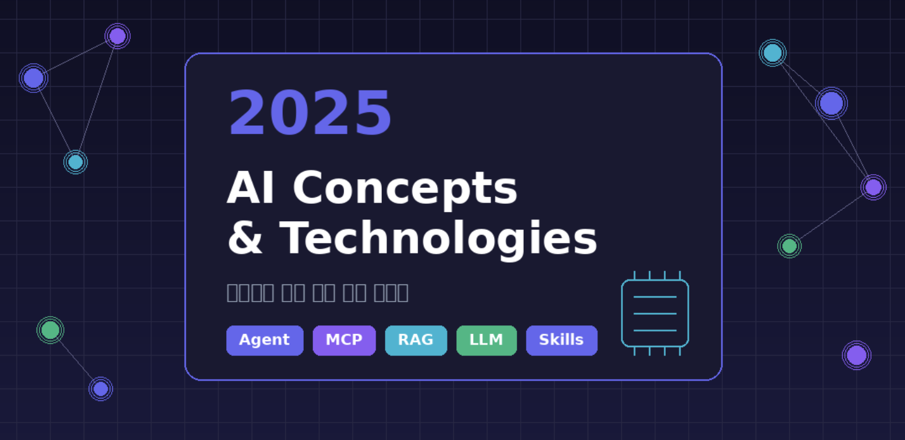

> 현재, AI는 단순한 챗봇을 넘어 스스로 판단하고 행동하는 Agent 시대로 접어들었다. MCP, RAG, Function Calling 등 개발자에게 필수적인 AI 핵심 개념들을 정리해보자



## 1. 핵심 AI 개념

### AI Agent (AI 에이전트)

**정의:** 사용자의 목표를 달성하기 위해 스스로 판단하고, 도구를 사용하며, 여러 단계의 작업을 자율적으로 수행하는 AI 시스템

**기존 챗봇 vs AI Agent 비교:**

|  | 기존 챗봇 | AI Agent |
| --- | --- | --- |
| **동작 방식** | 질문 → 답변 (1회성) | 목표 → 계획 → 실행 → 검증 (다단계) |
| **도구 사용** | ❌ | ✅ 웹 검색, 파일 생성, API 호출 등 |
| **자율성** | 수동적 응답 | 능동적 문제 해결 |

**예시 - "항공권 예약해줘"라고 요청하면:**

```text
[기존 챗봇]
→ "항공권 예약 사이트를 방문해보세요"

[AI Agent]
→ 1. 사용자 선호도 파악 (날짜, 가격대, 항공사)
→ 2. 여러 항공사 API 조회
→ 3. 옵션 비교 및 최적 선택
→ 4. 예약 진행 및 확인 메일 발송
```

---

### LLM (Large Language Model, 대규모 언어 모델)

**정의:** 대량의 텍스트 데이터로 학습하여 인간의 언어를 이해하고 생성할 수 있는 AI 모델

**주요 LLM 모델들 (2025 기준):**

| 기업 | 모델명 | 특징 |
| --- | --- | --- |
| **Anthropic** | Claude 4.5 | 긴 문맥 처리, 안전성 강조 |
| **OpenAI** | GPT-4o, o1 | 멀티모달, 추론 능력 |
| **Google** | Gemini 2.0 | 구글 생태계 통합 |
| **Meta** | LLaMA 3 | 오픈소스, 커스터마이징 가능 |

**개발자 관점의 활용:**

```java
// Spring Boot에서 LLM API 호출 예시
@Service
public class AIService {

    public String generateResponse(String prompt) {
        // Claude API 호출
        return anthropicClient.messages()
            .model("claude-sonnet-4-5-20250929")
            .maxTokens(1024)
            .message(prompt)
            .send();
    }
}
```

---

### RAG (Retrieval-Augmented Generation, 검색 증강 생성)

**정의:** LLM이 답변을 생성하기 전에 외부 데이터베이스에서 관련 정보를 검색하여 더 정확한 응답을 만드는 기법

**왜 필요한가?**

- LLM은 학습 시점 이후의 정보를 모름 (Knowledge Cutoff)
- 회사 내부 문서, 최신 뉴스 등 학습되지 않은 정보 활용 가능
- 환각(Hallucination) 현상 감소

**RAG 동작 흐름:**

```text
[사용자 질문]
    ↓
[1. 검색 (Retrieval)]
    - 질문을 벡터로 변환
    - Vector DB에서 유사 문서 검색
    ↓
[2. 증강 (Augmentation)]
    - 검색된 문서를 프롬프트에 추가
    ↓
[3. 생성 (Generation)]
    - LLM이 검색 결과 기반으로 답변 생성
```

**실전 예시 - 사내 문서 Q&A 시스템:**

```python
# 1. 문서를 청크로 분할하고 벡터화
documents = load_company_docs()
vectors = embedding_model.encode(documents)
vector_db.store(vectors)

# 2. 질문 시 관련 문서 검색 후 LLM에 전달
def answer_question(question):
    relevant_docs = vector_db.search(question, top_k=3)
    prompt = f"""
    다음 문서를 참고하여 질문에 답하세요:
    {relevant_docs}

    질문: {question}
    """
    return llm.generate(prompt)
```

---

### Prompt Engineering (프롬프트 엔지니어링)

**정의:** LLM에게 효과적인 지시를 작성하여 원하는 결과를 얻는 기법

**핵심 기법:**

#### 1) Zero-shot vs Few-shot

```text
# Zero-shot (예시 없이 바로 요청)
"다음 문장의 감정을 분석해줘: 오늘 날씨가 좋아서 기분이 좋다"

# Few-shot (예시를 먼저 보여줌)
"문장의 감정을 분석해줘.

예시:
- '정말 화가 난다' → 부정
- '너무 행복해' → 긍정

분석할 문장: '오늘 날씨가 좋아서 기분이 좋다'"
```

#### 2) Chain of Thought (CoT, 단계별 사고)

```text
# 일반 프롬프트
"가게에 사과가 23개 있었고, 7개를 팔았다. 남은 사과는?"

# CoT 프롬프트
"가게에 사과가 23개 있었고, 7개를 팔았다.
단계별로 생각해서 남은 사과 개수를 구해줘."

→ AI 응답:
1. 처음 사과 개수: 23개
2. 판매한 사과: 7개
3. 남은 사과: 23 - 7 = 16개
```

#### 3) 역할 부여 (Role Prompting)

```text
"당신은 10년 경력의 시니어 백엔드 개발자입니다.
다음 코드를 리뷰하고 개선점을 제안해주세요."
```

---

### Function Calling / Tool Use (함수 호출)

**정의:** LLM이 외부 함수나 API를 직접 호출할 수 있게 하는 기능

**예시 - 날씨 정보 조회:**

```json
// 1. 사용 가능한 도구 정의
{
  "tools": [{
    "name": "get_weather",
    "description": "특정 도시의 현재 날씨 조회",
    "parameters": {
      "city": { "type": "string", "description": "도시명" }
    }
  }]
}

// 2. 사용자: "서울 날씨 어때?"

// 3. LLM 응답 (함수 호출 요청)
{
  "tool_calls": [{
    "name": "get_weather",
    "arguments": { "city": "서울" }
  }]
}

// 4. 시스템이 실제 API 호출 후 결과 전달

// 5. LLM이 최종 답변 생성
"서울의 현재 날씨는 맑음이고, 기온은 15도입니다."
```

## 2. AI 통합 기술 (심화)

### ⭐ MCP (Model Context Protocol)

**정의:** Anthropic이 개발한 AI 모델과 외부 도구/데이터 소스를 연결하는 표준 프로토콜

**왜 중요한가?**

- 기존: 각 도구마다 별도 연동 코드 필요 (N개 도구 × M개 AI = N×M개 연동)
- MCP: 표준 프로토콜로 한 번만 구현하면 모든 AI에서 사용 가능

**MCP 아키텍처:**

```text
┌─────────────────────────────────────────────────┐
│                   AI 모델 (Claude 등)            │
└─────────────────────┬───────────────────────────┘
                      │ MCP Protocol
┌─────────────────────┴───────────────────────────┐
│                   MCP Client                     │
│         (Claude Desktop, IDE 플러그인 등)         │
└─────────────────────┬───────────────────────────┘
                      │
        ┌─────────────┼─────────────┐
        ▼             ▼             ▼
  ┌──────────┐  ┌──────────┐  ┌──────────┐
  │MCP Server│  │MCP Server│  │MCP Server│
  │ (GitHub) │  │(Database)│  │ (Slack)  │
  └──────────┘  └──────────┘  └──────────┘
```

**MCP Server 구현 예시 (Python):**

```python
from mcp import MCPServer, tool

server = MCPServer("my-database-server")

@server.tool()
def query_database(sql: str) -> str:
    """데이터베이스에서 SQL 쿼리를 실행합니다."""
    result = db.execute(sql)
    return json.dumps(result)

@server.tool()
def get_table_schema(table_name: str) -> str:
    """테이블의 스키마 정보를 반환합니다."""
    schema = db.get_schema(table_name)
    return schema

if __name__ == "__main__":
    server.run()
```

**실전 활용 시나리오:**

| MCP Server | 기능 | 예시 |
| --- | --- | --- |
| GitHub MCP | 코드 저장소 접근 | "이 PR의 변경사항 요약해줘" |
| PostgreSQL MCP | DB 쿼리 실행 | "지난달 매출 데이터 분석해줘" |
| Slack MCP | 메시지 전송/조회 | "오늘 팀 채널 내용 정리해줘" |
| Notion MCP | 문서 관리 | "회의록 페이지 생성해줘" |

---

### ⭐ Claude Skills (클로드 스킬)

**정의:** Claude가 특정 작업을 수행할 수 있도록 미리 정의된 능력 (도구 + 지침의 조합)

**기본 제공 Skills:**

```text
/mnt/skills/
├── public/           # Anthropic 제공 공식 스킬
│   ├── docx/         # Word 문서 생성/편집
│   ├── xlsx/         # Excel 스프레드시트 처리
│   ├── pptx/         # PowerPoint 프레젠테이션
│   └── pdf/          # PDF 생성/처리
├── user/             # 사용자 정의 스킬
└── examples/         # 예시 스킬
```

**Skill 사용 예시:**

```text
# 사용자 요청
"분기별 매출 데이터를 Excel 파일로 만들어줘"

# Claude 동작
1. /mnt/skills/public/xlsx/SKILL.md 읽기
2. 스킬 가이드라인에 따라 Excel 파일 생성
3. 적절한 서식, 차트 적용
4. 파일 다운로드 링크 제공
```

**사용자 정의 Skill 만들기:**

```markdown
# /mnt/skills/user/my-report-skill/SKILL.md

## 기능
주간 보고서를 회사 양식에 맞게 작성합니다.

## 템플릿
1. 제목: [날짜] 주간 업무 보고
2. 섹션: 금주 실적 / 차주 계획 / 이슈사항
3. 형식: 글머리 기호 사용, 간결한 문장

## 사용 예시
입력: "이번 주 API 개발 완료, 다음 주 테스트 예정"
출력: 양식에 맞는 보고서 문서
```

## 3. AI 자동화 & 워크플로우

### n8n

**정의:** 노코드/로우코드 워크플로우 자동화 플랫폼 (오픈소스)

**특징:**

- Self-hosted 가능 (데이터 보안)
- 400개 이상의 통합 노드
- AI 노드 지원 (OpenAI, Anthropic 등)

**예시 워크플로우 - Slack 알림 자동화:**

```text
[Webhook 트리거]
     ↓
[GitHub: PR 정보 조회]
     ↓
[Claude: PR 내용 요약]
     ↓
[Slack: 채널에 알림 전송]
```

**n8n AI 워크플로우 구성:**

```json
{
  "nodes": [
    {
      "type": "n8n-nodes-base.webhook",
      "name": "PR Webhook"
    },
    {
      "type": "@n8n/n8n-nodes-langchain.lmChatAnthropic",
      "name": "Claude Summarizer",
      "parameters": {
        "model": "claude-sonnet-4-5-20250929",
        "prompt": "다음 PR을 한국어로 요약해줘: {{$json.pr_body}}"
      }
    },
    {
      "type": "n8n-nodes-base.slack",
      "name": "Slack Notification"
    }
  ]
}
```

---

### LangChain / LlamaIndex

**LangChain:** LLM 애플리케이션 개발을 위한 프레임워크

```python
from langchain_anthropic import ChatAnthropic
from langchain.agents import create_tool_calling_agent

# 에이전트 생성
llm = ChatAnthropic(model="claude-sonnet-4-5-20250929")
tools = [search_tool, calculator_tool, database_tool]

agent = create_tool_calling_agent(llm, tools, prompt)

# 실행
result = agent.invoke({"input": "지난달 매출을 검색하고 전월 대비 증감율 계산해줘"})
```

**LlamaIndex:** 데이터 연결 및 검색에 특화된 프레임워크

```python
from llama_index import VectorStoreIndex, SimpleDirectoryReader

# 문서 로드 및 인덱싱
documents = SimpleDirectoryReader("./company_docs").load_data()
index = VectorStoreIndex.from_documents(documents)

# 질의
query_engine = index.as_query_engine()
response = query_engine.query("2024년 연간 실적 보고서 요약해줘")
```

**비교:**

| 구분 | LangChain | LlamaIndex |
| --- | --- | --- |
| **주요 목적** | 범용 LLM 앱 개발 | 데이터 연결/검색 특화 |
| **강점** | 에이전트, 체인 구성 | RAG 파이프라인 |
| **사용 사례** | 챗봇, 자동화 워크플로우 | 문서 Q&A, 지식 베이스 |

---

### Vector Database & Embeddings

**Embedding (임베딩):** 텍스트를 고차원 벡터(숫자 배열)로 변환하는 것

```text
"오늘 날씨가 좋다" → [0.23, -0.15, 0.87, ..., 0.42]  (1536차원)
"날씨가 화창하다" → [0.21, -0.12, 0.85, ..., 0.40]  # 유사한 벡터!
```

**Vector Database:** 벡터를 저장하고 유사도 검색을 수행하는 DB

**주요 Vector DB:**

| DB | 특징 | 용도 |
| --- | --- | --- |
| **Pinecone** | 완전 관리형, 빠른 시작 | 프로덕션 서비스 |
| **Milvus** | 오픈소스, 대규모 처리 | 엔터프라이즈 |
| **Chroma** | 경량, 로컬 실행 | 개발/프로토타입 |
| **pgvector** | PostgreSQL 확장 | 기존 PG 사용자 |

**pgvector 예시 (PostgreSQL):**

```sql
-- 확장 설치
CREATE EXTENSION vector;

-- 벡터 컬럼이 있는 테이블 생성
CREATE TABLE documents (
    id SERIAL PRIMARY KEY,
    content TEXT,
    embedding vector(1536)  -- OpenAI 임베딩 차원
);

-- 유사 문서 검색 (코사인 유사도)
SELECT content, 1 - (embedding <=> '[0.23, -0.15, ...]') AS similarity
FROM documents
ORDER BY embedding <=> '[0.23, -0.15, ...]'
LIMIT 5;
```

## 4. 실전 적용 사례

### 백엔드 개발에서의 AI 활용 (Claude)

#### 1) Claude API 활용 - 코드 리뷰 자동화

> **리뷰 자동화**: PR 생성 → GitHub Actions 트리거 → Claude(MCP) 호출 → 리뷰 코멘트 자동 작성

```yaml
# Claude Desktop MCP 설정 (config.json)
{
  "mcpServers": {
    "github": {
      "command": "npx",
      "args": ["-y", "@modelcontextprotocol/server-github"],
      "env": { "GITHUB_TOKEN": "your-token" }
    }
  }
}
```

```yaml
# GitHub Actions 자동화 (.github/workflows/ai-review.yml)
name: AI Code Review
on: [pull_request]

jobs:
  review:
    runs-on: ubuntu-latest
    steps:
      - name: AI Review via Claude
        run: |
          # Claude API + MCP로 PR 분석 및 코멘트 작성
          node scripts/claude-review.js ${{ github.event.pull_request.number }}
```

#### 2) Claude Skills 활용 - 주간 보고서 자동화

> **보고서 작성**: weekly-report 스킬 참조 → docx 스킬 참조 → 회사 양식에 맞는 docx 문서 생성

```text
# 사용자 정의 Skill 생성: /mnt/skills/user/weekly-report/SKILL.md

## 기능
Sprint 데이터를 기반으로 주간 개발 보고서를 docx로 생성합니다.

## 입력
- Jira/GitHub 이슈 목록
- 완료된 작업, 진행 중 작업, 블로커

## 출력 형식
1. 제목: [날짜] 주간 개발 보고서
2. 금주 완료 사항 (이슈 번호 + 설명)
3. 차주 계획
4. 리스크 및 이슈
```

```text
# Claude에게 요청
"""
이번 주 완료: 로그 수집 배치 개발, 권한 체계 리팩토링
진행 중: 대시보드 API 개발 및 테스트
이슈 사항: PostgreSQL 파티셔닝 성능 이슈

위 내용으로 주간 보고서 만들어줘
"""
```

#### 3) AI Workflow 구축 - 장애 대응 자동화

> **워크플로우**: Slack trigger 메시지 수신 → Agent task 실행(조회, 분석, 파악, 조치) → 알림 전송

```text
# Agent가 자율적으로 여러 도구를 조합하여 문제 해결
"""
[Slack 알림 수신]
"프로덕션 서버 API 응답 지연 발생"

[Agent 자율 동작]
├─ 1단계: 모니터링 도구 호출
│   → Grafana API로 메트릭 조회
│   → "DB 커넥션 풀 고갈 확인"
│
├─ 2단계: 로그 분석
│   → Elasticsearch에서 에러 로그 검색
│   → "특정 쿼리에서 Lock 대기 다수 발생"
│
├─ 3단계: 원인 파악 및 조치
│   → PostgreSQL slow query 확인
│   → 문제 쿼리 식별 + 인덱스 추가 제안
│
└─ 4단계: 보고서 작성 및 알림
    → Slack에 장애 보고서 전송
    → Jira 티켓 자동 생성
"""
```

```yaml
# n8n + MCP Agent 워크플로우 예시
trigger: Slack 메시지 (키워드: "장애", "에러", "지연")
  ↓
agent_task:
  goal: "장애 원인 분석 및 해결 방안 제시"
  tools:
    - grafana_mcp: 메트릭 조회
    - elasticsearch_mcp: 로그 검색
    - postgresql_mcp: 쿼리 분석
    - slack_mcp: 결과 전송
    - jira_mcp: 티켓 생성
```

---

### 실무 적용 팁

#### ✅ 권장

- **프롬프트 버전 관리**: Git으로 프롬프트 템플릿 관리
- **비용 모니터링**: API 호출 비용 추적 대시보드 구축
- **Fallback 구현**: AI 서비스 장애 시 대체 로직 준비
- **캐싱 적용**: 동일 질문에 대한 응답 캐싱으로 비용 절감

#### ❌ 주의

- 민감 정보(비밀번호, API 키)를 프롬프트에 포함하지 않기
- AI 응답을 검증 없이 프로덕션에 바로 반영하지 않기
- Rate Limit 고려 없이 대량 요청 보내지 않기

## 마무리

2025년 AI 기술은 단순한 챗봇을 넘어 자율적으로 작업을 수행하는 Agent, 외부 시스템과 연결하는 MCP, 자동화 워크플로우 등으로 빠르게 발전하고 있다.

백엔드 개발자로서 이러한 기술들을 이해하고 활용하면 반복적인 작업 자동화, 코드 품질 향상, 개발 생산성 증가를 기대할 수 있을 것 같다.

## References

- [Anthropic MCP Documentation](https://docs.anthropic.com/en/docs/agents-and-tools/mcp)
- [LangChain Documentation](https://python.langchain.com/)
- [n8n Documentation](https://docs.n8n.io/)
