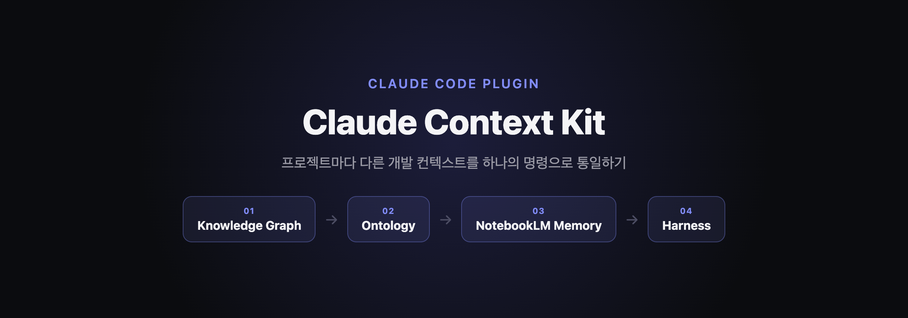

> 프로젝트마다 제각각인 개발 컨텍스트(하네스, 온톨로지, 메모리)를 매번 새로 세팅하는 게 귀찮아서, 프로젝트 구조에 맞춰 자동으로 구축해주는 Claude Code 플러그인을 만들었다.



## 들어가며

Claude Code로 여러 프로젝트를 오가며 작업하다 보면 매번 비슷한 고민을 하게 된다.

- 새 프로젝트를 시작할 때마다 Agent, Skill, 라우팅 규칙 같은 "하네스"를 처음부터 다시 세팅해야 한다.
- 프로젝트마다 구조가 제각각이라, A 프로젝트에서 만든 세팅을 B 프로젝트에 그대로 옮겨 쓸 수가 없다.
- 시간이 지나면 어떤 프로젝트에 어떤 세팅을 했는지조차 기억이 안 난다.

결국 "세팅 자체"가 매번 반복되는 잡무가 되어버렸다. 이 문제를 해결하고 싶어서, 프로젝트 구조를 스캔해서 그 프로젝트에 맞는 컨텍스트(코드 구조, 도메인 개념, 세션 기록, Agent Team)를 한 번의 명령으로 구축해주는 플러그인을 만들었다. 그게 **Claude Context Kit**이다.

## Claude Context Kit이란?

Claude Code 플러그인 형태로 배포되며, 아래 명령으로 설치한다.

```
/plugin marketplace add Lib0823/Claude_Context_Kit-Plugin
/plugin install devkit
```

설치 후 `/setup-all` 명령 하나로 4개 컴포넌트 중 필요한 것만 골라 세팅할 수 있다. 로컬 PC 환경(macOS/Windows)에서만 동작하며, Claude.ai 웹/모바일/데스크톱에서는 사용할 수 없다.

## 4가지 핵심 컴포넌트

| 컴포넌트 | 역할 | 기반 |
| --- | --- | --- |
| Knowledge Graph (graphify) | 코드 구조 분석·저장 (함수·클래스·호출관계) | graphify (PyPI) |
| Ontology | 개발 도메인 개념·관계 정의 + 시각화 UI | 자체 구현 (YAML + Cytoscape.js) |
| NotebookLM Memory (notebooklm) | 세션 간 히스토리 / RAG | notebooklm-mcp (MCP) |
| Harness (Agent Team) | 도메인별 Agent Team 생성 | revfactory/harness (Apache-2.0) |

각 컴포넌트는 독립적으로 선택 설치가 가능하다. 프로젝트 성격에 따라 4개를 다 쓸 수도, 필요한 것만 골라 쓸 수도 있다.

### 1. Knowledge Graph (graphify)

프로젝트의 함수·클래스·호출 관계를 분석해서 코드 구조 자체를 그래프로 저장한다. `graphify-out/graph.json`, `graph.html`로 산출되며, 코드가 바뀌면 다시 생성하면 되는 값이라 Git에는 올리지 않는다.

### 2. Ontology

프로젝트가 다루는 도메인의 개념과 관계를 YAML로 정의하고, Cytoscape.js 기반 뷰어로 시각화한다.

```
/ontology scan --scope backend        # 온톨로지 스캔
/ontology view                        # 뷰어 재생성 + 자동으로 열기
/ontology explain "Order"             # 특정 개체 설명
```

스캔 대상이 되는 도메인 자료(Java/SQL/Mapper/문서 등)는 프로젝트 루트의 `ontology_temp/` 폴더에 배치해야 하고, `.env`나 개인 키, 고객 데이터 같은 민감 파일은 절대 넣으면 안 된다. 결과물인 `ontology.yaml`은 Git에 커밋해서 프로젝트 자산으로 남긴다.

### 3. NotebookLM Memory (notebooklm)

notebooklm-mcp를 기반으로 세션 간 히스토리와 RAG 기능을 제공한다. Claude Code 세션이 끝나도 다음 세션에서 이전 맥락을 이어서 쓸 수 있게 해주는 역할이다.

### 4. Harness (Agent Team)

revfactory/harness(Apache-2.0)를 기반으로, 프로젝트 도메인에 맞는 Agent Team을 구성해준다. 산출물은 `.claude/agents`, `.claude/skills`에 저장되고 Git에 커밋한다.

## 4가지는 어떻게 연결되는가

네 컴포넌트는 각자 독립적으로 동작하지만, `/setup-all`로 함께 세팅하면 결국 하나의 계층 구조를 이룬다.

1. **Knowledge Graph**가 코드 수준의 사실(무엇이 무엇을 호출하는지)을 만든다.
2. **Ontology**는 그 위에 도메인 개념(무엇이 무엇을 의미하는지)을 얹는다.
3. **Harness의 Agent Team**은 작업할 때 이 온톨로지·그래프를 컨텍스트로 참고해서, 프로젝트 도메인에 맞는 방식으로 움직인다.
4. **NotebookLM Memory**는 세션이 바뀌어도 이 흐름이 끊기지 않도록, 이전 작업 기록을 다음 세션까지 이어준다.

즉 "코드가 뭘 하는지 → 그게 도메인적으로 뭘 의미하는지 → 그 의미에 맞게 누가 어떻게 작업할지 → 그 작업 기록을 다음에도 기억할지"까지 한 세트로 묶은 셈이다.

## 실제 사용법

```
/setup-all all                          # 4개 컴포넌트 전부 설치
/setup-all graphify,notebooklm          # 지정한 것만 설치
/setup-all ontology --scope fullstack   # scope 옵션 지정
/setup-all update                       # graph·ontology만 갱신
/setup-all                              # 인자 없이 실행하면 메뉴 제시
```

설치 전에는 PHASE 0 검증을 거친다. 알 수 없는 인자, 필요한 도구 미설치, `ontology_temp/` 폴더 부재 같은 경우는 여기서 걸러진다.

안전 관련해서 신경 쓴 부분도 있다.

- Harness를 다시 만들 때 기존 설정을 지우는 범위는 프로젝트 안의 `.claude/`로 한정된다. 전역 설정(`~/.claude/`)은 경로 검증을 거쳐도 절대 건드리지 않는다.
- `/setup-all update`는 graph·ontology만 갱신할 뿐, harness는 재구축하지 않는다. harness 재구축은 파괴적인 작업이라 명시적으로 다시 선택했을 때만 실행된다.

## 산출물 정리

| 산출물 | 위치 | Git 관리 |
| --- | --- | --- |
| 코드 그래프 | `graphify-out/graph.json`, `graph.html` | 무시 (재생성) |
| 온톨로지 원본 | `devkit/ontology.yaml` | 커밋 |
| 온톨로지 좌표 | `devkit/ontology.layout.json` | 커밋(선택) |
| 온톨로지 뷰어 | `devkit/ontology.html` | 선택 (재생성 가능) |
| Agent Team | `.claude/agents`, `.claude/skills` | 커밋 |
| 라우팅 규칙 | `CLAUDE.md` 최상단 | 커밋 |

## 마무리

결국 하고 싶었던 건 "프로젝트마다 매번 새로 세팅하는 하네스"를 "프로젝트 구조를 스캔해서 자동으로 맞춰주는 하네스"로 바꾸는 것이었다. Knowledge Graph, Ontology, NotebookLM Memory, Harness라는 4개 축을 독립적으로 쓸 수 있게 만들어서, 프로젝트 성격에 맞게 필요한 것만 골라 쓸 수 있게 했다.

## References

- [Claude_Context_Kit-Plugin (GitHub)](https://github.com/Lib0823/Claude_Context_Kit-Plugin)
