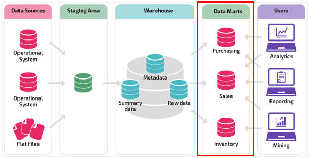
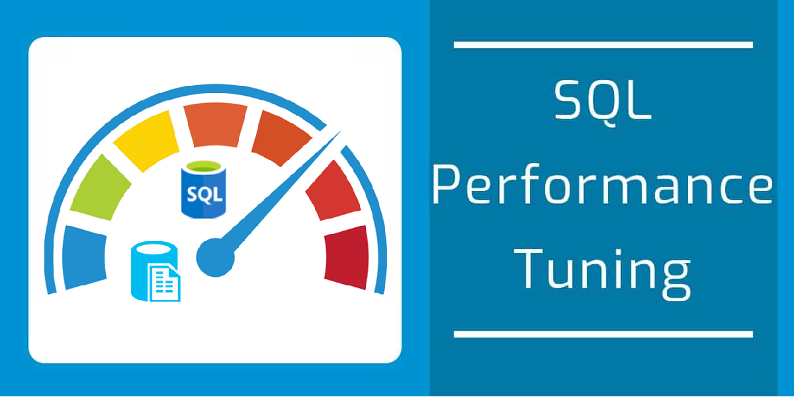

> 대량의 데이터 처리로 부하가 많은 기능에 대한 속도 개선을 위한 Database 성능 최적화 작업

프로젝트를 개발하다 보면 간단하게 처리할 수 있는 기능들도 있지만 매우 많은 양의 데이터를 복잡하게 처리해야 하는 기능들도 필요하다. (이런 시간/공간 복잡도가 높은 기능들을 잘 처리해야 프로젝트의 성능을 높일 수 있다!)

우선 어떤 부분에서 어느 로직이 문제인지 정확하게 파악하는게 중요한데 이 글에서 다루고자 하는 경우는 대량의 통계 데이터를 with, group by, join이 무분별하게 사용된 매우 복잡한 쿼리로 처리하다 보니 데이터베이스에서 데이터를 처리하는 속도가 매우 늦어져서 발생한 성능 이슈이다.

데이터베이스 성능 최적화에는 <u>인덱스 튜닝, 쿼리 최적화, 정규화/비정규화, 캐시 사용, 데이터 분할, 파티셔닝, 인메모리 처리</u> 등 매우 다양한 방법이 존재한다.

이러한 방법들을 활용하여 데이터베이스 조회 성능을 최적화 한 과정들을 정리했다.

#### [ 데이터베이스 성능 최적화 ]

### 1. Data Mart 추가하기

**Data Mart란?**

> AWS : 데이터 마트는 조직의 사업부와 관련된 정보를 포함하는 데이터 스토리지 시스템입니다. 여기에는 회사가 더 큰 스토리지 시스템에 저장하는 데이터의 일부만 포함됩니다. 기업은 데이터 마트를 사용하여 부서별 정보를 보다 효율적으로 분석합니다. 주요 이해 관계자가 정보에 입각한 결정을 신속하게 내리는데 사용할 수 있는 요약 데이터를 제공합니다.
> ChatGPT : 주로 특정 업무 부서나 기능 영역에서 필요로 하는 데이터에 대한 효율적인 접근을 제공하기 위해 설계됩니다.

데이터 마트란 보는 관점에 따라 다양하게 설명할 수 있지만 여기서 중요한 것은 특정 기능 영역에서 필요로 하는 데이터에 대한 효율적인 접근을 제공하기 위함이다.

즉, 특정 기능에서 데이터를 효율적으로 처리하기 위해 대량의 원본 데이터 저장소(Data Warehouse)에 직접 접근하는게 아닌 해당 기능을 위해 분리/가공된 데이터 저장소에 접근하여 실제 필요한 데이터에만 접근할 수 있게 하는 것이다.

데이터 마트를 추가함으로 써 <u>처리 데이터 수 감소와 필요 데이터를 미리 가공해 둘 수 있어 사용자가 실제 서비스를 사용할 때 훨씬 빠르고 적은 비용으로 데이터를 조회하여 제공할 수 있다.</u>

*그렇다고 무조건 다 가공하여 처리해 놓는건 오히려 자원관리 측면에서 좋지 않을 수 있으니 잘 판단해서 추가해야 한다.*

> **결과**: PostgreSQL 사용하였으며 따로 Mart 스키마에 필요 기능 별로 mart 테이블을 만들고, Batch 스케줄을 돌려 매일 새벽에 mart 데이터를 생성해두도록 하였다.

### 2. Data Mart를 기반으로 쿼리 튜닝하기

위의 첫번째 단계에서 Mart 데이터를 생성하였으니 기존과 같이 Data Warehouse에 직접 접근하여 데이터를 조회하는게 아닌 해당 기능의 필요한 데이터만 가공된 Data Mart에서 조회하면 되기 때문에 훨씬 쉽고 간단하며, Cost가 낮은 쿼리를 작성할 수 있다.

여기서 중요한 것은 Data Warehouse에서 Data Mart 데이터를 추출할 때 서비스에서 Data Mart에 있는 데이터를 조회할 때 어떻게 하면 비용을 최소화 할 수 있는지 고려하여 데이터를 가공해야 한다.

*(너무 세밀하게 가공해버리면 데이터를 조회할 때의 유연성이 떨어지기 때문에 서비스 기능에 대해 충분히 이해하고 적절한 수준으로 데이터를 만들어야 한다)*

> **결과**: 데이터 조회(select) 시 Cost를 많이 차지하는 With, Join, Group by절 등을 mart 데이터 생성 쿼리로 옮겨 사용자가 서비스에서 데이터를 조회할 때는 간단한 조건으로 Select 할 수 있도록 하였다.

### 3. 쿼리 분석하여 최적의 인덱스 생성하기

1, 2 단계에서 데이터와 쿼리를 최적화 했어도 Index를 어디에 어떻게 걸어주느냐에 따라 데이터 조회 성능의 차이가 크다.

인덱스 추가 방법에 대해서는 이 글에 자세하게 나와있으니 참고하면 된다.

[https://inbeom.tistory.com/entry/PostgreSQL-Postgre%EC%97%90%EC%84%9C-%EC%9D%B8%EB%8D%B1%EC%8A%A4-%EC%82%AC%EC%9A%A9%ED%95%98%EB%8A%94-%EB%B0%A9%EB%B2%95](https://inbeom.tistory.com/entry/PostgreSQL-Postgre%EC%97%90%EC%84%9C-%EC%9D%B8%EB%8D%B1%EC%8A%A4-%EC%82%AC%EC%9A%A9%ED%95%98%EB%8A%94-%EB%B0%A9%EB%B2%95)

> Data Mart 추가, 쿼리 튜닝, 인덱스 튜닝까지 하고 나면 데이터베이스 성능이 많이 향상 될 것이다.
> (조회 속도를 약 1.5 ~ 10배까지 개선하고 Cost도 평균 2배 이상 낮출 수 있었다!!!)

*- 끝 -*
