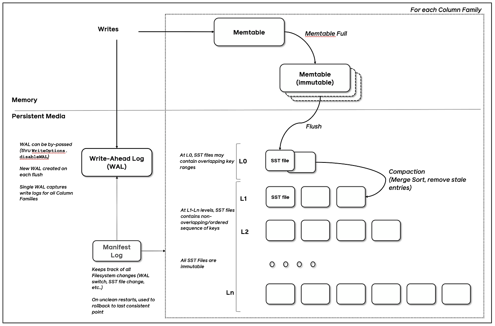

> Meta가 개발한 LSM-Tree 기반의 Key-Value 스토어.
> 빠른 쓰기 성능과 디스크 영속성을 동시에 챙긴다.

## 1. RocksDB란?

백엔드 개발을 하다 보면 데이터를 어디에 저장할지 고민할 때 선택지가 보통 이렇게 나뉜다.

| **구분** | **대표 제품** | **특징** |
| --- | --- | --- |
| **RDB** | PostgreSQL, MySQL | 정형 데이터, 트랜잭션, 디스크 저장 |
| **Memory DB** | Redis, Memcached | 초고속, 휘발성(기본), 메모리 한계 |
| **RocksDB** | RocksDB | 빠른 쓰기, 디스크 영속성, Key-Value |

RocksDB는 Redis처럼 빠르지만, PostgreSQL처럼 디스크에 저장된다.

2013년 Facebook이 내부 스토리지 엔진으로 개발했고, 현재는 오픈소스로 공개되어

**Apache Kafka, TiKV, CockroachDB** 등 수많은 유명 시스템의 내부 스토리지 엔진으로 사용되고 있다.

> 실제로 Kafka의 로그 스토리지, TiDB의 내부 KV 스토어가 RocksDB 기반이다.

---

## 2. 핵심 이론 개념

### 2-1. LSM-Tree (Log-Structured Merge-Tree)

RocksDB의 핵심 자료구조다. 일반 RDB가 B-Tree를 쓰는 것과 대조적이다.

**B-Tree vs LSM-Tree 비교**

| **구분** | **B-Tree (PostgreSQL 등)** | **LSM-Tree (RocksDB)** |
| --- | --- | --- |
| **쓰기** | 느림 (랜덤 I/O) | 빠름 (순차 I/O) |
| **읽기** | 빠름 | 상대적으로 느림 |
| **구조** | 정렬된 트리, 제자리 수정 | 불변 파일 + 병합 |
| **적합한 경우** | 읽기 많은 워크로드 | 쓰기 많은 워크로드 |

**LSM-Tree 쓰기 동작 흐름:**

```
[Write 요청]
     ↓
[1. WAL (Write Ahead Log) 기록] ← 장애 복구용
     ↓
[2. MemTable (메모리 버퍼)에 기록] ← 정렬된 구조(Skip List)
     ↓
[3. MemTable이 가득 차면 → SSTable(디스크)로 flush]
     ↓
[4. 백그라운드 Compaction으로 SSTable 병합/정리]
```

랜덤 위치에 데이터를 수정하는 B-Tree와 달리,

LSM-Tree는 **항상 순차적으로 append**하기 때문에 쓰기가 극도로 빠르다.

---

### 2-2. MemTable

메모리에 존재하는 쓰기 버퍼다. 내부적으로 **Skip List** 구조로 정렬을 유지한다.

MemTable이 일정 크기를 초과하면 **Immutable MemTable**이 되고, 디스크로 flush된다.

```
[Active MemTable]  ←  새로운 쓰기
[Immutable MemTable]  →  flush 대기 중
[SSTable (L0)]  →  디스크에 저장된 파일
```

---

### 2-3. SSTable & Compaction

SSTable(Sorted String Table)은 **정렬된 Key-Value 파일**이다.

Flush될 때마다 새 SSTable이 생기기 때문에, 주기적으로 **Compaction**이 필요하다.

**Compaction이 하는 일:**

```
[L0: SSTable-1] [L0: SSTable-2] [L0: SSTable-3]
        ↓ Compaction (병합 + 중복/삭제 제거)
[L1: 더 큰 SSTable]
        ↓ Compaction
[L2: 더 큰 SSTable]
```

Compaction 덕분에 오래된 버전 데이터, 삭제된 데이터(Tombstone)가 정리된다.

단, Compaction은 CPU/디스크 I/O를 소모하는 **Write Amplification**의 원인이기도 하다.

---

### 2-4. Column Family

RocksDB는 하나의 DB 안에서 **Column Family(CF)** 단위로 데이터를 분리할 수 있다.

RDB의 테이블과 비슷한 개념이지만, 스키마가 없는 Key-Value 공간이다.

```
RocksDB Instance
├── Column Family: "default"
├── Column Family: "user_session"
└── Column Family: "access_log"
```

각 CF는 독립적인 MemTable, SSTable을 가지므로

데이터 특성에 따라 설정을 다르게 줄 수 있다.



> <u>RocksDB의 계층 구조는 우연이 아니라 하드웨어 설계 원칙을 의도적으로 소프트웨어에 적용한 것이다.</u>
>
> **CPU 데이터 탐색** : Register → L1 → L2 → L3 Cache → RAM → Disk
>
> **RocksDB 데이터 탐색** : MemTable → Immutable MemTable → L0 → L1 → Ln
>
> 이는 **참조 지역성(Locality of Reference)** 원칙, 즉 "최근에 접근한 데이터는 곧 다시 접근할 가능성이 높다"는 하드웨어에서 검증된 개념을 그대로 차용한 것이다. 성능을 극대화하려면 결국 하드웨어가 동작하는 방식에 맞게 소프트웨어를 설계해야 하기 때문이다.

---

## 3. 실제 활용과 장단점

### 언제 RocksDB를 쓸까?

| **상황** | **이유** |
| --- | --- |
| **쓰기가 읽기보다 훨씬 많은 경우** | LSM-Tree의 순차 I/O 강점 |
| **대용량 데이터를 디스크에 영속 저장해야 할 때** | Redis보다 저렴하게 대용량 처리 |
| **메모리가 충분하지 않은 환경** | 디스크 기반이라 메모리 한계 없음 |
| **Kafka 같은 시스템의 내부 스토리지** | 로그성 데이터, append-only 패턴 |

### ✅ 장점

- **쓰기 성능이 극도로 빠름**: 초당 수백만 건 write도 처리 가능
- **디스크 영속성**: 재시작해도 데이터 유지 (Redis AOF보다 효율적)
- **압축 지원**: Snappy, LZ4, Zstd 등으로 디스크 사용량 절감
- **Column Family**: 논리적 데이터 분리 가능
- **Fine-grained 설정**: MemTable 크기, Compaction 전략 등 세밀한 튜닝

### ❌ 단점

- **읽기 성능은 Redis보다 느림**: 여러 레벨의 SSTable을 탐색해야 함
- **Write Amplification**: Compaction 과정에서 실제로 여러 번 데이터가 쓰임
- **SQL 없음**: 복잡한 쿼리 불가, 단순 Key-Value 조회만 가능
- **트랜잭션 제한적**: ACID 트랜잭션을 RDB 수준으로 지원하지 않음
- **운영 복잡도**: Compaction 튜닝, 메모리 관리 등 학습 비용 존재

### ⚠️ Redis와 헷갈리지 말자

```
Redis:  빠름 + 메모리 기반 + 데이터 크기 제한 + TTL 기반 캐시에 최적
RocksDB: 빠름 + 디스크 기반 + 대용량 가능 + 영속 스토리지에 최적
```

Redis를 캐시로 쓰고, 그 뒤에 RocksDB를 영속 레이어로 두는 구조도 실무에서 사용된다.

---

## 4. Spring Boot 코드 예시

### 4-1. 의존성 추가

```xml
<!-- pom.xml -->
<dependency>
    <groupId>org.rocksdb</groupId>
    <artifactId>rocksdbjni</artifactId>
    <version>9.2.1</version>
</dependency>
```

---

### 4-2. RocksDB 설정 Bean 등록

```java
@Configuration
public class RocksDBConfig {

    @Value("${rocksdb.path:/data/rocksdb}")
    private String dbPath;

    @Bean(destroyMethod = "close")
    public RocksDB rocksDB() throws RocksDBException {
        RocksDB.loadLibrary();

        Options options = new Options()
                .setCreateIfMissing(true)
                .setWriteBufferSize(64 * 1024 * 1024L)   // MemTable 크기: 64MB
                .setMaxWriteBufferNumber(3)                // MemTable 최대 개수
                .setCompressionType(CompressionType.LZ4_COMPRESSION); // 압축

        // DB 경로 디렉터리 생성
        new File(dbPath).mkdirs();

        return RocksDB.open(options, dbPath);
    }
}
```

---

### 4-3. Repository 구현

```java
@Repository
@RequiredArgsConstructor
public class RocksDBRepository {

    private final RocksDB rocksDB;

    /**
     * 데이터 저장
     */
    public void put(String key, String value) throws RocksDBException {
        rocksDB.put(
            key.getBytes(StandardCharsets.UTF_8),
            value.getBytes(StandardCharsets.UTF_8)
        );
    }

    /**
     * 데이터 조회
     */
    public Optional<String> get(String key) throws RocksDBException {
        byte[] valueBytes = rocksDB.get(key.getBytes(StandardCharsets.UTF_8));
        if (valueBytes == null) {
            return Optional.empty();
        }
        return Optional.of(new String(valueBytes, StandardCharsets.UTF_8));
    }

    /**
     * 데이터 삭제
     */
    public void delete(String key) throws RocksDBException {
        rocksDB.delete(key.getBytes(StandardCharsets.UTF_8));
    }

    /**
     * 배치 쓰기 (WriteBatch) - 대량 처리 시 성능 극대화
     */
    public void batchPut(Map<String, String> entries) throws RocksDBException {
        try (WriteBatch batch = new WriteBatch()) {
            for (Map.Entry<String, String> entry : entries.entrySet()) {
                batch.put(
                    entry.getKey().getBytes(StandardCharsets.UTF_8),
                    entry.getValue().getBytes(StandardCharsets.UTF_8)
                );
            }
            rocksDB.write(new WriteOptions(), batch);
        }
    }
}
```

---

### 4-4. Column Family 활용

```java
@Configuration
public class RocksDBColumnFamilyConfig {

    @Bean(destroyMethod = "close")
    public RocksDB rocksDBWithCF() throws RocksDBException {
        RocksDB.loadLibrary();

        // Column Family 정의
        List<ColumnFamilyDescriptor> cfDescriptors = List.of(
            new ColumnFamilyDescriptor(RocksDB.DEFAULT_COLUMN_FAMILY),
            new ColumnFamilyDescriptor("user_session".getBytes()),
            new ColumnFamilyDescriptor("access_log".getBytes())
        );

        List<ColumnFamilyHandle> cfHandles = new ArrayList<>();

        DBOptions dbOptions = new DBOptions()
                .setCreateIfMissing(true)
                .setCreateMissingColumnFamilies(true);

        return RocksDB.open(dbOptions, "/data/rocksdb", cfDescriptors, cfHandles);
    }
}
```

---

### 4-5. 실제 서비스 활용 예시 - 대용량 이벤트 로그 저장

```java
@Service
@RequiredArgsConstructor
@Slf4j
public class EventLogService {

    private final RocksDBRepository rocksDBRepository;
    private final ObjectMapper objectMapper;

    /**
     * 이벤트 로그 저장
     * key: "event:{userId}:{timestamp}"
     * value: JSON 직렬화된 이벤트 데이터
     */
    public void saveEventLog(String userId, EventLog eventLog) {
        String key = buildKey(userId, eventLog.getTimestamp());
        try {
            String value = objectMapper.writeValueAsString(eventLog);
            rocksDBRepository.put(key, value);
        } catch (Exception e) {
            log.error("이벤트 로그 저장 실패. userId={}, timestamp={}",
                userId, eventLog.getTimestamp(), e);
            throw new RuntimeException("이벤트 로그 저장 실패", e);
        }
    }

    /**
     * 배치로 대량 이벤트 저장 (WriteBatch 활용)
     */
    public void saveEventLogBatch(List<EventLog> eventLogs) throws RocksDBException {
        Map<String, String> entries = new HashMap<>();
        for (EventLog eventLog : eventLogs) {
            try {
                String key = buildKey(eventLog.getUserId(), eventLog.getTimestamp());
                String value = objectMapper.writeValueAsString(eventLog);
                entries.put(key, value);
            } catch (JsonProcessingException e) {
                log.error("직렬화 실패: {}", eventLog, e);
            }
        }
        rocksDBRepository.batchPut(entries);
        log.info("{}건 이벤트 배치 저장 완료", entries.size());
    }

    private String buildKey(String userId, long timestamp) {
        return String.format("event:%s:%d", userId, timestamp);
    }
}
```

---

## 5. 정리

### 핵심 포인트

| **구분** | **설명** |
| --- | --- |
| **자료구조** | LSM-Tree → 쓰기에 최적화 |
| **저장 위치** | 디스크 기반, 영속성 보장 |
| **쓰기 방식** | WAL → MemTable → SSTable (순차 I/O) |
| **데이터 구조** | Key-Value (스키마 없음) |
| **경쟁 대상** | Redis(속도) + PostgreSQL(영속) 사이 |

### ✅ RocksDB를 선택할 때

- 초당 수만 건 이상의 **대량 쓰기**가 필요할 때
- 데이터가 너무 커서 Redis 메모리에 다 올릴 수 없을 때
- **디스크에 영속** 저장해야 하지만 SQL은 필요 없을 때
- Kafka, TiDB처럼 **내부 스토리지 엔진**으로 쓸 때

### ❌ RocksDB가 맞지 않는 경우

- 복잡한 JOIN, 집계 쿼리가 필요한 경우 → PostgreSQL
- 단순 캐시 용도, 데이터 크기가 작은 경우 → Redis
- ACID 트랜잭션이 중요한 비즈니스 로직 → PostgreSQL

## 마무리

- RocksDB는 "빠른 쓰기 + 디스크 영속성"이라는 두 마리 토끼를 잡은 엔진이다.
- Redis처럼 모든 걸 메모리에 올릴 수 없고, PostgreSQL처럼 복잡한 쿼리가 필요 없는 대용량 로그, 이벤트 스트림, 시계열 데이터 같은 상황에서 탁월한 선택이 된다.
- 직접 서비스에 붙여 쓰기보다 Kafka, TiKV 같은 시스템 안에서 이미 쓰이고 있는 경우가 많으니, 이 엔진의 원리를 이해하면 해당 시스템들의 동작 방식도 더 명확하게 보일 것이다.

## Reference

- [RocksDB GitHub](https://github.com/facebook/rocksdb)
- [RocksDB Wiki](https://github.com/facebook/rocksdb/wiki)
- [RocksJava API](https://javadoc.io/doc/org.rocksdb/rocksdbjni/latest/index.html)
