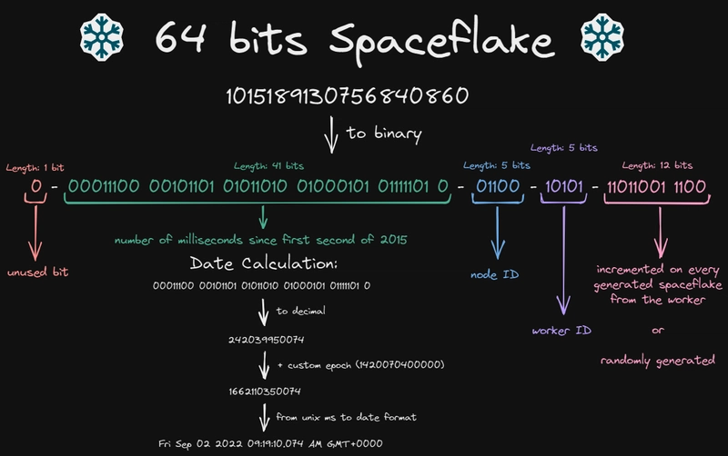

> 관계형 데이터베이스를 설계할 때 PK를 어떤 값을 지정해야 할지 항상 고민될 것이다. 대규모 트랜잭션 환경에서 유리한 단일 PK 전략을 세우기 위해 snowflake 알고리즘을 알아보자



## 1. 왜 Snowflake 알고리즘을 써야 할까?

대규모 분산 서버 환경에서 고유한 ID를 생성하는 건 꽤 까다로운 문제다.

기존에는 DB의 **AUTO\_INCREMENT** 기능에 의존해 ID를 생성했는데, 이 방식은 **DB에 부하가 집중**되어 트래픽이 몰리면 병목 현상이 발생할 수 있다.

즉, DB 락 경합으로 인해 전체 서비스가 느려지거나 심지어 중단될 위험도 있다.

또한, **UUID** 같은 랜덤 ID를 사용하면 고유성은 보장되지만, ID가 길고 무작위라서 인덱싱 효율이 떨어지고 조회 성능도 저하된다.

이처럼 단일 DB 의존, 성능 저하, 확장성 문제 등 기존 ID 생성 방식은 분산 환경에서 한계가 분명했다.

#### **❄️Snowflake가 답이다!**

Snowflake 알고리즘은 이런 문제를 해결하기 위해 <u>트위터에서 만든 분산 ID 생성 알고리즘</u>이다.

- 각 서버가 독립적으로 중복 없이 고유 ID를 생성할 수 있다.
- ID는 **시간 기반**으로 순차 증가해 인덱스 효율을 높여준다.
- 서버마다 고유한 worker ID를 포함해 중복 발생을 방지한다.
- DB 의존성을 줄여 서비스 확장성과 안정성을 높인다.

대규모 분산 시스템, 특히 게임서버, 대용량 트랜잭션 처리에 최적화된 ID 생성 방식이라고 할 수 있다.

---

## 2. Snowflake 알고리즘이란?

Snowflake 알고리즘은 64비트 정수를 만들어내는 방식으로, 이 정수는 크게 4부분으로 구성된다.

| **구성** | **bit** | **설명** |
| --- | --- | --- |
| 부호 비트 | 1 | 항상 0 (양수) |
| 타임스탬프 | 41 | 기준 시점(epoch)부터 경과한 밀리초 |
| 워커 ID (서버 식별자) | 10 | 분산 서버 고유 ID (data center ID 포함) |
| 시퀀스 번호 | 12 | 같은 밀리초 내 순번, 최대 4096개 생성 가능 |

### 핵심 내용

- **시간 기반**이라 ID가 생성된 순서대로 정렬된다.
- 서버 고유 ID(Worker ID)를 넣어 여러 서버가 동시에 생성해도 중복이 없다.
- 초당 수천~수만 건의 ID를 생성해도 안전하다.
- **서버 간 시간 동기화**가 중요하며, UTC 기준으로 맞춰야 한다.

### 사용 시 주의점 ⚠️

- 서버 시간이 뒤로 돌아가면 중복이나 오류가 발생할 수 있으니, 시간 동기화(NTP)를 꼭 해야 한다.
- 한 밀리초 안에 4096개 이상 생성 요청이 들어오면 잠시 대기하는 로직이 필요하다.
- Worker ID는 운영자가 명확히 관리해 중복을 막아야 한다.

Snowflake는 **시간, 서버, 시퀀스**를 적절히 조합해 분산 환경에서 <u>안전하고 빠른 고유 ID를 만들어 내는 매우 실용적인 알고리즘</u>이다.

---

## 3. Snowflake 알고리즘 사용 방법

Snowflake 알고리즘을 사용하기 위해서는 몇 가지 기본 설정이 필요하다.

먼저, **기준 시간**이 있는데 보통 <u>1970년 1월 1일 UTC 기준</u>을 사용한다. 이 시점부터 <u>밀리초 단위로 경과한 시간을 ID에 포함시켜 생성</u>한다.

그리고 <u>각 서버에 고유한 **Worker ID**를 부여</u>해야 하는데, 여러 서버가 동시에 ID를 생성해도 중복이 발생하지 않도록 하기 위함이다.

또한 <u>같은 밀리초 내에서 여러 개의 ID가 생성될 수 있기 때문에, **시퀀스 번호**를 관리</u>하여 고유성을 유지하게 된다.

서버가 많아질수록 Worker ID 관리가 더욱 중요해지며, 모든 서버는 반드시 UTC 시간으로 동기화되어 있어야 한다.

#### Java에서 Hutool 라이브러리를 사용한 SnowFlake 구현

```java
import cn.hutool.core.util.IdUtil;
import cn.hutool.core.lang.Snowflake;

public class SnowflakeExample {
    public static void main(String[] args) {
        // 데이터센터 ID = 1, 워커 ID = 1
        Snowflake snowflake = IdUtil.getSnowflake(1, 1);

        // 고유 ID 생성
        long id = snowflake.nextId();
        System.out.println("생성된 Snowflake ID: " + id);
    }
}
```

---

## 4. Snowflake 알고리즘 장단점 ✅

#### **장점**

**RDB 시퀀스는 ID 생성을 위해 추가 조회가 필요**하고 성능에 한계가 있지만, Snowflake는 애플리케이션 내에서 조회 없이 고속으로 고유 ID를 생성할 수 있어 대량 데이터 처리에 유리하다.

- 시간 기반으로 순차적으로 증가하기 때문에 <u>인덱스 효율</u>이 높고 조회 성능이 좋다.
- 64비트(Long 타입) 숫자를 사용하여 <u>저장 공간이 효율적</u>이고, 시간 기준 조회가 용이하다.
- 서버가 늘어나더라도 Worker ID만 잘 관리하면 쉽게 확장이 가능하다.
- 단일 PK로 사용할 수 있어 <u>테이블 간 조인 최적화</u>, 인덱스 관리 단순화 등이 가능하다.

#### **단점**

- 서버 시간 동기화가 필수이므로, 시계가 어긋나면 문제가 발생할 수 있다.
- 시퀀스 번호가 밀리초 당 약 4096개로 제한되어 있어, 한꺼번에 너무 많은 ID를 생성하면 대기 현상이 발생할 수 있다.
- Worker ID 관리가 운영 측면에서 까다로울 수 있다.

---

## 5. 실제 활용 사례

Snowflake 알고리즘은 특히 대규모 분산 환경에서 많이 활용된다.

예를 들어, MMORPG와 같은 대형 게임 서버에서는 <u>수많은 유저와 아이템에 대해 **고유한 ID**를 빠르고 중복 없이 생성</u>해야 한다. Snowflake는 이런 환경에서 효율적인 PK 관리를 가능하게 한다.

또한, 빅데이터 처리 시스템이나 SNS, 메신저 서비스 등 트래픽이 집중되는 곳에서도 안정적인 ID 생성과 데이터 삽입을 지원한다.

특히 <u>메모리에 ID를 미리 생성해 두고, 대량의 데이터를 한 번에 DB에 넣는 **Bulk insert** 방식과 결합</u>하면 데이터 삽입 성능을 크게 개선할 수 있다.

---

## 6. 운영 시 주의 사항 ⚠️

Snowflake 알고리즘을 운영할 때는 몇 가지 중요한 점을 반드시 유념해야 한다.

1. 서버의 시간이 반드시 **UTC 기준**으로 동기화되어 있어야 하며, 시간 오차가 발생하지 않도록 관리해야 한다.
2. 각 서버에 부여하는 **Worker ID가 중복**되지 않도록 철저히 관리해야 하며, **동시성 제어**도 신경 써야 한다.
3. 대량 데이터를 삽입할 때는 한꺼번에 너무 큰 단위로 처리하기보다는 적절한 배치 크기로 나누어 처리하는 것이 좋다.
4. 시퀀스 락이나 동시성 문제로 인해 타임스탬프나 시퀀스 번호가 꼬이는 경우를 대비한 예외 처리도 필요하다.

---

## 7. 결론 요약

Snowflake 알고리즘은 분산 서버 환경에서 안전하고 효율적으로 고유 ID를 생성하는 최적의 방법이다.

- 여러 서버가 동시에 DB 부하 없이 중복 없는 ID 생성 가능
- 시간 순서대로 ID가 생성되어 인덱스 성능 향상
- 서버 시간 동기화와 Worker ID 관리가 핵심 요소
- 대규모 게임, 빅데이터, SNS 등 고트래픽 환경에 적합
- 메모리 버퍼와 bulk insert 활용 시 삽입 성능 극대화

> 분산 시스템이나 대규모 트래픽 환경, 빅데이터 서비스에서 안정적이고 효율적인 PK 관리가 필요하다면, Snowflake 알고리즘 도입을 적극 고려하는 것도 좋을 것 같다.
