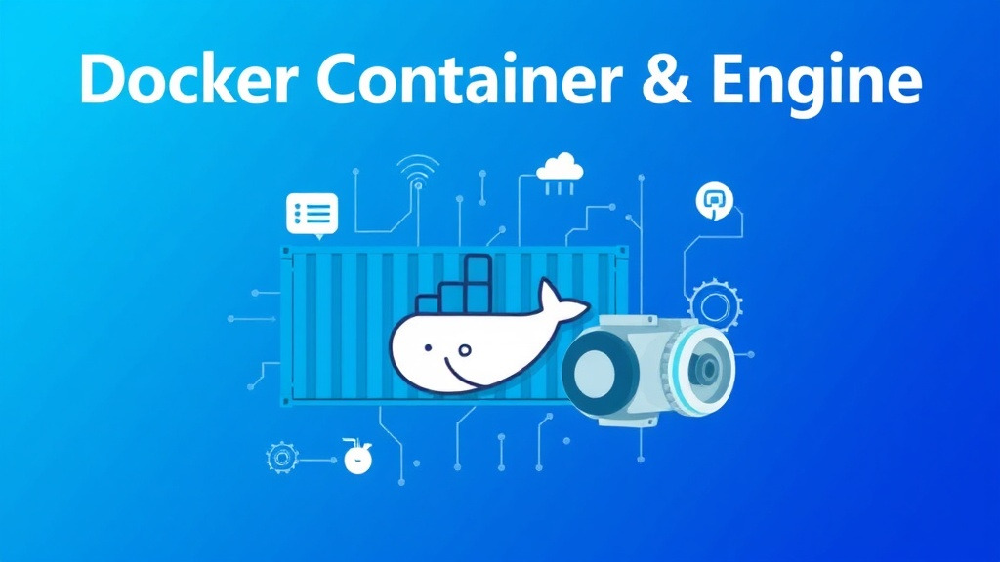
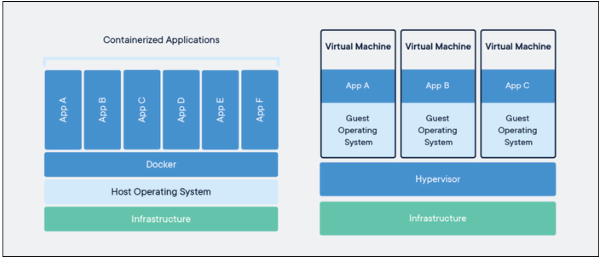
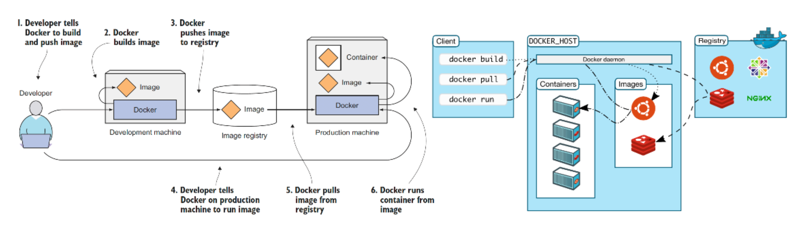
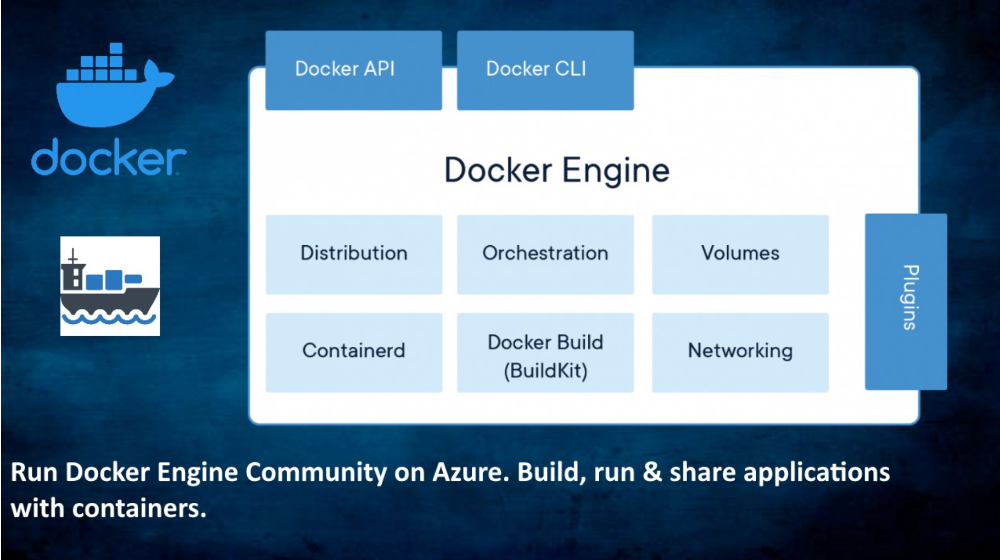
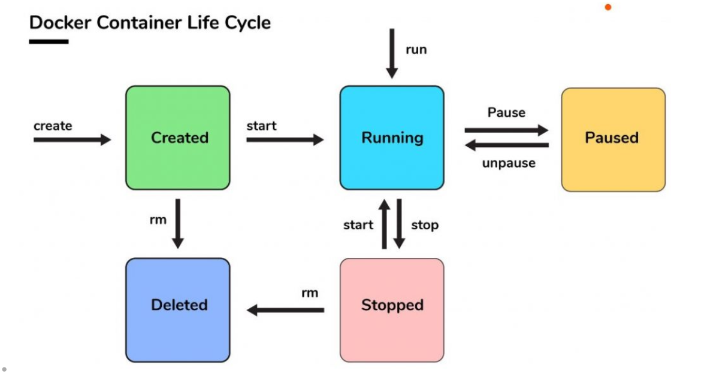

> Docker의 Container에 대한 기본 개념과 Docker Engine의 내부 동작 방식



## 모던 웹개발에서 Docker가 왜 필요한가?

### **해결하고자 하는 문제**

#### 1. 초창기 컴퓨팅 환경의 한계

1960~70년대 컴퓨터는 한 대의 기계가 하나의 애플리케이션만 실행하는 구조였다. **프로세스(Process)**는 프로그램의 실행 인스턴스로, CPU·메모리 등 자원을 할당받아 실행되며, **커널(Kernel)**이 이를 관리했다.

하지만 여러 사용자가 동시에 자원을 쓰기 시작하면서 문제가 발생했다.

- 특정 프로그램이 CPU·메모리를 과도하게 점유 → 다른 사용자 프로그램까지 영향을 줌
- 애플리케이션 오류가 OS까지 확산 → 전체 시스템 중단 발생

즉, 자원을 공유하되 안전하게 격리할 방법이 필요해졌다.

#### 2. 웹 서비스 시대와 자원 관리의 중요성

웹 애플리케이션은 클라이언트-서버 구조로 동작한다.

- 웹 서버, 애플리케이션 서버, DB 서버가 유기적으로 연결되어 서비스 제공
- 서비스 장애 발생 시 비즈니스에 직접적인 타격 발생

따라서 자원을 효율적으로 나누고 관리하는 기술이 필수적이었다.

#### 3. 가상화(Virtualization)의 등장

이 문제를 해결하기 위해 등장한 것이 **가상화(Virtualization)** 이다.

- **VM (Virtual Machine)**: 하나의 물리 서버 위에 여러 개의 가상 운영체제를 올려 독립 실행 가능
- **하이퍼바이저(Hypervisor)**: 물리 하드웨어와 VM 사이에서 자원을 분배하고 격리하는 중재자 역할

이를 통해 얻은 장점:

- 여러 운영체제를 동시에 실행 가능
- 보안성 높은 격리 환경 제공
- 자원 활용 최적화와 비용 절감
- 테스트/마이그레이션/재해 복구 등 유연한 인프라 관리 가능

하지만 VM은 운영체제 단위로 격리하기 때문에 무겁고 느리며 자원 낭비가 크다는 단점이 있었다.

#### 4. 컨테이너(Container)의 등장

VM의 무거운 구조를 개선하기 위해 나온 기술이 **컨테이너(Container)** 이다.

- 컨테이너는 **호스트 OS의 커널을 공유**하면서, 애플리케이션과 실행 환경만 독립적으로 격리
- VM보다 훨씬 가볍고 빠르게 실행 가능
- 애플리케이션 환경을 표준화된 형태로 패키징하여 어디서나 동일하게 실행

> **[ 요약 정리 ]**
> Docker는 컨테이너를 쉽고 강력하게 사용할 수 있도록 만든 플랫폼으로 다양한 문제를 해결했다.
> 1. **환경 불일치 문제** : 이미지 기반 실행으로 개발·테스트·운영 <u>환경을 동일하게 유지</u>
> 2. **격리와 보안** : 애플리케이션마다 <u>독립적인 실행 공간</u> 제공
> 3. **효율성** : VM 대비 <u>자원 소모가 적고 실행 속도가 빠름</u>
> 4. **운영 자동화** : CI/CD, DevOps 환경에 최적화되어 <u>신속한 배포·확장</u> 가능

### **컨테이너에 대하여**

#### 1. 컨테이너란?

컨테이너는 애플리케이션을 실행하는 데 필요한 **코드, 런타임, 시스템 도구, 라이브러리, 설정** 등을 포함한 **경량의 독립 실행 환경**이다.

- VM(가상 머신)과 달리, **운영체제 수준(OS-level)에서 격리**된다.
- 하나의 리눅스 커널 위에서 여러 개의 독립된 사용자 공간(User Space)을 실행할 수 있다.
- 이 덕분에 컨테이너는 **가볍고 빠르며 이식성이 뛰어난 실행 단위**가 된다.

즉, 컨테이너는 “개발 → 배송 → 배포”를 위한 표준화된 단위이다. (Docker 공식 정의)

#### 2. VM과 컨테이너의 차이

- **VM**: 애플리케이션 실행을 위해 하이퍼바이저 위에서 OS 전체를 가상화 → 무겁고 자원 소모 큼.
- **컨테이너**: **호스트 OS의 커널을 공유**하면서 격리된 환경을 제공 → 훨씬 가볍고 빠름.

VM은 “운영체제 단위 가상화”, 컨테이너는 “프로세스 단위 격리”라고 이해할 수 있다.



#### 3. 컨테이너를 가능하게 한 리눅스 핵심 기술

**(1) Cgroups (Control Groups)**

- 역할: **자원 할당 및 제한**
- CPU, 메모리, 네트워크 대역폭 등 시스템 자원을 컨테이너별로 제한하고 모니터링한다.
- 특정 컨테이너가 자원을 과도하게 사용해도 다른 컨테이너나 전체 시스템에 영향을 주지 않도록 제어.
- 예시: cpu.shares 파라미터를 통해 특정 컨테이너의 CPU 점유율 제한 가능.

**(2) Namespace**

- 역할: **프로세스 격리**
- 프로세스마다 독립된 시스템 뷰를 제공.
- 파일 시스템, 네트워크, 사용자 ID, 호스트 이름 등을 컨테이너별로 분리.
- 예시: PID 네임스페이스를 사용하면 각 컨테이너는 자신만의 프로세스 번호 공간(PID 1부터 시작)을 가짐. → 마치 전체 시스템에서 유일한 프로세스로 동작하는 것처럼 보이게 함.

**Cgroups + Namespace** = 컨테이너 격리 기술의 핵심.

#### 4. 컨테이너의 장점

- **경량성**: OS 전체를 포함하지 않으므로 VM보다 빠르고 효율적.
- **격리성**: 독립 실행 환경 제공, 보안성과 안정성 향상.
- **이식성**: “어디서 실행하든 동일하게 동작” → 개발·테스트·운영 환경 차이를 줄임.
- **효율성**: 자원 낭비가 적고, 서버 집약도가 높아 클라우드 환경에 적합.
- **자동화 최적화**: CI/CD 및 DevOps 파이프라인과 결합하여 배포 속도 및 확장성 극대화.

> **[ 요약 정리 ]**
> - 컨테이너는 <u>VM보다 가볍고, OS 커널을 공유</u>하면서 애플리케이션을 격리해 실행하는 표준 단위다.
> - 리눅스의 Cgroups와 Namespace 기술을 활용해 <u>자원 관리와 보안을 보장</u>한다.
> - Docker는 이러한 컨테이너를 손쉽게 만들고 배포·운영할 수 있는 <u>대표 플랫폼</u>이다.

---

## Docker 기본 개념과 구조



### **⚙️ Docker Engine**

Docker Engine은 컨테이너를 생성·실행·관리하기 위한 클라이언트-서버 애플리케이션이며, 세 가지 주요 구성 요소로 이루어져 있다.



**1. 도커 데몬 (Docker Daemon)**

- 백그라운드 프로세스로 동작.
- 컨테이너의 **생성, 실행, 중지** 등 생명주기를 관리.
- 이미지 빌드 및 가져오기, 네트워크 설정, 저장소 연동 담당.
- REST API를 통해 클라이언트 명령을 수신·처리.

**2. REST API**

- 도커 데몬과 상호작용하기 위한 인터페이스.
- 클라이언트가 컨테이너 관리, 배포, 확장 **명령을 전달하는 통로** 역할.

**3. CLI (Command Line Interface) 클라이언트**

- 사용자가 명령어를 입력해 **도커 데몬을 제어하는 인터페이스**.
- 이미지 빌드, 컨테이너 실행·관리, Docker Hub와 같은 이미지 저장소와 연동 가능.

### **동작 방식**

도커 엔진은 **컨테이너의 생명 주기 관리**를 중심으로 동작하며, 기본 과정은 다음과 같다.

#### 1. 이미지 다운로드/빌드

- 컨테이너 실행 전, 필요한 **도커 이미지** 확보.
- 도커 허브·레지스트리에서 다운로드하거나 Dockerfile로 직접 빌드.

#### 2. 컨테이너 생성

- 이미지 기반으로 새로운 컨테이너 인스턴스 생성.
- 네트워크, 볼륨 마운트, 환경 변수 등 추가 옵션 설정 가능.

#### 3. 컨테이너 실행

- 도커 데몬이 컨테이너 내부에서 애플리케이션 실행.
- 독립된 파일 시스템, 네트워크, PID 공간을 제공 → **호스트와 격리된 환경** 보장.

#### 4. 컨테이너 관리

- 실행 중인 컨테이너 모니터링 및 관리.
- CLI/API를 통해 **조회, 로그 확인, 중지, 재시작, 삭제** 가능.

#### 5. 자원 관리

- Linux의 **Cgroups**와 **네임스페이스**를 활용.
- 컨테이너 자원 사용량 제한 및 격리 → 시스템 안정성 보장.

> **[ 용어 정리 ]**
> - **Docker Image** : 컨테이너 실행을 위한 소스 코드, 라이브러리, 환경변수, 설정 파일 등을 포함하는 <u>불변의 템플릿</u>
> - **Docker Container** : 격리된 환경에서 가볍고 빠르게 애플리케이션을 실행하기 위한 도커 <u>이미지의 실행 인스턴스</u>
> - **Dockerfile** : 도커 이미지를 자동 빌드하기 위한 기본 이미지, 실행 명령어 등의 내용을 작성하는 <u>스크립트 파일</u>
> - **Docker Hub** : 도커 이미지를 관리하기 위한 클라우드 기반 <u>공식 이미지 저장소</u>
> - **Docker Registry** : 조직 내부 환경에서 <u>프라이빗 이미지 저장소</u> 구축을 위한 응용 프로그램

---

### **Docker 기본 명령어**

Docker는 공식 페이지에 내용이 잘 정리되어 있기 때문에 여기서 필요한 명령어들을 찾을 수 있는데 명령어가 매우 많다 보니 기본적으로 컨테이너 생명주기 관리에 사용되는 주요 명령어만 간단히 정리하였다.

**⚙️ 명령어 구성**

```
docker [커맨드] (옵션) [대상] (인자)

Ex) docker exec -it mynginx /bin/bash
-- 커맨드 : exec
-- 옵션 : -it
-- 대상 : mynginx
-- 인자 : /bin/bash
```

**컨테이너 생명주기(Lifecycle)**



**1. create** : 컨테이너 생성 (실행 X)

```
docker create --name myapp nginx
```

**2. start** : 정지 상태 컨테이너 실행

```
docker start myapp
```

**3. stop** : 실행 중인 컨테이너 정지

```
docker stop myapp
```

**4. rm (remove)** : 컨테이너 삭제

```
docker rm myapp
```

**5. 기타 주요 명령**

```bash
# 컨테이너 로그 확인
docker logs myapp

# 컨테이너 쉘 접속
docker exec -it myapp /bin/bash

# 컨테이너 생성 및 실행
docker run myapp

# 컨테이너 확인
docker ps -a
```

> wanted 강의 내용을 참고하여 정리한 글이다.
