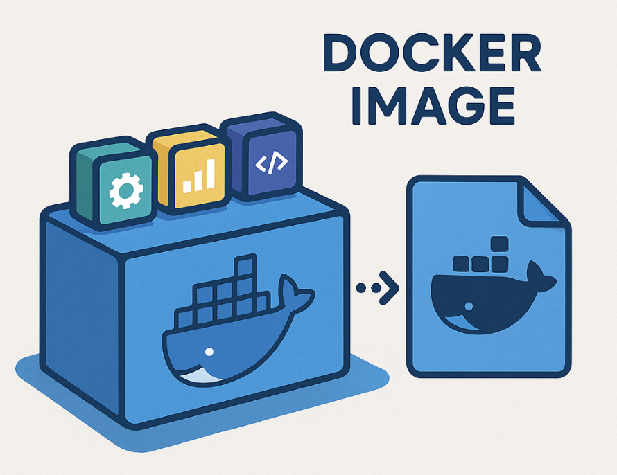

> 운영중인 컨테이너 환경을 그대로 백업하거나 복제해야 하는 경우 이미지로 저장할 수 있다.



요즘은 개발, 테스트, 운영 등 대부분의 작업을 도커 컨테이너 환경에서 하는 것 같다. 이 이유는 환경 일관성, 리소스 효율성, 이식성 등 다양한 이점이 있기 때문이다.

컨테이너 환경을 사용중이라면 <u>컨테이너(서버) 환경을 그대로 백업하거나 복제하여 사용할 수 있다</u>. 이렇게 컨테이너를 도커 이미지로 저장할 수 있는 기능은 이러한 도커의 장점을 극대화할 수 있는 중요한 기능 중 하나이다.

컨테이너를 이미지로 저장하면, 해당 시점의 상태 설정, 실행 중인 서비스, 내부 데이터 등을 그대로 캡처하여 보존할 수 있다. 이 이미지를 다른 환경에 배포하거나, 백업용으로 보관하거나, 장애 발생 시 롤백용으로 활용할 수 있어 운영 안정성과 유연한 배포 전략에 매우 유리하다.

## **이미지 생성**

컨테이너를 이미지로 생성하려면 **docker commit** 명령어를 사용하면 된다.

docker commit은 현재 실행 중인 컨테이너 상태 전체(파일시스템 포함) 를 새로운 이미지로 저장하는 명령어다. 컨테이너 내부에 수동으로 설정하거나 변경한 모든 내용이 함께 저장되기 때문에 서비스나 데이터가 많다면 시간이 좀 걸릴 수 있다.

> 애플리케이션과 DB에 데이터가 꽤 있어서 3~4시간정도 소요됨. 백그라운드로 돌리는 것을 추천한다.

```
docker commit <기존컨테이너명> <저장할이미지명>

#Example 
docker commit my-app-container my-app-image:backup
```

## **컨테이너 실행**

이미지가 정상적으로 생성되었다면 docker images를 했을 때 생성된 이미지가 목록에 표시될 것이다.

그럼 이미지를 push하여 백업해두거나 새로 컨테이너로 올려서 모든 환경, 데이터가 동일한 복제된 컨테이너를 만들어 사용하거나 다른 서버에서 가져와 사용할 수 있다.

```bash
# --net, --ip는 생략 가능
docker run -dit \
  --name <새컨테이너명> \
  --net <브리지네트워크> \
  --ip <새로운IP> \
  <복사된이미지명>

#Example
docker run -dit \
  --name my-app-static \
  --net my-bridge-net \
  --ip 172.30.0.10 \
  my-app-image:backup
```

**⚠️ 주의 사항**

commit 시 대상이 되는 컨테이너는 데이터 손상을 방지하기 위해 pause 상태로 전환되는데 **--pause false** 옵션으로 방지할 수 있지만 사용하지 않는 것을 권장한다.
