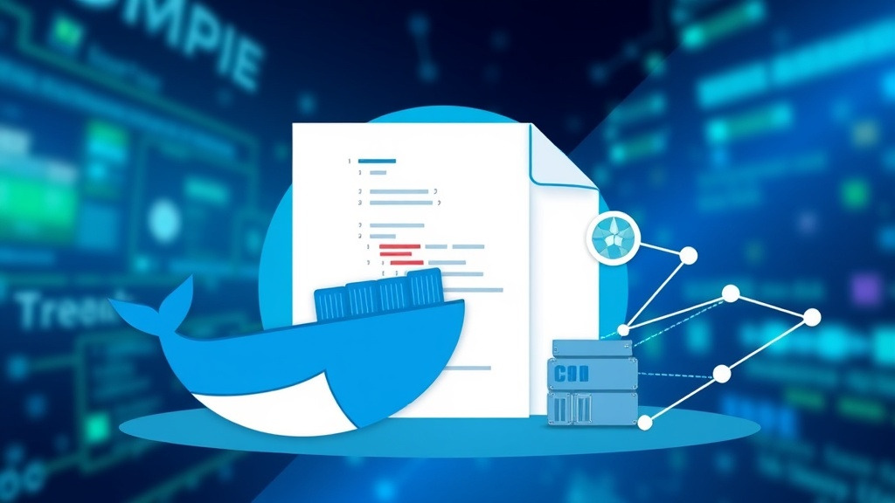
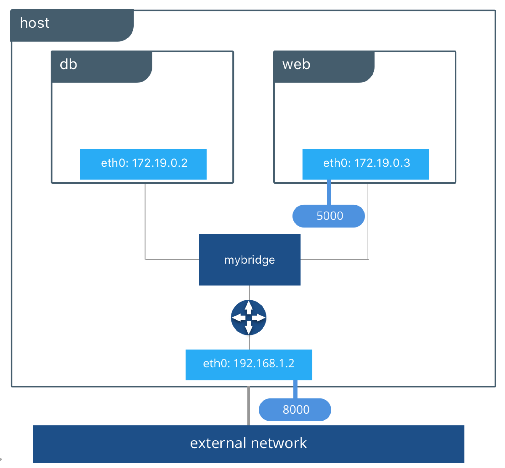

> 도커 이미지를 만들어 컨테이너를 띄우는 방법과 주로 사용되는 개념들을 정리하자



## 1. DockerFile 작성

**Dockerfile**은 도커 이미지를 생성하기 위해 필요한 명령어들을 순차적으로 나열한 텍스트 파일이다. 각 명령어는 새로운 계층(layer)을 만들며, 이 계층들이 합쳐져 최종 이미지를 구성한다. 이를 통해 애플리케이션 빌드와 배포 과정을 표준화·자동화할 수 있다.

#### **기본 구조 및 주요 명령어**

**1. FROM**: 기반 이미지를 지정 (모든 Dockerfile은 FROM으로 시작)

```dockerfile
FROM ubuntu:18.04
```

**2. LABEL**: 이미지 메타데이터 정의 (제작자, 버전 등)

```
LABEL maintainer="name@example.com"
```

**3. RUN**: 빌드 시 실행할 명령어 정의 (패키지 설치, 설정 변경 등)

```dockerfile
RUN apt-get update && apt-get install -y python
```

**4. COPY**: 호스트 파일/디렉토리를 컨테이너로 복사할 때 사용 (애플리케이션 jar 파일 추가)

```dockerfile
COPY target/app.jar /app.jar
```

**5. ADD**: 원격 URL에서 파일을 추가하거나 로컬의 압축 파일을 해제하며 파일 추가

```
ADD https://example.com/big.tar.xz /usr/src/things/
```

**6. WORKDIR**: 작업 디렉토리 지정

```dockerfile
WORKDIR /app
```

**7. ENV**: 환경 변수 설정

```
ENV API_KEY="YOUR_API_KEY"
```

**8. EXPOSE**: 컨테이너가 열어둘 포트 지정

```
EXPOSE 8080
```

**9. CMD**: 컨테이너 실행 시 기본 실행 명령어 지정 (한 번만 사용 가능)

```dockerfile
CMD ["python", "./app/app.py"]
```

**10. ENTRYPOINT**: 컨테이너 실행 시 고정 실행 명령어 지정 (CMD와 조합해 인자 전달 방식 설정 가능)

```dockerfile
ENTRYPOINT ["python"]
CMD ["app.py"]
```

#### **Ex.**Spring Boot 빌드 방법

```dockerfile
# 1단계: 빌드
FROM maven:3.6.3-jdk-11 AS build
WORKDIR /app
COPY pom.xml .
COPY src ./src
RUN mvn -f pom.xml clean package

# 2단계: 실행
FROM openjdk:11
WORKDIR /app
COPY --from=build /app/target/*.jar app.jar
EXPOSE 8080
CMD ["java", "-jar", "app.jar"]
```

> 위 예시는 Maven 기반으로 Spring Boot 애플리케이션을 빌드하고, 결과물인 JAR 파일만 가져와 경량 실행 환경에서 구동하는 방식으로 멀티 스테이지 빌드를 활용하여 빌드 환경과 실행 환경을 분리해 구동하는 방식이다.

Dockerfile은 docker build 명령어로 이미지를 생성할 수 있으며, 각 명령어가 순차적으로 실행되어 최종 이미지가 완성된다.

LEGO처럼 조립하는 개념으로, 빌드와 배포 과정을 모듈화하여 관리할 수 있고, 이를 통해 **배포 과정을 표준화·자동화**하여 개발 효율성을 높일 수 있다.

---

## 2. Docker compose 개념

**Docker Compose**는 여러 컨테이너로 구성된 애플리케이션을 정의하고 실행하기 위한 도구로 docker-compose.yml 파일 하나로 **서비스, 네트워크, 볼륨**을 정의하여 여러 컨테이너를 한 번에 실행할 수 있다.

복잡한 멀티 컨테이너 애플리케이션을 단순화하여 **개발, 테스트, 스테이징, 프로덕션** 환경에서 일관성을 보장하는 데 유용하다.

#### **주요 특징**

**1. 간편한 구성**

- docker-compose.yml 파일 하나로 애플리케이션 스택 정의
- 컨테이너, 이미지, 포트 매핑, 볼륨, 환경 변수 등을 설정

**2. 명령어 단순화**

- docker-compose up, docker-compose down 명령어로 서비스 시작/중지 관리 가능

**3. 개발 효율성**

- 로컬 환경에서 전체 애플리케이션을 쉽게 시뮬레이션 및 테스트 가능
- 컨테이너 기반으로 다른 개발자 환경과 충돌 없이 작업

**4. 환경 일관성 보장**

- 개발부터 배포까지 동일한 환경 유지
- “로컬에선 되는데 서버에선 안 된다” 문제 예방

**5. 멀티 서비스 관리**

- 데이터베이스, 백엔드, 프론트엔드 등 여러 서비스를 한 번에 관리
- 컨테이너 간 네트워크 연결 및 조율 자동 처리

#### **Compose 파일 기본 구조**

**[ docker-compose.yml ]**

- **version**: Compose 파일 버전 (보통 최신 버전 사용 권장)
- **services**: 실행할 컨테이너 정의 (예: web, db)
- **networks**: 컨테이너 간 통신을 위한 네트워크 설정
- **volumes**: 데이터 영속화 및 공유를 위한 볼륨 정의

```yaml
version: '3'  # Compose 파일 버전 정의

services:
  web:  # 웹 애플리케이션 서비스
    image: nginx
    ports:
      - "8080:80"  # 호스트 8080 → 컨테이너 80 매핑
  db:   # 데이터베이스 서비스
    image: postgres
    environment:  # 환경 변수 설정
      POSTGRES_USER: user
      POSTGRES_PASSWORD: password

volumes:
  db-data:  # DB 데이터 영구 저장 볼륨
```

> 추가적으로 환경 변수(environment), 종속성(depends_on), 보안(secrets) 등을 설정하여 더 복잡한 애플리케이션 환경도 구성할 수 있다.

---

## 3. Volumes 설정

컨테이너는 기본적으로 **불변(immutable)**이며, 컨테이너 내부에 저장된 데이터는 컨테이너가 삭제되면 함께 사라진다.

이를 해결하기 위해 **볼륨(Volume)**을 사용한다. 볼륨은 데이터를 **컨테이너의 생명주기와 독립적**으로 보존하고, 여러 컨테이너 간 공유할 수 있는 **영구 저장소**다.

#### **볼륨의 특징과 장점**

**1. 데이터 영속성**

- 컨테이너가 삭제되더라도 볼륨에 저장된 데이터는 유지된다.

**2. 데이터 공유 및 재사용**

- 여러 컨테이너에서 동일한 볼륨을 마운트해 데이터 공유 가능

**3. 백업 및 복구 용이**

- 볼륨 데이터를 다른 호스트로 이전하거나, 백업 및 복구에 활용 가능.

**4. 이식성 및 성능 최적화**

- Docker가 직접 관리하므로 환경에 독립적이며, I/O 부하 분산에도 유리하다.

#### **볼륨 관련 주요 명령어**

```
docker volume create myvolume     # 새로운 볼륨 생성
docker volume ls                  # 볼륨 목록 조회
docker volume rm myvolume         # 특정 볼륨 삭제
docker volume inspect myvolume    # 볼륨 상세 정보 확인
```

> 컨테이너 실행 시 볼륨 마운트 방법

```bash
docker run -v myvolume:/app <이미지이름>
```

#### **바인드 마운트 & 볼륨 마운트**

Docker에서 데이터를 컨테이너와 연결하는 방식은 크게 두 가지다.

**1. 바인드 마운트 (Bind Mount)**

- **정의**: 호스트 시스템의 특정 디렉토리를 컨테이너 내부 경로에 직접 연결
- **특징**: 개발 시 코드 변경을 즉시 반영할 때 유용
- **단점**: 호스트 경로에 의존 → 이식성 낮음
- **예시 (현재 디렉토리의 index.html을 Nginx 컨테이너에 연결)**

```bash
docker run --name my-nginx -v $(pwd):/usr/share/nginx/html:ro -p 8080:80 -d nginx
```

**2. 볼륨 (Volume)**

- **정의**: Docker가 관리하는 데이터 저장소
- **특징**: 컨테이너와 독립적으로 존재, 안전하고 이식성 높음
- **단점**: 파일 직접 접근이 어려워 초기 설정 과정 필요
- **예시 (볼륨 생성 후 Nginx 컨테이너에 마운트)**

```bash
docker volume create my-nginx-volume
docker run --name my-nginx -v my-nginx-volume:/usr/share/nginx/html -p 8080:80 -d nginx
```

> **✅ [ 정리 ]**
> - **바인드 마운트**: 개발 환경에서 빠른 테스트·코드 반영에 유용하지만 이식성 낮음.
> - **볼륨**: 운영 환경에서 데이터 영속성, 안전성, 이식성을 확보하기에 적합.
> => 따라서 <u>**개발** 환경에서는 바인드 마운트</u>, <u>**운영** 환경에서는 볼륨</u>을 활용하는 것이 일반적이다.

---

## 4. Network 설정

#### **도커 네트워크 개념**

**1. 네트워크의 정의**

- 네트워크는 **노드(Node) 간의 통신 구조**를 의미.
- 컨테이너는 기본적으로 **독립적이며 격리된 환경**에서 실행되므로, 따로 생성하면 자동으로 서로 연결되지 않음.

**2. 왜 가상 네트워크가 필요한가?**

- 컨테이너는 독립적인 네임스페이스를 가지므로, 기본 상태에서는 다른 컨테이너와 IP나 포트가 충돌하지 않도록 격리됨.
- 애플리케이션이 **다중 컨테이너로 구성될 경우**, 예를 들어 **웹 서버 → DB 서버** 구조에서는 컨테이너 간 통신이 필수.
- 따라서 **가상 네트워크**를 만들어 컨테이너를 연결하면, 컨테이너들이 안전하게 서로 통신 가능.

**3. 네트워크 격리**

- 도커 네트워크는 컨테이너 격리를 제공.
- 서로 다른 네트워크에 속한 컨테이너는 기본적으로 통신 불가 → 보안 및 충돌 방지 가능.



#### **⚙️ 네트워크 설정 예시 (Redmine + MySQL 연결)**

**1. 사용자 정의 네트워크 생성**

```
docker network create redmine-network
```

**2. MySQL 컨테이너 실행 시 네트워크 지정**

```bash
docker run --name some-mysql --network redmine-network \
  -e MYSQL_ROOT_PASSWORD=my-secret-pw \
  -e MYSQL_DATABASE=redmine \
  -d mysql:8
```

**3. Redmine 컨테이너 실행 시 네트워크 지정**

```bash
docker run --name some-redmine --network redmine-network \
  -e REDMINE_DB_MYSQL=some-mysql \
  -e REDMINE_DB_PASSWORD=my-secret-pw \
  -p 3000:3000 -d redmine
```

> 이렇게 설정 하면 같은 네트워크를 지정한 컨테이너 끼리 통신 가능.

```
# 생성된 네트워크 조회
docker network ls

# 특정 네트워크에 연결된 컨테이너 확인
docker network inspect <네트워크이름>
```

#### **도커 네트워크 종류**

| **네트워크 종류** | **정의/동작 방식** | **주요 특징** | **IP 설정** |
| --- | --- | --- | --- |
| **브리지 (Bridge)** | 컨테이너가 같은 bridge 네트워크 내에서 IP로 통신. 172.x.x.x 대역 자동 할당. | - 기본 네트워크 - 사용자 정의 브리지: 컨테이너 이름 DNS 사용 가능 - 네트워크 격리 가능 | Docker가 자동으로 IP 할당. 수동 설정도 가능. |
| **호스트 (Host)** | 컨테이너가 호스트의 네트워크 스택을 직접 사용. 포트 바인딩 불필요. | - 네트워크 격리 없음 - 최대 성능 제공 | 호스트와 동일 IP 사용. 개별 IP 없음. |
| **오버레이 (Overlay)** | 여러 호스트에 걸쳐 있는 컨테이너 간 통신. | - Swarm 모드 지원 - 암호화 통신 가능 - 다중 호스트 오케스트레이션 | Docker가 가상 네트워크 구성. 자동 IP 할당. |
| **맥바이란 (Macvlan)** | 컨테이너 고유 MAC 주소 부여, 물리 네트워크처럼 동작. | - 물리 네트워크 장치와 직접 통신 - 기존 VLAN 통합 가능 | 실제 IP 대역 사용. 수동 IP 설정 필요. |
| **None** | 네트워크 미사용. 완전 격리. | - | IP 없음. 통신 불가. |

> ✅**[ 정리 ]**
> - 컨테이너 간 통신을 위해서는 사용자 정의 네트워크 생성이 필수.
> - 네트워크 종류에 따라 격리, 보안, 성능, 확장성 측면에서 다르게 활용 가능.
> => <u>**개발** 환경에서는 브리지 네트워크</u>, <u>**운영** 환경에서는 Overlay/Host/Macvlan을 적절히 선택</u>.

---

## 5. 실제 배포 체크 포인트 ✅

#### **도커 이미지 최적화**

동일한 동작을 하는 이미지라도 어떻게 구성하여 작성하는가에 따라 이미지 크기, 보안 및 유지보수성이 달라질 수 있으니 이미지를 배포하기 전 아래 7가지 최적화 전략을 다시 한번 확인하자.

1️⃣ 경량 베이스 이미지 사용

- alpine 등 최소 기능만 포함된 경량 베이스 이미지 사용.
- 불필요한 라이브러리 및 패키지 제거로 이미지 크기 축소.

2️⃣ 멀티 스테이지 빌드(Multi-stage Build) 적용

- 빌드용 스테이지와 실행용 스테이지를 분리.
- 빌드 시 필요한 도구는 최종 이미지에 포함하지 않음.
- FROM을 여러 번 사용하여 중간 아티팩트만 복사 → 최종 이미지 최소화.

3️⃣ 불필요한 파일 제거

- 빌드 중 생성된 **임시파일, 캐시** 등은 RUN ... && rm -rf /path/to/tmp 형태로 제거.
- 실행에 불필요한 파일이 남지 않도록 관리.

4️⃣ 레이어 수 최소화

- RUN, COPY, ADD는 각각 새로운 레이어를 생성하므로, 명령어를 &&로 결합하여 최소한의 레이어로 구성.

```
Ex) RUN apt-get update && apt-get install -y curl && rm -rf /var/lib/apt/lists/*
```

5️⃣ dockerignore 활용 및 COPY/ADD 최적화

- .dockerignore를 사용하여 **불필요한 파일(예: .git, 문서 등)** 제외.
- COPY 또는 ADD는 필요한 파일만 지정하여 포함.

6️⃣ 환경 변수 기반 설정

- 설정 파일 대신 **환경 변수(ENV)** 를 활용.
- 설정 변경 시 이미지 재빌드 불필요 → 유지보수 및 크기 효율성 향상.

7️⃣ 적절한 버전 태그 사용

- 베이스 이미지 및 의존 패키지의 **명확한 버전 태그 지정**.
- 예측 불가능한 업데이트로 인한 용량 증가 및 빌드 불안정 방지.

---

#### **⏩️ 컨테이너-호스트 간 파일 복사**

**❓ 파일 복사 목적 (docker cp)**

- docker cp 명령은 호스트와 실행 중인 컨테이너 간의 파일 또는 디렉터리를 복사할 때 사용.
- 컨테이너의 파일시스템과 호스트 파일시스템 간 데이터를 쉽게 이동할 수 있음.
- **로그, 설정 파일, 정적 리소스 등**을 교체하거나 백업할 때 활용.

**⚙️ 기본 명령어 구조**

```
▸ 호스트 → 컨테이너 복사
docker cp <호스트 경로> <컨테이너명>:<컨테이너 경로>
docker cp myfile.txt mycontainer:/usr/src/app/myfile.txt

▸ 컨테이너 → 호스트 복사
docker cp <컨테이너명>:<컨테이너 경로> <호스트 경로>
docker cp mycontainer:/usr/src/app/myfile.txt ./myfile.txt
```

> **⚠️ [ 주의 사항 ]**
> - 컨테이너 이름 대신 컨테이너 ID 사용 가능
> - 디렉터리 복사 시 하위 디렉터리 포함 전체 복사
> - 서비스 중인 파일 교체 시 중단 위험이 있으므로 주의 필요

**예시: Nginx 초기화면 변경하기**

```bash
1. Nginx 컨테이너 실행
docker run --name my-nginx -p 8080:80 -d nginx
→ my-nginx 컨테이너 생성 및 실행
→ 호스트 8080 포트를 컨테이너의 80 포트에 연결

2. 새로운 index.html 작성
→ 호스트에서 새 HTML 파일 생성 (index.html):
<!DOCTYPE html> <html> <head> <title>Welcome to My Nginx!</title> </head> <body> <h1>Hello, Docker!</h1> <p>This is my custom Nginx homepage served from a Docker container.</p> </body> </html>

3. 컨테이너로 파일 복사
→ Nginx의 기본 정적 파일 경로 /usr/share/nginx/html 에 새 파일 복사:
docker cp index.html my-nginx:/usr/share/nginx/html/index.html

4. 변경 확인
→ 브라우저에서 http://localhost:8080 접속
→ 페이지에 “Hello, Docker!” 문구가 표시되면 정상 반영 완료
```

---

#### **☁️ 이미지 공유하기**

Docker Hub를 통해 공식 이미지 가져오기 → 태그 지정 → 자신의 저장소로 업로드하는 과정은 배포 시 **이미지 버전 관리 및 배포 자동화 파이프라인 구성**에 필수적이다.

> Docker 이미지 가져오기(Pull) 및 올리기(Push)

```
1. 공식 이미지 가져오기 (Pull)
→ Docker Hub에서 이미지를 로컬로 다운로드
docker pull nginx
→ 예: Nginx 공식 이미지를 최신 버전(latest)으로 가져옴
→ 로컬에 이미지가 저장되어 이후 태깅 및 수정 가능

2. 이미지 태그(Tag) 지정
→ 가져온 이미지에 자신의 Docker Hub 계정명을 포함한 새 태그 부여
docker tag nginx:latest <your-docker-hub-username>/nginx:<tag>
→ 예: docker tag nginx:latest john/nginx:v1
→ <your-docker-hub-username> : Docker Hub 계정명
→ <tag> : 이미지 버전명 (예: v1, prod, test)

3. Docker Hub 로그인
→ 이미지를 업로드하기 전 Docker Hub에 인증
docker login
→ 명령 실행 후 사용자 이름과 비밀번호 입력
→ 로그인 성공 시 인증 토큰이 로컬에 저장됨

4. 이미지 업로드 (Push)
→ 로그인 상태에서 태그된 이미지를 자신의 저장소로 업로드
docker push <your-docker-hub-username>/nginx:<tag>
→ 예: docker push john/nginx:v1
→ 업로드 완료 후 Docker Hub 웹 UI에서 john/nginx:v1 이미지 확인 가능
→ 다른 환경(서버, CI/CD, 팀원 로컬)에서도 동일 이미지 사용 가능
```

> wanted 강의 내용을 참고하여 정리한 글이다.
