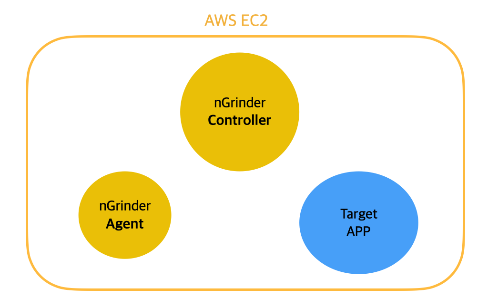
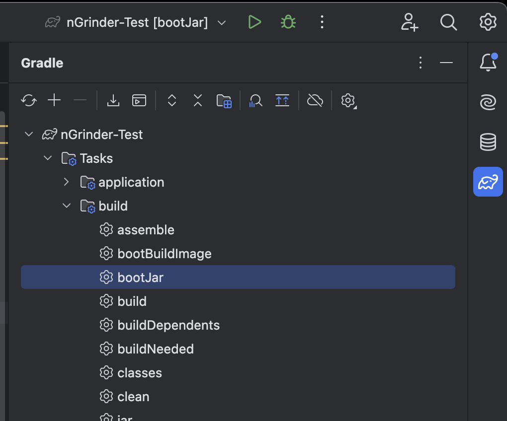
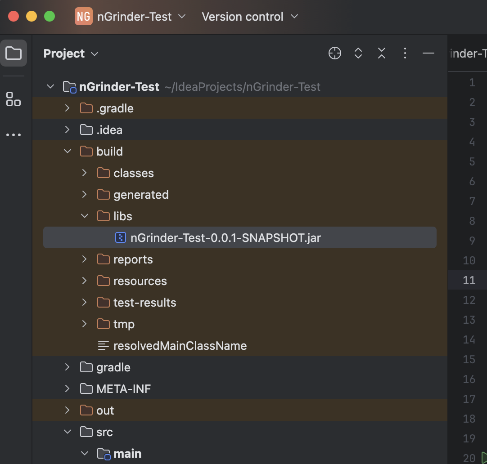
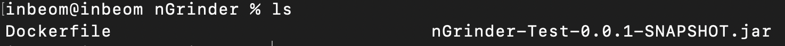
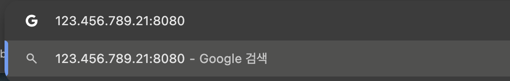
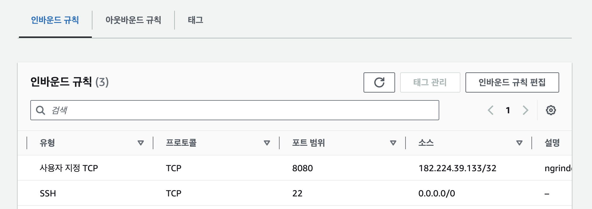
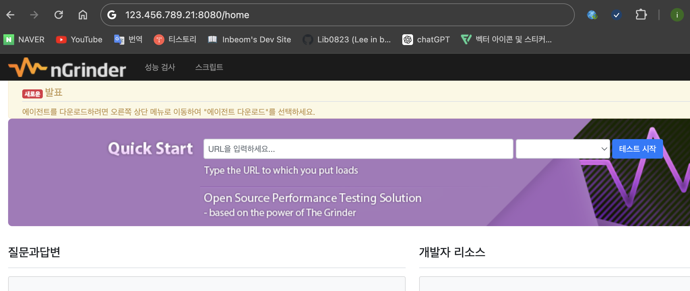

> AWS EC2 환경에서 docker-compose를 사용하여 nGrinder(성능 테스트 툴)를 동작시키기 위한 컨테이너 구성 과정



*해당 글은 Ubuntu 기준으로 작성됨.*

### 1. AWS EC2 인스턴스 세팅

Local 환경에 Container를 생성해서 테스트 해도 되지만 리소스가 제한적이고, 외부에서 접속할 수 없기 때문에 AWS ec2를 사용하였다.

우선 아래의 링크에서 AWS에서 EC2 인스턴스를 생성해야 한다.

[https://ap-northeast-2.console.aws.amazon.com/ec2/home?region=ap-northeast-2#Home:](https://ap-northeast-2.console.aws.amazon.com/ec2/home?region=ap-northeast-2#Home:)

인스턴스 생성이 완료되면 Local에서 Terminal을 열고 SSH로 EC2 서버에 접속한다.

```
ssh -i [.pem 파일 경로] ubuntu@[서버 IP]
```

### 2. Docker 설치 및 세팅

Docker 설치

```
apt install docker.io
```

Docker-compose 설치

```bash
curl -L "https://github.com/docker/compose/releases/download/v2.28.0/docker-compose-$(uname -s)-$(uname -m)" -o /usr/local/bin/docker-compose

chmod +x /usr/local/bin/docker-compose
```

### 3. 테스트 프로젝트 준비

부하 테스트를 위한 테스트 서버를 만들고 배포 파일로 추출하면된다.



위 사진과 같이 Intellij에서 Gradle -> Tasks -> build -> bootJar를 클릭하면 아래와 같이 build -> libs 경로에 .jar 파일이 만들어진다.



### 4. Docker Image 생성

생성한 테스트 프로젝트의 jar파일이 있는 위치로 이동하여 Dockerfile이란 이름의 파일을 생성한다.



**Dockerfile**

```dockerfile
# OpenJDK 22을 기반으로 하는 Docker 이미지를 사용.
FROM openjdk:22

# 작업 디렉토리를 생성하고 JAR 파일을 해당 디렉토리로 복사.
WORKDIR /app
COPY nGrinder-Test-0.0.1-SNAPSHOT.jar /app/app.jar

# 포트 8080을 노출. (nGrinder-Test.main.jar이 8080번 포트를 사용하는 경우에 한정.)
EXPOSE 8080

# JAR 파일을 실행.
CMD ["java", "-jar", "/app/app.jar"]
```

> 테스트 할 프로젝트에 맞게 Dockerfile 내용을 작성해주면 된다.

Dockerfile 작성이 끝났으면 해당 경로에서 이미지를 빌드하고 Docker Hub에 올려주면 된다.

```bash
# Login
docker login

# Image build
docker build -t inbeom0823/ngrinder-test-app:1.0 .

# Push docker hub
docker push inbeom0823/ngrinder-test-app:1.0
```

### 5. Docker Compose 작성

이제 Compose 파일을 작성하고 올리기만 하면 된다.

다시 AWS EC2 서버에 접속하여 원하는 경로에 프로젝트 디렉터리를 생성한 다음 docker-compose.yml 파일을 생성한다.

**docker-compose.yml**

```yaml
version: '3.7'

services:
  controller:
    image: ngrinder/controller:3.5.9
    container_name: ngrinder-controller
    ports:
      - "8080:80"
    environment:
      - GRINDER_AGENT_CONTROLLER_IP=controller

  agent:
    image: ngrinder/agent:3.5.9
    container_name: ngrinder-agent
    environment:
      - GRINDER_AGENT_CONTROLLER_IP=controller
      - GRINDER_AGENT_CONTROLLER_PORT=16001
    depends_on:
      - controller

  target:
    image: inbeom0823/ngrinder-test-app:1.0
    container_name: target_app
    ports:
      - "8081:8080"
    deploy:
      resources:
        limits:
          cpus: '1.00'
          memory: 1G
        reservations:
          cpus: '0.50'
          memory: 512M
```

- 테스트를 위한 nGrinder의 controller와 agent 그리고 target인 테스트 서버를 service로 등록한다.
- 환경변수로 ip, port를 지정해주었고, agent는 controller에 등록하여 사용해야 하기 때문에 controller가 먼저 시작된 후에 agent 서비스가 시작되도록 설정하였다.
- Docker Container는 기본적으로 서버의 전체 리소스를 사용할 수 있기 때문에 원할한 테스트를 위해 target의 리소스를 제한한다.

모든 준비가 끝났다! 마지막으로 compose 실행

```
# compose 실행 (-d : daemon)
docker-compose up -d
```

### 6. 동작 테스트

테스트 환경 구성이 완료되었으니 nGrinder의 controller 서비스로 접속해보자

브라우저에 EC2 서버 ip주소의 8080포트로 접속하면 된다.



하지만 접속이 되지 않을 것이다.. 이유는 AWS에서 EC2 서버의 인바운드 규칙에 8080 포트를 추가해주지 않아서 해당 포트로 접근이 불가능 한 것이다.

(EC2 서버를 생성 후 따로 설정하지 않았다면 기본적으로 SSH가 사용하는 22번 포트만 열려있다)

AWS 사이트 -> EC2 -> 인스턴스 -> 보안그룹 -> 인바운드 규칙에 들어가서 편집을 눌러 8080 포트를 인바운드 규칙으로 추가.



다시 접속해보면 nGrinder controller로 접속할 수 있다.



nGrinder를 사용하여 부하 테스트를 하는 방법은 다음 글에서 참고..

[https://inbeom.tistory.com/296](https://inbeom.tistory.com/296)

*테스트 환경을 구성하며 발생한 에러들은 에러노트(*[*https://inbeom.tistory.com/295*](https://inbeom.tistory.com/295)*)에 정리되어 있다.*

*- 끝 -*
