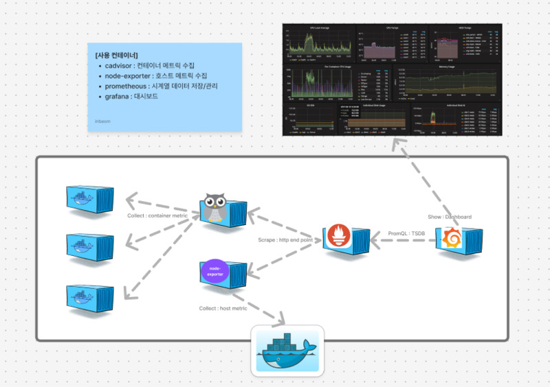
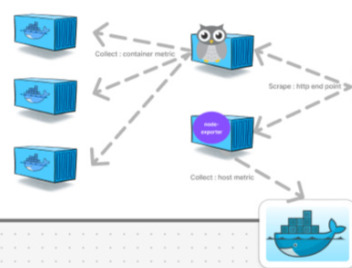
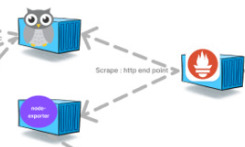
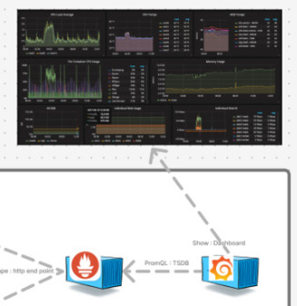
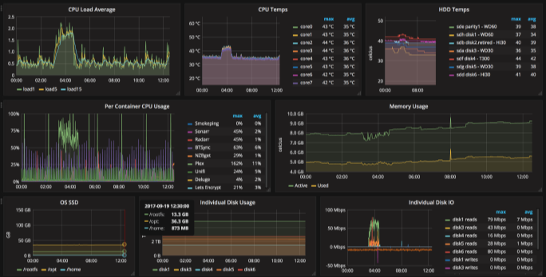
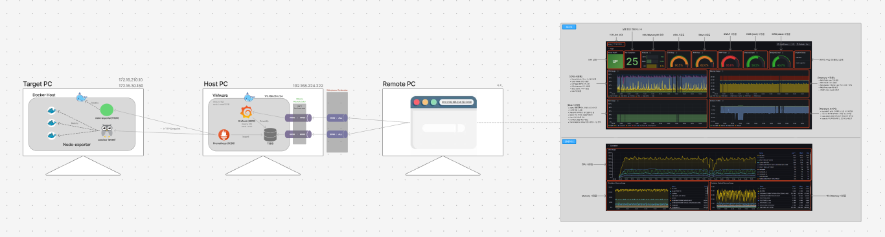

> Prometheus, Grafana, cAdvisor, node-exporter를 사용하여 Docker 호스트와 컨테이너들을 모니터링 하는 방법.

Docker 호스트로 사용되는 서버의 리소스와 컨테이너들을 모니터링하기 위해 리서치 해보았을 때 서버를 모니터링하기 위한 다양한 툴이 있지만 가장 많이 사용되는 조합은 역시 Prometheus & Grafana였다.

Prometheus & Grafana는 다른 경량 모니터링 툴 보다 다소 무거울 수 있지만, 보다 정밀한 데이터 수집, 장기 저장, 알림 기능 등 강력한 기능을 제공한다. 특수한 경우가 아니라면 커스텀 없이도 기본값으로 충분히 활용할 수 있기 때문에 초기 구축도 크게 어렵지 않으며, 레퍼런스나 정보도 많고, 다양한 대시보드 소스를 활용할 수 있다.

## 1. 시스템 아키텍처

기존 Docker 컨테이너 환경에 총 4개의 모니터링용 컨테이너가 추가로 실행된다. 상황에 따라 컨테이너를 추가하거나 병합해도 되지만 각각 독립적으로 구성하는게 가장 안정적이다.

> 여유가 된다면 Prometheus와 Grafana는 다른 안정적인 서버에 따로 분리하여 모니터링 대상 서버에서 Http end point로 메트릭을 수집하도록 하는 것이 가장 좋다.



---

## 2. 모니터링 컨테이너 구성

**cAdvisor**

<u>컨테이너의 메트릭</u>(예: CPU 사용률, 메모리 사용량, 네트워크, 디스크 I/O 등)을 수집하고, /metrics HTTP 엔드포인트를 통해 노출한다.

**node-exporter**

<u>호스트 시스템(서버 자체)의 메트릭</u>(예: CPU 부하, 메모리 사용량, 디스크 사용량, 네트워크 트래픽 등)을 수집하고, /metrics 엔드포인트를 통해 노출한다.

**Prometheus**

cAdvisor, node-exporter 등 Exporter들이 제공하는 /metrics 데이터를 주기적으로 pull 방식으로 <u>수집하여 내부 시계열 데이터베이스(TSDB)에 저장</u>한다.

또한 PromQL이라는 쿼리 언어를 통해 데이터를 검색하고, 알림 조건을 설정할 수 있다.

**Grafana**

Prometheus를 데이터 소스로 연결하여 <u>쿼리(PromQL)를 실행하고, 결과를 다양한 시각화 위젯(그래프, 테이블 등)으로 표현</u>하여 사용자에게 실시간 및 과거 데이터를 시각적으로 보여준다.

> **메트릭(Metric)이란?**
> 모니터링 대상(호스트, 컨테이너 등)의 상태나 성능 지표를 수치로 나타낸 데이터이다.

---

## 3. 시스템 구축 방향

1. 타겟 서버에서 각각 node-exporter로 Docker 호스트의 메트릭을 수집하고, cAdvisor로 컨테이너들의 메트릭을 **수집**하여 HTTP endpoint로 메트릭 데이터를 제공한다.



2. 모니터링 서버에서 Prometheus 컨테이너를 띄워서 대상 서버에서 수집된 메트릭 데이터를 주기적으로 가져와서 일정 기간 **저장**한다.



3. Prometheus와 동일한 서버에서 Grafana 컨테이너를 띄운다음 Prometheus와 연결하여 PromQL로 메트릭 데이터를 조회하고 대시보드로 **시각화**한다.



### 4. 시스템 구축 방법

**1. 타겟 서버 컨테이너 생성**

Docker compose를 작성하여 node-exporter와 cadvisor 컨테이너를 띄운다.

(docker-compose.yml)

```yaml
version: '3'

services:
 node-exporter:
   image: prom/node-exporter:latest
   container_name: node-exporter
   restart: always
   ports:
     - "9100:9100"
   pid: "host"
   volumes:
     - /proc:/host/proc:ro     # 커널, 프로세스, 메모리 등 시스템 리소스
     - /sys:/host/sys:ro       # 커널, 장치, CPU, 메모리, cgroup 등 low level 시스템 정보
     - /:/rootfs:ro            # 호스트 전체 파일 시스템을 root(/) 경로로 마운트
   command:
     - '--path.procfs=/host/proc'  
     - '--path.sysfs=/host/sys'
     - '--path.rootfs=/rootfs'

 cadvisor:
   image: zcube/cadvisor     # 공식 이미지(gcr.io/cadvisor/cadvisor:latest) 사용 권장 
   container_name: cadvisor
   restart: always
   ports:
     - "8080:8080"
   volumes:
     - /:/rootfs:ro                           # 호스트 전체 파일 시스템 (컨테이너의 파일 사용 정보 등)
     - /var/run:/var/run:ro                   # 도커 관련 소켓 및 프로세스 정보
     - /sys:/sys:ro                           # 시스템, cgroup, 리소스 제한 정보 
     - /var/lib/docker/:/var/lib/docker:ro    # 도커 컨테이너 및 이미지의 메타 정보
     - /dev/disk/:/dev/disk:ro                # 디스크 및 I/O 장치 정보
   privileged: true
```

- 기본 포트는 9100, 8080이며 포트 변경이 필요하다면 호스트(외부) 포트를 변경하여 내부 포트와 매핑해주면 된다.
- 리소스 사용 정보에 접근하기 위해 리소스 정보를 가지고 있는 주요 경로들을 Volumes으로 세팅한다. (모니터링으로 정보를 읽기만 하면 되기 때문에 ro(read-only)로 지정)
- 컨테이너 내부에서 호스트의 상세 정보를 수집하기 위해 호스트 수준의 권한을 가지도록 privileged를 true로 세팅한다. (컨테이너가 호스트 시스템을 조작할 수 있게 되기 때문에 위험할 수 있으니 주의 필요)

**2. Monitoring Server 컨테이너 생성**

타겟 서버와 동일하게 Docker compose를 작성하여 prometheus와 grafana 컨테이너를 띄운다.

(docker-compose.yml)

```yaml
version: '3'

services:
  prometheus:
    image: prom/prometheus:latest          # Prometheus 최신 이미지 사용
    container_name: prometheus             # 컨테이너 이름 지정
    restart: always                         # 컨테이너 장애 시 항상 재시작
    ports:
      - "9090:9090"                         # 호스트:컨테이너 포트 매핑 (Prometheus 웹 UI)
    volumes:
      # Prometheus 설정 파일 마운트 (호스트의./prometheus.yml → 컨테이너 내부 경로)
      - ./prometheus.yml:/etc/prometheus/prometheus.yml:ro
      # Prometheus 시계열 데이터 저장 볼륨 (컨테이너 삭제 시에도 데이터 유지)
      - prometheus_data:/prometheus
    command:
      # Prometheus 설정 파일 경로 지정
      - '--config.file=/etc/prometheus/prometheus.yml'
      # 데이터 저장 경로 지정
      - '--storage.tsdb.path=/prometheus'

  grafana:
    image: grafana/grafana:latest          # Grafana 최신 이미지 사용
    container_name: grafana                # 컨테이너 이름 지정
    restart: always                         # 컨테이너 장애 시 항상 재시작
    ports:
      - "3000:3000"                         # 호스트:컨테이너 포트 매핑 (Grafana 웹 UI)
    environment:
      # Grafana 관리자 계정 설정
      - GF_SECURITY_ADMIN_USER=admin
      - GF_SECURITY_ADMIN_PASSWORD=admin
    volumes:
      # Grafana 데이터 저장 볼륨 (대시보드, 데이터소스 설정 유지)
      - grafana_data:/var/lib/grafana

volumes:
  prometheus_data:  # Prometheus 데이터 영구 저장 볼륨
  grafana_data:     # Grafana 데이터 영구 저장 볼륨
```

- 기본 포트는 9090, 3000이며 포트 변경이 필요하다면 호스트(외부) 포트를 변경하여 내부 포트와 매핑해주면 된다.
- 대부분의 설정이 자동으로 되지만 prometheus 기본적으로 데이터를 무제한으로 저장하기 때문에 저장 기간을 설정해주는 것이 좋다.

(prometheus.yml)

```
global:
 scrape_interval: 15s

scrape_configs:
 - job_name: 'cadvisor'
   static_configs:
     - targets: ['<타겟서버IP>:8080']   # 타겟 서버 cadvisor경로
 - job_name: 'node-exporter'
   static_configs:
     - targets: ['<타겟서버IP>:9100']   # 타겟 서버 node-exporter경로
```

- 프로메테우스 컨테이너를 띄우고 꼭 prometheus.yml 파일을 지정한 위치에 작성해줘야 한다.

**3. Grafana 대시보드 설정**

컨테이너가 정상적으로 실행되는 것을 확인했으면 웹 브라우저에서 모니터링 서버의 그라파나 홈페이지로 접속한다.(localhost:3000)

Docker compose 파일에서 지정한 grafana 관리자 계정을 사용하여 로그인하면 된다.

1) 메뉴에서 Connections > Data sources로 들어가서 새로운 data source를 추가한다.

- Add data source : prometheus 선택

- Prometheus URL : http://prometheus:9090

- 기타 설정 후 Save&Test 클릭

2) 메뉴에서 Dashboards로 가서 새로운 dashboard를 등록한다.

- PromQL로 직접 대시보드를 커스텀하여 만들 수 있지만 귀찮으니 Import하여 기존대시보드 양식을 사용한다.

- [https://grafana.com/grafana/dashboards](https://grafana.com/grafana/dashboards) 에서 원하는 대시보드를 검색하여 찾고 ID만 입력하고 Load 해주면 자동으로 대시보드가 생성된다.

> 생성 초기에 데이터가 없어 제대로 나오지 않을 수 있으니 조금 기다리자..

---

#### 다중 서버 Docker host and Container 대시보드

Docker 환경에서 호스트 서버와 컨테이너들을 하나의 대시보드에서 통합하여 모니터링할 수 있으며, 타겟 서버가 여러대인 경우에도 선택하여 각각의 리소스 현황을 파악할 수 있다.



- Github에서 대시보드 소스인 .json 파일을 다운받아 그라파나에서 import하여 사용할 수 있다.
- 대시보드에 대한 상세 설명은 README에 작성되어있다.

> **[TIP]**
> - 그라파나 대시보드 처음 진입 시 데이터가 보이지 않는다면 각 요소의 edit을 들어갔다 나오면 된다.
> - 변수 설정에서 Query option의 Data source를 선택해준다.

---

## 통신 환경 구성

안정적인 모니터링 환경을 구축하기 위해 모니터링 대상이 되는 타겟 서버와 모니터링 서버는 서로 영향을 받지 않는 별도의 서버에 세팅하는 것이 좋다. 하지만 마땅한 여분의 서버가 없었기 때문에 남는 노트북을 모니터링 서버로 사용하였다.

노트북의 OS는 편한걸로 하면 되지만 Linux 환경을 설치하는데 문제가 있어 Windows 환경에서 VMware를 사용하였다.

**1. VMware + Nat port forwarding**

VMware를 설치 및 네트워크를 설정하기 위한 Network Editor를 설치한다.

- 무료 버전의 player는 Network Editor를 지원하지 않아 불가능함

ㄴ 하지만 다른 경로로 Editor 설치하여 설정할 수 있다.

[https://startdatastudy.tistory.com/44](https://startdatastudy.tistory.com/44)

**2. Network Port forwarding 설정**

VMware가 실제 PC처럼 IP를 할당 받을 수 있도록 네트워크를 설정한다.

- network editor 별도로 설치하여 NAT로 변경한 후 IP, Subnet, Gateway를 설정 및 포트 포워딩 등록

**3. 방화벽 설정**

외부에서 모니터링 서버로 접근하여 Grafana 대시보드를 확인할 수 있도록 방화벽을 뚫는다.

- host(windows) 방화벽 포트 오픈

ㄴ Windows Defender > 인바운드 규칙 >

(Grafana)

프로토콜 종류 : TCP

로컬 포트 : 특정 포트/3000

원격 포트 : 모든 포트

(Prometheus)

프로토콜 종류 : TCP

로컬 포트 : 특정 포트/9090

원격 포트 : 모든 포트

**4. 접속 확인**

- 호스트에서 그라파나(3000) 접속 확인

- 외부 PC에서 호스트 IP로 그라파나 접속 확인

> [외부에서 요청이 안될 때]
> 1) ping으로 통신 확인 (호스트의 방화벽에서 ICMP 인바운드 규칙 올려줘야됨)
> 2) ping은 되는데 TCP(http) 요청이 막힌다면 wireshark로 패킷 캡쳐하여 네트워크 트래픽 확인


