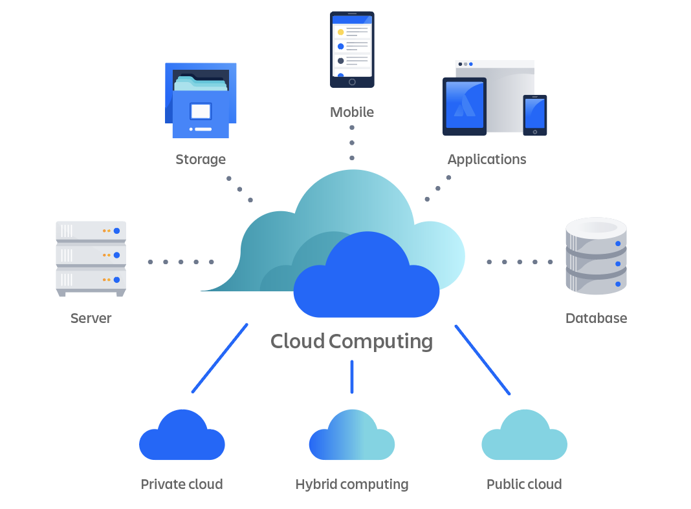

#### **Cloud Computing**

- 클라우드 컴퓨팅은 컴퓨팅 리소스를 인터넷을 통해 서비스로 사용할 수 있는 주문형 서비스이다.
- 기업에서 직접 리소스를 조달하거나 구성, 관리할 필요가 없으며 사용한 만큼만 비용을 지불하면 된다.

### 클라우드 컴퓨팅 배포 모델

- **퍼블릭 클라우드(public)**

타사 클라우드 서비스 제공업체에서 실행한다. 인터넷을 통해 컴퓨팅, 스토리지, 네트워크 리소스가 제공되므로 기업에서 고유한 요구사항과 비즈니스 목표에 따라 주문형 공유 리소스에 액세스할 수 있다.

- **프라이빗 클라우드(private)**

단일 조직에서 빌드, 관리, 소유하고 일반적으로 '온프레미스' 또는 '온프렘'으로 알려진 자체 데이터 센터에서 비공개로 호스팅된다. 데이터를 보다 효과적으로 제어, 보안, 관리하는 동시에 내부 사용자가 컴퓨팅, 스토리지, 네트워크 리소스의 공유 풀을 통해 이점을 누릴 수 있다.

- **하이브리드 클라우드(hybrid)**

퍼블릭 클라우드와 프라이빗 클라우드 모델을 결합해 기업이 퍼블릭 클라우드 서비스를 활용하면서 일반적으로 프라이빗 클라우드 아키텍처에서 찾아볼 수 있는 보안 및 규정 준수 기능을 유지할 수 있다.

### 클라우드 컴퓨팅 유형

- **Infrastructure as a Service(IaaS)**

컴퓨팅, 스토리지, 네트워킹, 가상화 등 IT 인프라 서비스에 대한 주문형 액세스를 제공한다. IT 리소스를 가장 높은 수준으로 제어하며 기존 온프레미스 IT 리소스와 가장 유사하다.

- **Platform as a Service(PaaS)**

클라우드 애플리케이션 개발에 필요한 모든 하드웨어 및 소프트웨어 리소스를 제공한다. PaaS를 사용하면 기업은 기본 인프라의 관리 및 유지보수에 대한 부담 없이 애플리케이션 개발에 집중할 수 있다.

- **Software as a service(SaaS)**

기본 인프라에서 유지보수 및 앱 소프트웨어 자체 업데이트에 이르기까지 전체 애플리케이션 스택을 서비스로 제공한다. SaaS 솔루션은 클라우드 인프라 제공업체에서 서비스와 인프라를 모두 관리하고 유지보수하는 최종 사용자 애플리케이션인 경우가 많다.

### **클라우드 컴퓨팅의 용도**

- **인프라 확장**

소매업체를 포함한 많은 조직은 각기 다른 컴퓨팅 용량 요구사항을 갖고 있다. 클라우드 컴퓨팅은 이러한 변동을 쉽게 수용한다.

- **재해 복구**

재해 발생 시 연속성을 보장하기 위해 더 많은 데이터 센터를 구축하는 대신 클라우드 컴퓨팅을 사용하면 기업에서 디지털 애셋을 안전하게 백업할 수 있다.

- **데이터 스토리지**

클라우드 컴퓨팅은 대량의 데이터를 저장하고 접근성을 높이며 분석과 백업을 더 쉽게 만들어 과부하 상태의 데이터 센터를 지원한다.

- **애플리케이션 개발**

클라우드 컴퓨팅을 통해 기업 개발자가 애플리케이션을 빌드하고 테스트하는 도구 및 플랫폼에 빠르게 액세스하여 TTM(time to market)을 단축할 수 있다.

- **빅데이터 분석**

클라우드 컴퓨팅은 대량의 데이터를 처리할 수 있는 리소스를 거의 무제한으로 제공하여 조사 속도를 높이고 통계 도출 시간을 단축한다.

### **클라우드 컴퓨팅의 이점**

- **유연성**

클라우드 컴퓨팅의 아키텍처 덕분에 기업과 사용자가 인터넷만 연결되면 어디서나 클라우드 서비스에 액세스하고 필요에 따라 서비스를 확장하거나 축소할 수 있다.

- **효율적**

기업에서 기본 인프라에 대한 걱정 없이 새로운 애플리케이션을 개발하여 빠르게 프로덕션에 배포할 수 있다.

- **전략적 가치 제공**

클라우드 제공업체에서 최신 혁신 기술을 앞서 받아들인 후 고객에게 서비스 형태로 제공하기 때문에 기업에서 경쟁력을 강화하고 금방 쓸모 없어진 기술에 투자했더라도 투자수익을 높일 수 있다.

- **보안**

위험은 비교적 낮은 것으로 간주된다. 클라우드 컴퓨팅 보안은 일반적으로 클라우드 공급업체에 사용되는 보안 메커니즘의 수준 및 범위로 인해 기업 내 데이터 센터보다 강력한 것으로 인식된다. 또한 클라우드 공급업체의 보안팀은 업계에서 최고 수준의 전문가들로 알려져 있다.

- **비용 효율성**

어떤 클라우드 컴퓨팅 서비스 모델을 사용하든 기업은 사용하는 컴퓨팅 리소스에 대해서만 비용을 지불한다. 예상치 못한 수요 급증이나 비즈니스 성장을 대비하여 데이터 센터 용량을 과도하게 구성할 필요가 없으며 IT 직원을 배치하여 보다 전략적인 이니셔티브를 진행할 수 있다.
