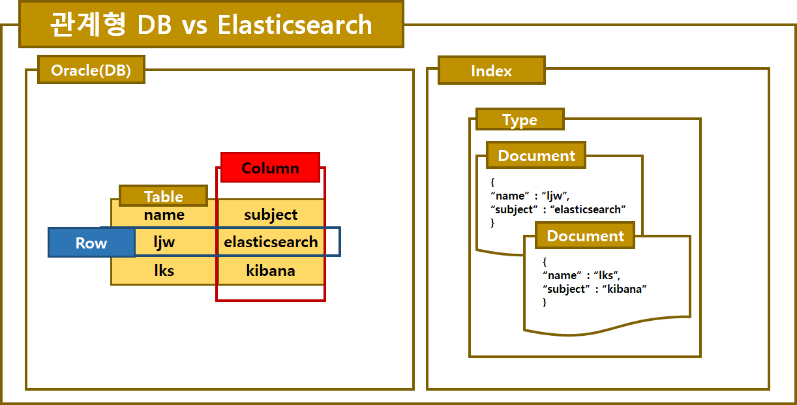
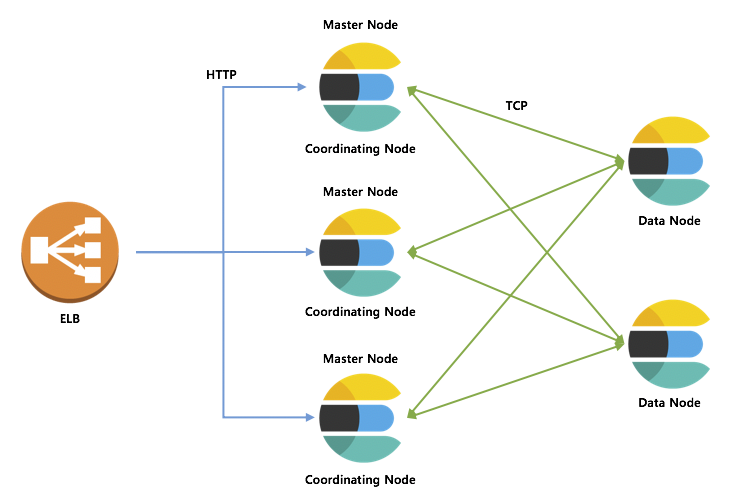
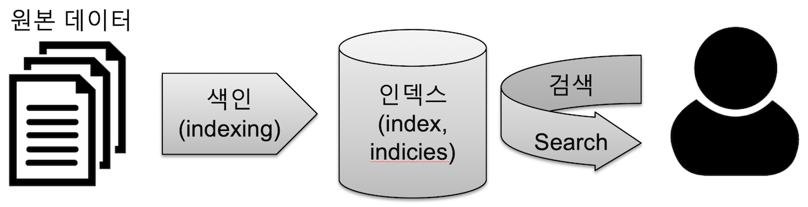
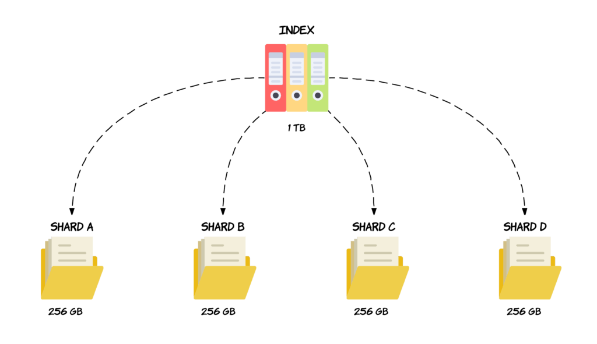

> Elasticsearch는 실시간 검색 및 분석을 위한 오픈 소스 분산 검색 엔진으로, 대용량 데이터를 신속하게 색인하고 검색할 수 있는 강력한 도구이다.


> *데이터베이스가 아닌 분산 검색/분석 엔진.*

Elasticsearch는 2010년에 Shay Banon에 의해 만들어졌다.

초기에는 Apache Lucene을 기반으로 하여 검색 기능을 제공하다가, 분산 시스템으로 확장하여 대규모 데이터 처리를 지원하게 되었다.

### 개념

Elasticsearch는 주로 검색 및 분석 엔진으로 사용된다.

- 비정형/반정형 데이터를 JSON 형식으로 색인(index)하고, 강력한 쿼리를 사용하여 데이터를 검색한다.
- Elasticsearch Query DSL 쿼리를 사용하며, Match, Range, Wildcard 등의 다양한 쿼리문과 Filterig, Analysis, Scripting 등 여러가지 기능을 제공하여 정확한 검색이 가능하다.
- 또한 대용량 데이터를 처리할 수 있는 분산 시스템으로 여러 노드로 구성되어 있으며, 각 노드는 데이터를 색인하고 검색하는 역할을 수행한다.
- 노드 간에는 데이터가 자동으로 분산되어 저장되므로 고가용성 및 확장성을 제공한다.

### 데이터 구조

Elasticsearch는 비정형 데이터를 저장하는데 적합한 문서기반의 데이터 구조를 가지고 있다.

<u>문서(Document)</u>란 JSON형식으로 기록된 하나의 데이터 단위를 의미한다. 이러한 하나의 Document는 데이터의 최소 단위이며, 고유한 식별자로 \_id 필드를 가진다.

```json
{
    "_id": "1",
    "product_name": "Example Product",
    "price": 50.99,
    "stock": 100
}
```



### 노드

Node는 Elasticsearch 클러스터를 이루는 하나의 단위이다.

각 노드는 데이터를 저장하고 관리하며, 클러스터의 일부로서 여러 노드와 함께 작동해 대용량 데이터를 효과적으로 처리하고, 작업을 분산하여 병렬로 처리해 성능을 향상시킨다.

**마스터 노드 (Master Node)**

- 클러스터의 구성 관리, 상태 모니터링 등의 역할을 수행한다.

**데이터 노드 (Data Node)**

- 실제 데이터를 저장하고 검색 작업을 처리하는 역할을 한다.
- 인덱스의 Shard를 갖고 있어 실제 데이터가 저장된다.

**코디네이팅 노드 (Coordinating Node)**

- 클라이언트의 요청을 받아 실제 데이터 노드에 라우팅하는 역할을 수행한다.
- 검색 요청을 받으면 쿼리를 조합해 각 데이터 노드에 요청을 분배하여 전달하고 결과를 취합한다.

```
// DataNode Setting >
node.master: false
node.data: true
```

### 특징

**분산 아키텍처:**

- 여러 노드로 구성된 분산 시스템으로, 데이터의 색인과 검색을 여러 노드에서 병렬로 처리한다.



**실시간 검색:**

- 데이터가 색인되면 거의 실시간으로 검색이 가능하며, 검색 결과를 빠르게 반환한다.



**다양한 데이터 형식 지원:**

- JSON 형식으로 Keyword, Array, Date, Range, IP 등 다양한 타입의 데이터를 저장하고 검색할 수 있다.

**검색 기능 강화:**

- Full-Text Search, Filtering, Analysis 등 다양한 유형의 검색 기능을 제공하여 더 정확한 검색 결과를 얻을 수 있다.

**자동 샤딩:**

- 자동으로 데이터를 샤딩하여 여러 노드에 분산 저장함으로써 확장성을 보장한다.
- 샤드(shard)는 인덱스를 각 노드에 분산하여 저장하는 기본 단위이다.



**고급 집계 및 분석 기능:**

- 데이터를 집계하고 분석할 수 있는 기능을 제공하여 비즈니스 인텔리전스나 분석에 활용된다.

reference.

[https://dlrudtn108.tistory.com/7](https://dlrudtn108.tistory.com/7)
