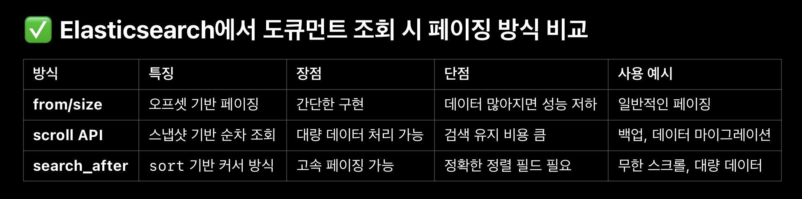

### 문제 상황:

Elasticsearch에서 데이터를 집계하여 조회하는 DSL쿼리에서 size를 설정하지 않아서 집계 데이터가 최대 10개만 반환됨.

집계 데이터가 몇개가 나올지 예측할 수 없고 매우 큰 데이터를 다뤄야 하기 때문에 size를 임의로 설정할 수 없어 페이징 처리로 데이터를 쪼개서 가져와야 하는 상황임

### 페이징 방법:

scroll API

- 집계에서 안됨

sort & size & from

- 집계에서 안됨

SearchAfter

- 집계에서 안됨



### 집계 페이징 방법:

Bucket Sort Aggregation

- Elasticsearch 6버전부터 사용 가능

[https://www.elastic.co/guide/en/elasticsearch/reference/6.1/search-aggregations-pipeline-bucket-sort-aggregation.html](https://www.elastic.co/guide/en/elasticsearch/reference/6.1/search-aggregations-pipeline-bucket-sort-aggregation.html)

하지만 데이터를 집계한 후 정렬하고 자르는 것이기 때문에 결국은 해당 집계의 사이즈에 종속적이게 된다.

그렇기 때문에 기존 집계의 정렬이나 상위/하위의 특정 개수 값만 뽑을 때 사용한다

### 해결 방법:

AfterKey

- 키로 사용할 필드를 정해서 Composite로 그룹화하고 페이징 할 size를 지정해서 조회하면 after\_key가 응답에 포함되어 반환되어 다음 요청 때 after\_key를 포함시키면 된다.

**기존 집계쿼리 (aggregation)**

size를 안 정해주면 기본값 10개 버킷만 돌아오는 문제가 있던 쿼리.

```json
{
  "size": 0,
  "aggs": {
    "by_category": {
      "terms": {
        "field": "category.keyword"
      }
    }
  }
}
```

**그룹화 쿼리 (composite)**

```json
{
  "size": 0,
  "aggs": {
    "by_category": {
      "composite": {
        "size": 100,
        "sources": [
          { "category": { "terms": { "field": "category.keyword" } } }
        ]
      }
    }
  }
}
```

응답에는 이번 페이지의 버킷들과 함께 `after_key`가 같이 내려온다.

```json
{
  "aggregations": {
    "by_category": {
      "after_key": { "category": "electronics" },
      "buckets": [ ... ]
    }
  }
}
```

다음 페이지를 요청할 때는 받은 `after_key`를 그대로 `composite.after`에 넣어서 다시 요청하면 된다.

```json
{
  "size": 0,
  "aggs": {
    "by_category": {
      "composite": {
        "size": 100,
        "sources": [
          { "category": { "terms": { "field": "category.keyword" } } }
        ],
        "after": { "category": "electronics" }
      }
    }
  }
}
```

버킷 배열이 `size`보다 적게 돌아오면 마지막 페이지라는 뜻이라, 이 조건으로 반복 요청을 멈추면 된다.
