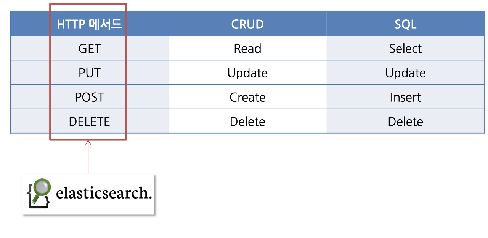

> Elasticsearch는 http 프로토콜로 접근이 가능한 REST API(CRUD)를 지원한다.

### 설치 및 실행

홈페이지를 통해 다운로드 및 메뉴얼을 확인할 수 있다.

*자세한 설치 방법은 [https://triest.tistory.com/46](https://triest.tistory.com/46) 해당 블로그를 참조하면 된다.*

### REST API 구조

*Elasticsearch REST API의 기본 구조.*

**Host:**

- 클러스터의 호스트 주소

**Port:**

- 클러스터의 포트 번호 (Default: 9200)

**Index:**

- 데이터베이스 내에서 Document들을 묶어 관리하는 단위

**Type:**

- 인덱스 내 문서의 종류를 나타냄. ver 6.0 이상 부터는 \_doc 등의 고정된 타입만 사용

**Document ID:**

- 문서의 고유 식별자 id

```
http://<호스트>:<포트>/<인덱스>/<타입>/<문서 ID>
```

### CRUD 요청

> **GET**: 데이터 조회
> **POST**: 문서 색인 및 검색
> **PUT**: 문서 업데이트
> **DELETE**: 문서 삭제
> **HEAD**: 리소스 존재 여부 확인
> **PATCH**: 부분 업데이트



**HttpClient를 사용하여 요청**

Spring에서 Elasticsearch와 HTTP 요청을 통해 상호작용 하기 위해선 RestTemplate, HttpClient를 사용할 수 있다.

```xml
<!-- 의존성 추가 -->
<dependency>
    <groupId>org.apache.httpcomponents</groupId>
    <artifactId>httpclient</artifactId>
    <version>4.5.13</version>
</dependency>
```

**Create**

```java
private final CloseableHttpClient httpClient = HttpClients.createDefault();

public void createDocument(String index, String id, String jsonBody) throws IOException {
        String url = "http://localhost:9200/" + index + "/_doc/" + id;
        HttpPost request = new HttpPost(url);
        StringEntity entity = new StringEntity(jsonBody);
        request.setEntity(entity);

        try (CloseableHttpResponse response = httpClient.execute(request)) {
            HttpEntity responseEntity = response.getEntity();
            String responseBody = EntityUtils.toString(responseEntity);
            EntityUtils.consume(responseEntity);
        }
    }
```

**Read**

```java
public String getDocument(String index, String id) throws IOException {
        String url = "http://localhost:9200/" + index + "/_doc/" + id;
        HttpGet request = new HttpGet(url);

        try (CloseableHttpResponse response = httpClient.execute(request)) {
            HttpEntity entity = response.getEntity();
            return EntityUtils.toString(entity);
        }
    }
```

**Update**

```java
public void updateDocument(String index, String id, String jsonBody) throws IOException {
        String url = "http://localhost:9200/" + index + "/_update/" + id;
        HttpPost request = new HttpPost(url);
        StringEntity entity = new StringEntity(jsonBody);
        request.setEntity(entity);

        try (CloseableHttpResponse response = httpClient.execute(request)) {
            HttpEntity responseEntity = response.getEntity();
            String responseBody = EntityUtils.toString(responseEntity);
            EntityUtils.consume(responseEntity);
        }
    }
```

**Delete**

```java
public void deleteDocument(String index, String id) throws IOException {
        String url = "http://localhost:9200/" + index + "/_doc/" + id;
        HttpDelete request = new HttpDelete(url);

        try (CloseableHttpResponse response = httpClient.execute(request)) {
            HttpEntity responseEntity = response.getEntity();
            String responseBody = EntityUtils.toString(responseEntity);
            EntityUtils.consume(responseEntity);
        }
    }
```

> Spring Data Elasticsearch를 사용하면 JPA와 같은 형태로 사용할 수 있다.

reference.

[https://esbook.kimjmin.net](https://esbook.kimjmin.net/02-install)

[https://velog.io/@baik9261/Elastic-Search-2-ES-CRUD-Search-API](https://velog.io/@baik9261/Elastic-Search-2-ES-CRUD-Search-API)
