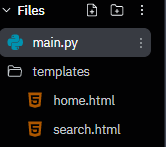

#### **Flask로 페이지 링크 및 파라미터 전송**

1. templates 이름의 폴더 생성하여 밑에 view파일 생성



2. 함수에서 View를 리턴시키기 위해서는 render\_template를 import 해야 함.

3. URL매핑 시 Parameter를 받기 위해서는 request를 import 해야 함.

4. HTML 페이지 리턴 return render\_template('home.html')

5. Parameter추출 keyword = request.args.get('keyword')

6. HTML페이지 리턴 시 값을 같이 넘겨줌 return render\_template('search.html', keyword=keyword)

7. HTML에서 {{keyword}} 를 이용하여 받은 값 출력


### Code >

*<u>Python</u>*

```python
from flask import Flask, render_template, request

app = Flask("HelloFlask")

@app.route("/")
def home():
    return render_template('home.html')

@app.route("/search")
def search():
    print(request.args)
    print(request.args.get('keyword'))

    keyword = request.args.get('keyword')
    
    return render_template('search.html', keyword=keyword)

app.run("0.0.0.0")
```

<u>*HTML*</u>

```html
<!DOCTYPE html>
<html lang="en">
<head>
    <meta charset="UTF-8">
    <meta http-equiv="X-UA-Compatible" content="IE=edge">
    <meta name="viewport" content="width=device-width, initial-scale=1.0">
    <title>search</title>
</head>
<body>
    <h1>Search~! {{keyword}}</h1>

		
            <tr>
                <td>{{job.title}}</td>
                <td>{{job.company}}</td>
                <td>{{job.location}}</td>
                <td><a href="{{job.link}}" target="_blank">Apply &rarr;</a></td>
            </tr>
        

</body>
</html>
```

> 위 `search()` 뷰와는 별개로, `jobs`라는 리스트 파라미터를 넘겨받았다고 가정했을 때 Flask(Jinja2) 문법의 for문으로 반복 출력하는 예시.

```python
# jobs를 넘겨주는 뷰가 있다면 이런 형태가 된다
@app.route("/jobs")
def job_list():
    jobs = [
        {"title": "백엔드 개발자", "company": "A사", "location": "서울", "link": "#"},
    ]
    return render_template('jobs.html', jobs=jobs)
```

```html

    <tr>
         <td>{{job.title}}</td>
         <td>{{job.company}}</td>
         <td>{{job.location}}</td>
         <td><a href="{{job.link}}" target="_blank">Apply &rarr;</a></td>
    </tr>

```
