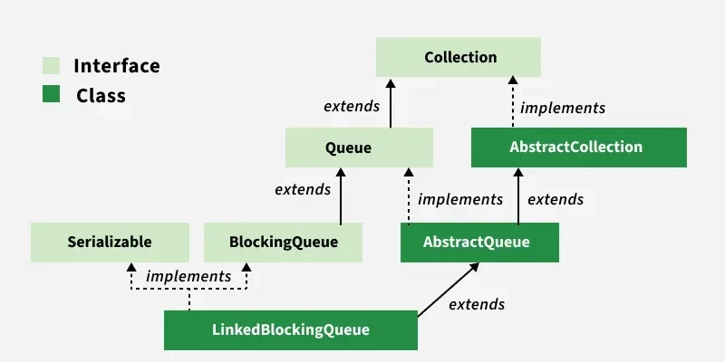

> 성능 최적화를 고민할 때 무조건 병렬 처리가 정답은 아니다. 상황에 따라서는 순차 처리를 통한 동시성 제어가 더 적합할 수 있다.



### Queue의 기본 개념

Queue는 FIFO(First-In-First-Out) 구조로, 먼저 들어온 데이터가 먼저 나간다.

```
[작업1] → [작업2] → [작업3]  →  처리
  ↑                           ↓
 추가(add)                    완료(poll)
```

### 왜 BlockingQueue가 필요한가?

실무에서 배치성 대용량 데이터 생성 API를 개발하는 중 데이터 정합성과 서버 환경을 고려하여 아래의 내용들에 대한 고려가 필요했다.

- API 요청이 들어오면 즉시 응답을 반환해야 함 (사용자 경험 향상)
- 실제 처리는 비동기로 순차적으로 진행 (서버 리소스 부하 최소화)
- 동시에 여러 작업이 처리되면 안 됨 (데이터 정합성 유지)

<u>이런 상황에서 **BlockingQueue**가 완벽한 해결책이었다.</u>

---

## **Non-Blocking Queue** & **Blocking Queue**의 차이

### Non-Blocking Queue (ConcurrentLinkedQueue)

데이터를 넣거나 뺄 때 큐가 비어있거나 가득 차있어도 스레드가 대기하지 않고 즉시 null이나 false를 반환한다.

> 프로세스

```
[스레드가 계속 확인]
   ↓ poll()
[큐: 비어있음] → null 반환
   ↓ 
[다시 확인] → null 반환
   ↓
[또 확인] → null 반환  ← CPU 낭비!
   ↓
[계속 반복...]
```

> 소스코드

```
while (true) {
    Task task = queue.poll();  // 즉시 반환
    if (task == null) {
        // 큐가 비어있음 → CPU 자원 낭비!
        continue;  // 계속 확인
    }
    process(task);
}
```

**특징:**

- ✅ 빠른 응답 속도
- ✅ Lock-Free 알고리즘
- ❌ 큐가 비어있을 때 CPU 자원 낭비
- ❌ 폴링 방식으로 계속 확인 필요

**사용 시나리오:**

- <u>실시간 처리가 중요한 경우</u>
- 큐가 거의 항상 데이터를 가지고 있는 경우
- 큐가 비어도 다른 작업을 수행해야 하는 경우

---

### Blocking Queue (LinkedBlockingQueue)

데이터를 넣거나 뺄 때 큐가 비어있거나 가득 차있으면 조건이 충족될 때까지 스레드가 멈춰서 대기한다.

> 프로세스

```
[스레드 대기 중 - CPU 거의 미사용]
   ↓ take()
[큐: 비어있음] → 대기... (sleep)
   ↓
[작업 추가됨!] → 스레드 깨어남
   ↓
[작업 처리] → 완료
   ↓
[다시 대기...]
```

> 소스코드

```
while(true) {
    Task task = queue.take();  // 데이터가 있을때까지 대기.. (CPU 거의 사용 안함)
    process(task);
}
```

**특징:**

- ✅ CPU 자원 효율적 (대기 중 리소스 거의 미사용)
- ✅ 간단한 구현
- ✅ 자동으로 대기/깨어남
- ❌ 블로킹으로 인한 지연 가능
- ❌ Lock 사용으로 약간의 오버헤드

**사용 시나리오:**

- 생산자-소비자 패턴
- <u>순차 처리가 필요한 작업</u>
- 서버 리소스 절약이 중요한 경우
- <u>처리 속도보다 안정성이 중요한 경우</u>

---

### BlockingQueue 구현체 중 LinkedBlockingQueue 선택 이유

**WAIT** :

- 규칙적이지 않은 API 요청으로 큐가 사용되지 않는 상황에 리소스(cpu)를 거의 사용하지 않고 대기할 수 있다.

**LOCK** :

- 연결 리스트 기반의 여러 노드가 연결되어 있는 구조로 Take/Put Lock이 분리되어 충돌(대기)가 없다.

**SIZE** :

- 큐 사이즈를 제한하지 않아도 되기 때문에 예측 불가한 여러 요청들을 유연하게 처리할 수 있다.

**1. 노드 기반 구조** (크기 제한 없음)

```
// 크기 제한 없음 (메모리가 허용하는 한)
BlockingQueue<Task> queue = new LinkedBlockingQueue<>();

// 또는 크기 제한 설정 가능
BlockingQueue<Task> queue = new LinkedBlockingQueue<>(1000);
```

**2. 분리된 Lock** (높은 동시성)

```java
// LinkedBlockingQueue 내부
private final ReentrantLock takeLock = new ReentrantLock();  // 꺼내기용
private final ReentrantLock putLock = new ReentrantLock();   // 넣기용

// 동시에 가능:
// - 스레드 A: 작업 추가 (putLock)
// - 스레드 B: 작업 꺼내기 (takeLock)
```

**3. take() 메서드의 효율성**

```java
// LinkedBlockingQueue의 take() 핵심 로직
public E take() throws InterruptedException {
    takeLock.lockInterruptibly();
    try {
        while (count.get() == 0) {
            notEmpty.await();  // ← 여기서 대기 (CPU 거의 안 씀)
        }
        return dequeue();
    } finally {
        takeLock.unlock();
    }
}
```

### ArrayBlockingQueue와의 차이

큐 크기 고정 여부와 동시성 처리를 고려하여 선택하면 되는데 여러 상황에서 유연하게 사용할 수 있는 LinkedBlockingQueue가 주로 사용된다.

| **특징** | **LinkedBlockingQueue** | **ArrayBlockingQueue** |
| --- | --- | --- |
| 구조 | 링크드 노드 | 고정 배열 |
| 크기 | 선택적 제한 | 필수 제한 |
| Lock | 2개 (put/take 분리) | 1개 (공유) |
| 메모리 | 노드마다 추가 메모리 | 고정 크기 |
| 동시성 | 높음 | 낮음 |

---

### ⚠️ 사용 시 주의사항 및 예시

**1. 큐 크기 제한 설정하기**

```
// ❌ 위험: 무제한 큐 → OOM 발생 가능
BlockingQueue<Task> queue = new LinkedBlockingQueue<>();
// ✅ 안전: 크기 제한 필수
BlockingQueue<Task> queue = new LinkedBlockingQueue<>(1000);

// ⚠️ 큐가 가득 찼을 때
// offer() - 즉시 반환 (추천)
if (!queue.offer(task)) {
    throw new QueueFullException("처리 용량 초과");
}
// put() - 공간 생길 때까지 대기 (API 응답 지연 주의)
queue.put(task);
```

**2. ThreadPoolExecutor 적용 예시**

ThreadPoolExecutor는 내부적으로 BlockingQueue를 사용하기 때문에 필요한 BlockingQueue 구현체를 사용할 수 있다.

```
ThreadPoolExecutor executor = new ThreadPoolExecutor(
    1, 1, 0L, TimeUnit.MILLISECONDS,
    new LinkedBlockingQueue<>(1000)  // 큐 크기 제한
);
```

**3. 무한 대기 방지**

BlockingQueue는 보통 ExecutorService나 Spring @Async와 함께 사용되므로 애플리케이션 종료 시 자동으로 정리된다.

하지만 스레드를 직접 구현해서 사용하면 take()로 대기 중인 스레드가 종료되지 않아 애플리케이션이 정상 종료되지 않을 수 있다.

```
// ❌ 종료 안 됨
new Thread(() -> {
    while (true) {
        queue.take();  // 영원히 대기
    }
}).start();

// ✅ 타임아웃으로 종료 가능
new Thread(() -> {
    while (!Thread.currentThread().isInterrupted()) {
        Task task = queue.poll(1, TimeUnit.SECONDS);
        if (task != null) process(task);
    }
}).start();
```

---

### ✅ 마무리

**BlockingQueue를 사용해야 하는 경우:**

- API 응답은 빠르게, 처리는 천천히 해야 할 때
- 순차 처리로 데이터 정합성을 보장해야 할 때
- 서버 리소스 부하를 최소화하고 싶을 때
- 외부 API 호출 제한을 지켜야 할 때

**LinkedBlockingQueue의 장점:**

- CPU 자원 효율적 (대기 중 거의 사용 안 함)
- 높은 동시성 (분리된 Lock)
- 유연한 크기 설정
- 간단한 구현

> 실무에서 비동기 순차 처리가 필요하다면, LinkedBlockingQueue는 가장 안정적이고 효율적인 선택인 것 같다.
