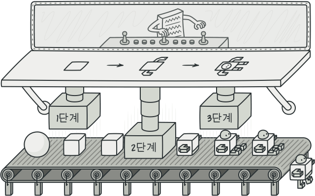

### 빌더 패턴 (builder pattern)

Java에서의 빌더 패턴(Builder Pattern)은 객체 생성 과정을 더 직관적이고 유연하게 만들기 위한 디자인 패턴이며, 주로 객체의 생성 과정이 복잡하거나 매개변수가 많을 때 사용된다.

> **특징**

- 객체의 생성과 구성을 분리한다.
- 가독성이 높아진다. 메서드 이름을 통해 생성되는 객체의 구성 요소를 명확히 알 수 있다.
- 필수적인 매개변수와 선택적인 매개변수를 구분할 수 있다.
- 객체의 불변성을 보장할 수 있다.

### 메서드 체이닝 (method chaining)

Method chaining은 객체의 메서드를 연이어 호출하는 프로그래밍 패턴을 말한다. 이 패턴을 통해 한 줄에 여러 메서드를 호출하여 객체를 설정하거나 조작할 수 있다.

> Method chaining은 코드의 가독성을 높이고, 한 줄로 간결하게 객체를 설정하거나 조작할 수 있도록 도와준다. 그러나 너무 길어지면 가독성이 떨어질 수 있으므로 적절한 상황에서 사용하는 것이 좋다.

> 두 패턴은 서로 관련이 있지만 다른 개념이며, 종종 같이 사용된다.
> 객체 생성과 설정을 더 효과적으로 관리할 수 있도록 도와주므로 복잡한 객체를 다룰 때 유용하다.

**@Builder**

*해당 클래스의 객체를 생성할 때 builder 패턴 사용이 가능하다.*

**@Accessors(chain = true)**

Lombok에서 제공하는 어노테이션으로 해당 클래스의 setter 메서드들이 자기 자신(this)을 반환하도록 만들어준다.

이를 통해 메서드 체이닝을 사용하여 객체를 설정(set)할 수 있게 된다.

*Ex >*

```java
@Data
@AllArgsConstructor
@NoArgsConstructor
@Builder
@Accessors(chain = true)
public class Person {
    private String firstName;
    private String lastName;
    private int age;
    private String address;
}

public class Main {
    public static void main(String[] args) {
        Person person = Person.builder()
                .firstName("John")
                .lastName("Doe")
                .age(30)
                .address("123 Main St")
                .build();
    }
}
```
