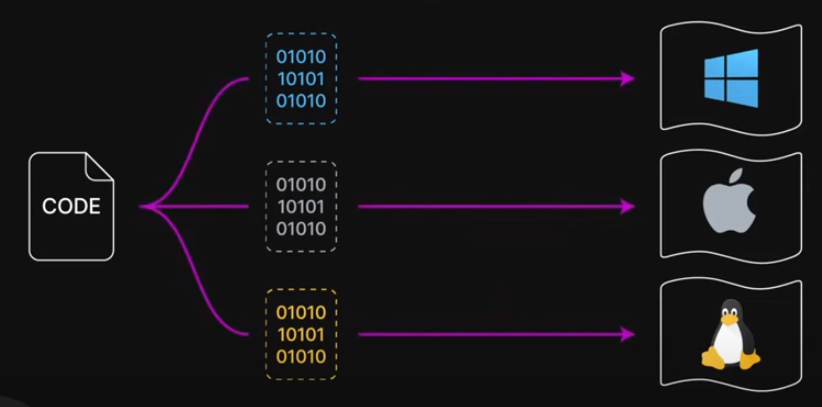
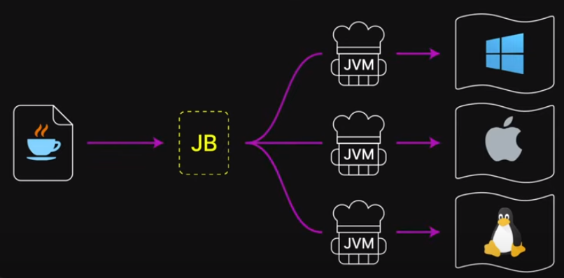
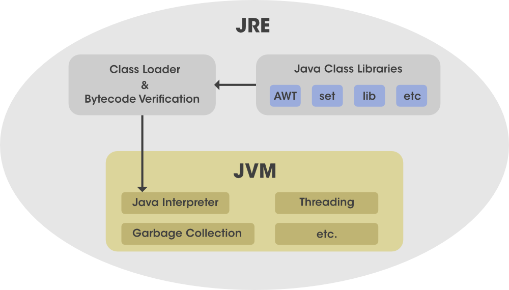
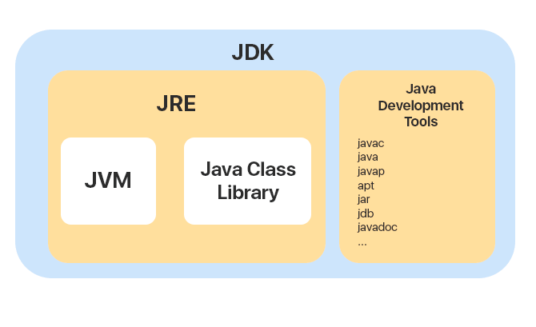

JVM, JRE, JDK의 이해와 관계

### **JVM** (Java Virtual Machine)

<u>jvm이란 자바 가상 머신으로 자바 프로그램 실행환경을 만들어주는 소프트웨어이다.</u>

프로그램을 실행하기 위해서는 개발자가 작성한 코드를 컴파일을 통해 컴퓨터가 이해할 수 있는 기계어로 번역하는 과정을 거쳐야 한다.

만약 C언어로 개발한 프로그램을 윈도우에서 사용하려면 .exe 로 컴파일하여 실행시킬 수 있다.

하지만 해당 프로그램을 리눅스나 맥 등 다른 운영체제에서 사용하려면 다시 실행할 운영체제에 맞는 파일로 컴파일 해줘야 한다.

*Example >*

하지만 Java는 코드를 자바 컴파일러를 통해 Java Bytecode로 .class 확장자를 가지는 파일로 변환하여 각 운영체제에 설치되어 있는 JVM에 전달하기만 하면 JVM이 Java Bytecode를 해당 운영체제에 맞는 실행파일로 변환해준다.

즉, 자바는 운영체제(플랫폼)에 영향을 받지 않고 어디서나 동일하게 실행할 수 있다.

*Example >*

### **JRE** (Java Runtime Environment)

jre란 자바 런타임 환경으로 컴퓨터의 운영체제 소프트웨어 상에서 실행되고 클래스 라이브러리 및 특정 Java프로그램이 실행해야 하는 기타 리소스를 제공하는 소프트웨어 계층이다.

<u>Jre 런타입 아키텍처</u>

**클래스 로더 (class loader)**

- Java 클래스 로더는 Java 프로그램의 실행에 필요한 모든 클래스를 동적으로 로드한다.

- Java 클래스는 필요 시에만 메모리에 로드되므로, jre는 클래스 로더를 요청 시에 이 프로세스를 자동화한다.

**바이트코드 검증기 (Bytecode Verifier)**

- 바이트코드 검증기는 인터프리터에 전달되기 전에 Java 코드의 형식과 정확성을 보장한다.

- 코드가 시스템 무결성 또는 액세스 권한을 위반하는 경우, 클래스는 손상된 것으로 간주되어 로드되지 않는다.

**인터프리터 (interpreter)**

- 바이트 코드의 로드에 성공한 후, Java 인터프리터는 Java 프로그램이 기본시스템에서 기본적으로 실행될 수 있도록 해주는 jvm의 인스턴스를 작성한다.

<u>Jre 구성요소</u>

**배치 솔루션 (batch solution)**

- 애플리케이션의 활성화를 간소화하고 향후 Java 업데이트를 위한 고급 지원을 제공하는 Java 플러그인 및 Java Web Start등과 같은 배치 기술이 jre 설치의 일부로 포함되어 있다.

**개발 툴킷 (development toolkit)**

- jre에는 개발자의 사용자 인터페이스 개선을 지원할 수 있도록 설계된 툴킷도 포함되어 있다.

> Java 2D, AWT, Swing

<u>통합 라이브러리</u>

**Java IDL (Corba)**

- 공통 오브젝트 요청 아키텍처를 사용하여 Java 프로그래밍 언어로 작성된 분산 오브젝트를 지원한다.

**JDBC API (Java Database Connectivity)**

- 원격 관계 데이터베이스, 플랫 파일 및 스프레드시트에 대한 액세스를 통해 애플리케이션을 작성할 수 있는 개발자용 툴을 제공한다.

**JNDI (Java Naming and Directory Interface)**

클라이언트가 이름 지정 규칙을 사용하여 데이터베이스에서 정보를 패치할 수 있는 포터블 애플리케이션을 작성할 수 있게 해주는 프로그래밍 인터페이스 및 디렉토리 서비스이다.

<u>언어 및 유틸리티 라이브러리</u> (java.lang / java.util)

**컬렉션 프레임워크 (collection framework)**

- 애플리케이션 데이터의 저장과 처리를 개선하도록 설계된 인터페이스의 컬렉션으로 구성된 통합 아키텍처이다.

**동시성 유틸리티 (concurrency utility)**

- 고성능 스레딩 유틸리티의 강력한 프레임워크 패키지이다.

**환경 설정 API (Preferences)**

- 동일 시스템에서 다수의 사용자가 자체 애플리케이션 환경 설정 그룹을 정의 할 수 있도록 해주는 경량의 크로스 플랫폼 지속적 api이다.

**로깅 (Logging)**

- 추가 분석을 위해 로그 보고서를 생성한다.

**JAR (Java Archive)**

- 다수의 파일을 jar형식으로 번들링할 수 있도록 하여 다운로드 속도를 개선하고, 파일 크기를 줄일 수 있도록 해주는 독립형 파일 형식이다.

### **JDK** (Java Development Kit)

jdk란 Java 애플리케이션 개발 및 실행을 위한 툴 세트이다.

개발자는 Java EE, Java SE, Java ME 등 Java 버전 및 패키지나 에디션에 따라 jdk를 선택한다.

<u>구성 요소</u>

**apt**

- 어노테이션 툴

**appletviewer**

- 웹브라우저 없이 자바 app를 실행하고 디버깅하기 위한 툴

**javac**

- 자바 컴파일러

**java**

- javac가 만든 클래스 파일을 해석 및 실행

**jar**

- 서로 관련있는 클래스 라이브러리들과 리소스를 하나의 파일로 묶어주는 툴

**jdb**

- 자바 디버깅 툴

**jre**

- 자바 런타임 환경

**jvm**

- 자바 가상머신

> 즉 JVM < JRE < JDK 는 포함되는 관계이다.

reference.

[https://www.youtube.com/watch?v=OxvtGYvVkRU](https://www.youtube.com/watch?v=OxvtGYvVkRU)

[https://www.ibm.com/kr-ko/topics/jre](https://www.ibm.com/kr-ko/topics/jre)
