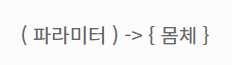

### **1. 람다 함수(Lambda Function)란?**

람다 함수는 함수형 프로그래밍 언어에서 사용되는 개념으로 **익명 함수**라고도 한다.

Java 8 부터 지원되며, 불필요한 코드를 줄이고 가독성을 향상시키는 것을 목적으로 두고있다.

### **2. 람다 함수의 특징**

- 메소드의 매개변수로 전달될 수 있고, 변수에 저장될 수 있다. 즉, 어떤 전달되는 매개변수에 따라서 행위가 결정될 수 있음을 의미한다.
- 컴파일러 추론에 의지하고 추론이 가능한 코드는 모두 제거해 코드를 간결하게 한다.

### **3. 람다식 표현**

- 파라미터와 몸체로 구분된다.
- 파라미터와 몸체 사이에 화살표(`->`)를 추가하여 람다식을 완성시킨다.
- 몸체 부분이 단일 행일 경우 중괄호와 return문을 생략할 수 있다.

### 함수형 인터페이스 (Functional Interface)

람다식이 아무 데나 쓰일 수 있는 건 아니고, **추상 메서드가 딱 하나만 있는 인터페이스(함수형 인터페이스)** 자리에만 들어갈 수 있다. 아래에서 볼 `new Thread(() -> {...})`가 가능한 이유도 `Runnable`이 추상 메서드 `run()` 하나만 가진 함수형 인터페이스이기 때문이다.

```java
@FunctionalInterface
interface Calculator {
    int calculate(int a, int b);
}

Calculator add = (a, b) -> a + b;
System.out.println(add.calculate(3, 4)); // 7
```

`@FunctionalInterface` 애너테이션은 필수는 아니지만, 실수로 추상 메서드를 2개 이상 추가하면 컴파일 에러로 막아주기 때문에 붙여두는 게 안전하다.

java.util.function 패키지에는 자주 쓰는 함수형 인터페이스가 미리 정의되어 있어서, 매번 인터페이스를 직접 만들지 않아도 된다.

| 인터페이스 | 메서드 시그니처 | 용도 |
| --- | --- | --- |
| `Function<T, R>` | `R apply(T t)` | 입력을 받아 변환한 결과를 반환 |
| `Consumer<T>` | `void accept(T t)` | 입력을 받아 소비만 하고 반환값 없음 |
| `Supplier<T>` | `T get()` | 입력 없이 값을 생성해서 반환 |
| `Predicate<T>` | `boolean test(T t)` | 입력을 받아 참/거짓 판단 |

```java
Function<Integer, Integer> square = x -> x * x;
Predicate<Integer> isEven = x -> x % 2 == 0;

System.out.println(square.apply(5)); // 25
System.out.println(isEven.test(4));  // true
```

이 인터페이스들은 `Stream`의 `map()`, `filter()` 같은 메서드의 파라미터 타입으로 그대로 쓰이기 때문에, 스트림 코드를 읽으려면 익숙해질 필요가 있다.

### **4. 익명함수를 람다식으로 변경하기**



**기존 방법**

```java
new Thread(new Runnable() {
            @Override
            public void run() {
                System.out.println("Thread!");
            }
        }).start();
```

**람다식**

```
new Thread(() -> {
            System.out.println("Thread!");
        }).start();
```

### 예제

<u>값 a, b를 입력 받아 더하기</u>

```java
(매개변수 목록) -> { 람다식 바디 }
public int sum(int a, int b) {
    return a + b;
}

// 람다식 
(a, b) -> a + b;
```

<u>값 a, b를 입력 받아 더 큰 수 리턴</u>

```java
public int big(int a, int b) {
	if(a > b) return a;
	else return b;
}

// 람다식 문법
(a, b) -> { return a > b ? a : b; }
(a, b) ->  a > b ? a : b
```
