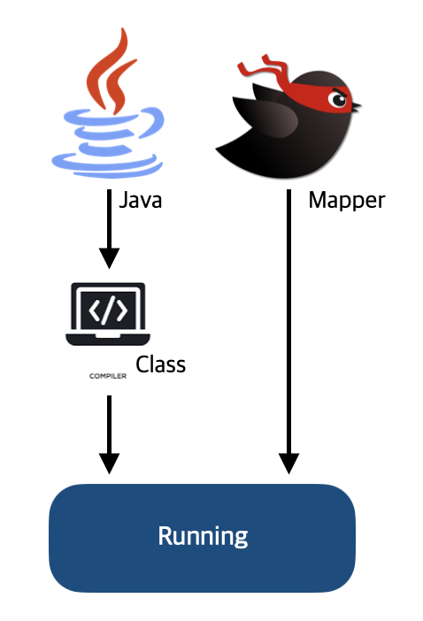

> InnerClass 사용 시 Mybatis에서 ClassNotFound 에러를 발생시키는 원인인 JVM의 클래스 네이밍 규칙..?


TDD 개발 중 Mybatis 매퍼 파일에 쿼리를 작성하여 실행했을 때 resultType으로 InnerClass인 Authority 클래스를 사용한 쿼리들에서 ClassNotFoundException이 발생했다.

*이래서 테스트 주도 개발이 중요하다....*

```sql
<select id="getAuthorities" resultType="kr.co.com.test.application.AdminDTO.Authority">
	SELECT
    	authority_id AS authorityId,
        authority_name AS authorityName,
        created_date AS createdDate
    FROM
        authorities
</select>
```

```
Caused by: java.lang.ClassNotFoundException: Cannot find class: kr.co.com.test.application.AdminDTO.Authority
```

분명 resultType으로 사용한 AdminDTO 클래스의 이너 클래스인 Authority 클래스는 해당 경로에 정상적으로 생성되어 있는데 왜 찾지 못한다는 걸까..? 원인을 알아보자

### 에러 원인

### 1. 이너 클래스 static 선언

inner class에 static을 붙이는 이유는 MyBatis에서만 사용하기 위함은 아니며, **Java의 언어적인 특성** 때문이다.

**정적 이너 클래스와 일반 이너 클래스의 차이**

Java에서 이너 클래스는 두 가지 유형이 있다.

- **정적 이너 클래스 (Static Nested Class)**: static 키워드가 붙은 이너 클래스는 **외부 클래스의 인스턴스에 종속되지 않고** 독립적으로 존재할 수 있다. 즉, 외부 클래스의 인스턴스 없이도 이 클래스를 사용할 수 있다.
- **일반 이너 클래스 (Non-static Inner Class)**: static 키워드가 없는 이너 클래스는 **외부 클래스의 인스턴스에 종속**된다. 이 클래스를 생성하려면 반드시 외부 클래스의 인스턴스가 필요하다.

```java
public class OuterClass {
    // static inner class
    public static class StaticInnerClass { }
    
    // non-static inner class
    public class InnerClass { }
}
```

**MyBatis에서 정적 이너 클래스를 요구하는 이유**

MyBatis는 SQL 매퍼로, XML 파일에서 지정된 클래스의 경로를 기반으로 매핑을 수행한다.

하지만 Java의 일반 이너 클래스는 외부 클래스의 인스턴스에 종속적이기 때문에, <u>외부 클래스의 인스턴스가 없으면 일반 이너 클래스를 MyBatis에서 독립적으로 사용할 수 없다.</u>

따라서, 일반 이너 클래스를 MyBatis에서 매핑하려면 외부 클래스의 인스턴스를 함께 제공해야 하지만, 이는 비효율적이고 복잡해진다.

반면, **static 이너 클래스**는 외부 클래스의 인스턴스 없이도 독립적으로 존재할 수 있기 때문에, MyBatis는 이런 클래스에 대해 직접적으로 접근할 수 있다.

---

### 2. 이너 클래스 '$'표시

MyBatis에서는 이너 클래스를 $ 기호로 표시한다.

왜 그럴까? JVM의 클래스 네이밍 규칙 때문이다. JVM에서는 InnerClass를 구분하기 위해 $기호를 사용한다.

```
// JVM의 Class네이밍 규칙
OuterClass$InnerClass

// JAVA의 Class네이밍 규칙
OuterClass.InnerClass
```

하지만 Java에서는 정적 이너클래스를 사용할 때 $ 기호가 아닌 .으로 구분한다.

이 이유는 <u>Java 코드가 자바 컴파일러(javac)에 의해 컴파일 될 때 외부 클래스와 이너 클래스를 구분하기 위해 $기호를 사용하여 내부적으로 클래스 파일을 생성</u>해주기 때문이다.



그렇기 때문에 Java 소스코드에서는 이너클래스를 .으로 표시하여 사용할 수 있지만 MyBatis의 매퍼파일(.xml)은 따로 컴파일 하지 않고 실행되기 때문에 <u>이너 클래스를 $기호로 표시해줘야 JVM의 클래스 로더(class loader)가 resultType으로 지정된 클래스를 불러올 때 정상적으로 경로를 찾을 수 있다</u>.

*- 끝 -*
