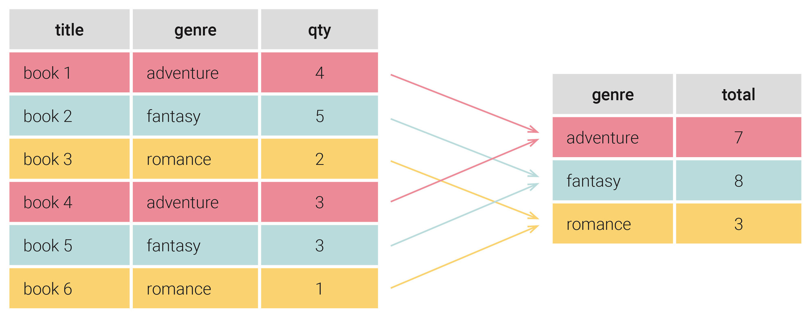

쿼리에서 데이터를 조회할 때 그룹화하는 것이 성능이 좋지만 상황에 따라 비즈니스 로직에서 Stream으로 그룹화 하면 Stream의 필터링, 매핑 등의 기능을 활용해서 복잡한 로직을 유연하게 처리할 수 있고, DB의 부하를 줄일 수 있다.



> 나의 경우 이전 로직에서 리스트를 단순 조회한 상태인데 그룹화 정보를 얻기 위해 대용량 데이터를 또 조회하는데 비용이 많이 들기 때문에 조회된 리스트를 활용하여 그룹화 정보를 추출했다.

### Stream 그룹핑

Java의 Stream API에서는 Collectors.groupingBy()를 사용하여 데이터를 그룹화할 수 있다.

**groupingBy()**

- 특정 기준(키)에 따라 데이터를 그룹화하여 Map<K, List<V>> 형태로 반환한다.

**Collectors.counting()**

- 그룹별 개수를 셀 수 있다. (집계)

+ 기본, 집계, 특정값 추출, 다중수준, 통계 그룹핑 방법..

### 기존 처리 로직

forEach로 하나 하나 반복하면서 이전 데이터와 다른지 확인하여 카운트

```
AtomicInteger tableCount = new AtomicInteger(0);
final Data[] prev = {null}; 

list.stream()
    .sorted(Comparator.comparing(d -> d.tableId)) // 정렬 필요시
    .forEach(data -> {  // 직접 조건 비교하여 count 증가
        if (prev[0] == null || 
            !prev[0].tableId.equals(data.tableId) || 
            prev[0].databaseSeq != data.databaseSeq) {
            tableCount.incrementAndGet();
        }
        prev[0] = data;
    });

System.out.println("테이블 개수: " + tableCount.get());
```

### 그룹화 처리 로직

table\_id + database\_id로 그룹화하여 카운트

```
int totalGroups = list.stream()
    .collect(Collectors.groupingBy(
        data -> data.tableId + data.databaseSeq  // 그룹 키 생성
    ))
    .size();  // 그룹의 개수를 바로 구함

System.out.println("Total groups: " + totalGroups);
```
