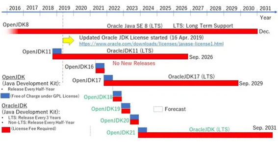
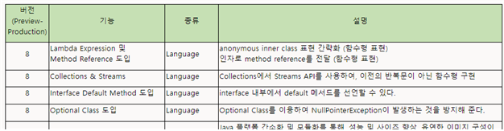

> Java 8버전이 많이 사용되는 이유.

JDK 8은 2014년에 등장하였고 장기 지원(LTS)버전 중에서도 가장 오랜 기간 지원되는 버전이며, 이러한 이유로 많은 프로젝트들이 Java 8로 개발되었기 때문에 기존 제품과의 호환성과 안정성 등의 이유 때문에 아직까지도 가장 많이 사용되는 버전이다.

*Oracle JDK 버전별 지원 로드맵*



#### **Java 8 버전의 핵심 기능들**

- <u>Lambda Expression</u>
- <u>Stream</u>
- <u>Optional Class</u>



---

## Lambda Expression

**람다 함수(Lambda Function)란?**

- 람다 함수는 함수형 프로그래밍 언어에서 사용되는 개념으로, 익명함수 라고도 불리고 있다.
- 람다 표현식을 사용하여 함수를 정의하며 이름이 없는 함수로, 코드를 간결하게 만들고 익명 함수를 간단하게 정의할 수 있는 기능을 제공한다.
- 자바 8부터 지원되며, 불필요한 코드를 줄이고 가독성을 향상시키는 것을 목적으로 한다.

**1. 람다 표현식 구조**

```
(parameters) -> { body }
```

- **parameters**: 메소드의 매개변수를 나타낸다.
- **->**: 람다 화살표(operator)로, 파라미터와 몸체를 구분한다.
- **{ body }**: 람다 함수의 본문이다. 실행될 코드를 포함한다.

Example >

```
(x, y) -> x + y
```

**2. 람다 표현식의 특징**

- **익명 함수**: 람다 표현식은 이름이 없는 함수이다. 이는 함수를 정의하면서 동시에 사용할 수 있게 해준다.
- **First-Class Citizens**: 람다 표현식은 함수를 값처럼 다루는 것을 지원한다. 이는 함수를 다른 함수의 인자로 전달하거나 함수의 반환값으로 활용할 수 있다는 것을 의미한다.
- **간결성과 가독성**: 람다 표현식을 사용하면 코드를 간결하게 만들 수 있다. 불필요한 코드를 제거하고 함수형 스타일로 코드를 작성할 수 있다.

> **익명 함수 (Anonymous functions) 사용 이유**
> 간결한 코드, 코드 모듈화와 재사용성, 함수형 프로그래밍, 이벤트 처리, 스레드와 병렬처리, 코드 가독성 향상 등

**3. 람다 표현식의 사용**

람다 표현식은 주로 컬렉션을 처리하거나 스레드를 다룰 때 활용된다. stream과 함께 사용하여 데이터를 변환하거나 필터링하거나 스레드를 생성할 때 간결한 문법으로 사용할 수 있다.

*사용 예시*

**1. 짝수 필터링**

람다 적용 전

```java
import java.util.ArrayList;
import java.util.List;

public class Main {
    public static void main(String[] args) {
        List<Integer> numbers = new ArrayList<>();
        numbers.add(1);
        numbers.add(2);
        numbers.add(3);
        numbers.add(4);
        numbers.add(5);

        // 짝수만 필터링
        List<Integer> evenNumbers = getEvenNumbers(numbers);

        // 결과 출력
        System.out.println("짝수만 필터링된 리스트: " + evenNumbers);
    }

    public static List<Integer> getEvenNumbers(List<Integer> numbers) {
        List<Integer> evenNumbers = new ArrayList<>();
        for (Integer num : numbers) {
            if (num % 2 == 0) {
                evenNumbers.add(num);
            }
        }
        return evenNumbers;
    }
}
```

람다 적용 후

```java
import java.util.ArrayList;
import java.util.List;

public class Main {
    public static void main(String[] args) {
        List<Integer> numbers = new ArrayList<>();
        numbers.add(1);
        numbers.add(2);
        numbers.add(3);
        numbers.add(4);
        numbers.add(5);

        // 람다 표현식을 사용하여 짝수만 필터링
        List<Integer> evenNumbers = numbers.stream()
                                           .filter(num -> num % 2 == 0)
                                           .toList();

        // 결과 출력
        System.out.println("짝수만 필터링된 리스트: " + evenNumbers);
    }
}
```

**2. 스레드 생성**

람다 적용 전

```java
public class Main {
    public static void main(String[] args) {
        // 익명 내부 클래스를 사용하여 스레드 생성
        Thread thread = new Thread(new Runnable() {
            @Override
            public void run() {
                for (int i = 0; i < 5; i++) {
                    System.out.println("Hello from Thread: " + i);
                }
            }
        });

        // 스레드 시작
        thread.start();
    }
}
```

람다 적용 후

```java
public class Main {
    public static void main(String[] args) {
        // 람다 표현식으로 스레드 생성
        Thread thread = new Thread(() -> {
            for (int i = 0; i < 5; i++) {
                System.out.println("Hello from Thread: " + i);
            }
        });

        // 스레드 시작
        thread.start();
    }
}
```

> 코드가 매우 간결해지고 가독성 향상

---

## Stream

#### 스트림(Stream)이란?

Stream은 Iterator와 비슷한 역할을 하는 반복자이지만, 람다식으로 요소 처리 코드를 제공하는 점과, 내부 반복자를 사용하므로 병렬처리가 쉽다는 점, 중간처리와 최종 처리 작업을 수행하는 점에서 많은 차이를 가지고 있다.

> **기존 루프문 처리의 문제점**

기존 Java에서 컬렉션 데이터를 처리할때는 for, foreach 루프문을 사용하면서 컬렉션 내의 요소들을 하나씩 다루었다.

간단한 처리나 컬렉션의 크기가 작으면 큰 문제가 아니지만 복잡한 처리가 필요하거나 컬렉션의 크기가 커지면 루프문의 사용은 성능저하를 일으킬 수 있다.

> **스트림의 등장**

스트림은 Java8에서 추가된 기능으로 컬렉션 데이터를 선언형으로 쉽게 처리할 수 있도록 한다.

복잡한 루프문을 사용하지 않아도 되며 루프문을 중첩해서 사용해야 되는 최악의 경우도 없으며, 스트림은 병렬처리(Multi thread)를 별도의 멀티스레드 구현없이도 쉽게 구현할 수 있다.

<u>*사용 예시*</u>

Stream [ X ]

```
// 빨간색 사과 필터링
List<Apple> redApples = new ArrayList<>();
for (Apple apple : appleList) {
    if (apple.getColor().equals("RED")) {
        redApples.add(apple);
    }
}

// 무게 순서대로 정렬
redApples.sort(Comparator.comparing(Apple::getWeight));

// 사과 고유번호 출력
List<Integer> redHeavyAppleUid = new ArrayList<>();
for (Apple apple : redApples)
    redHeavyAppleUid.add(apple.getUidNum());
```

Stream [ O ]

```
List<Integer> redHeavyAppleUid = appleList.stream()
        .filter(apple -> apple.getColor().equals("RED"))        // 빨간색 사과 필터링
        .sorted(Comparator.comparing(Apple::getWeight))         // 무게 순서대로 정렬
        .map(Apple::getUidNum).collect(Collectors.toList());    // 사과 고유번호 출력
```

**장점:**

1. **간결한 코드**: 스트림은 함수형 프로그래밍 스타일을 지원하며, 코드를 간결하게 만든다. 필터링, 매핑, 정렬 등의 연산을 한 줄로 표현할 수 있다.
2. **병렬 처리 지원**: 스트림은 내부적으로 멀티쓰레딩을 활용하여 병렬 처리를 할 수 있다. 이는 데이터를 빠르게 처리할 수 있게 해주며, 다중 코어를 활용하는데 유용하다.
3. **지연 평가**(Lazy Evaluation): 스트림은 연산이 실제로 필요할 때까지 기다린다. 이는 필요한 데이터만 처리하고 메모리를 절약할 수 있게 해준다.
4. **중간 및 최종 연산**: 스트림은 중간 연산과 최종 연산으로 구성된다. 중간 연산은 필터링, 매핑 등을 수행하고, 최종 연산은 최종 결과를 생성한다. 이를 통해 연산을 체이닝할 수 있다.

**단점:**

1. **메모리 사용**: 스트림은 내부적으로 반복자를 사용하며, 한 번 사용된 스트림은 재사용이 불가능하다. 따라서 큰 데이터셋을 다룰 때는 메모리 사용에 주의해야 한다.
2. **스트림 오버헤드**: 작은 규모의 데이터셋에는 스트림을 사용하기보다는 일반적인 반복문을 사용하는 것이 더 효율적일 수 있다.
3. **병렬 처리**: 작은 규모의 데이터셋이나 복잡한 연산의 경우에는 순차적인 처리가 병렬 처리보다 빠를 수 있다.

### Intermediate Operations (중간 연산)

- **filter**(predicate): 조건에 맞는 요소를 선택한다.

```
List<Integer> numbers = Arrays.asList(1, 2, 3, 4, 5, 6, 7, 8, 9, 10);
List<Integer> evenNumbers = numbers.stream()
                                  .filter(n -> n % 2 == 0)
                                  .collect(Collectors.toList());
// 결과: [2, 4, 6, 8, 10]
```

- **map**(function): 요소들을 변환한다.

```
List<String> names = Arrays.asList("Alice", "Bob", "Charlie");
List<Integer> nameLengths = names.stream()
                                 .map(String::length)
                                 .collect(Collectors.toList());
// 결과: [5, 3, 7]
```

- **sorted**(): 요소들을 기본 정렬 순서에 따라 정렬한다.

```
List<Integer> numbers = Arrays.asList(5, 3, 8, 1, 2);
List<Integer> sortedNumbers = numbers.stream()
                                     .sorted()
                                     .collect(Collectors.toList());
// 결과: [1, 2, 3, 5, 8]
```

- **distinct**(): 중복된 요소를 제거한다.

```
List<Integer> numbers = Arrays.asList(1, 2, 3, 2, 4, 3, 5);
List<Integer> distinctNumbers = numbers.stream()
                                       .distinct()
                                       .collect(Collectors.toList());
// 결과: [1, 2, 3, 4, 5]
```

- **limit**(n): 처음부터 n개의 요소로 제한한다.

```
List<Integer> numbers = Arrays.asList(1, 2, 3, 4, 5);
List<Integer> limitedNumbers = numbers.stream()
                                      .limit(3)
                                      .collect(Collectors.toList());
// 결과: [1, 2, 3]
```

- **skip**(n): 처음 n개의 요소를 건너뛴 후 남은 요소들로 구성한다.

```
List<Integer> numbers = Arrays.asList(1, 2, 3, 4, 5);
List<Integer> skippedNumbers = numbers.stream()
                                      .skip(2)
                                      .collect(Collectors.toList());
// 결과: [3, 4, 5]
```

### Terminal Operations (최종 연산)

- **forEach**(consumer): 각 요소를 소비하면서 작업을 수행한다. - print

```
List<String> names = Arrays.asList("Alice", "Bob", "Charlie");
names.stream()
     .forEach(System.out::println);
// 출력: Alice
//       Bob
//       Charlie
```

- **collect**(collector): 요소들을 수집하여 결과를 반환한다. - list

```
List<String> names = Arrays.asList("Alice", "Bob", "Charlie");
List<String> collectedNames = names.stream()
                                  .collect(Collectors.toList());
// 결과: ["Alice", "Bob", "Charlie"]
```

---

## Optional Class (옵셔널 클래스)


java.util.Optional은 Java 8에서 도입된 클래스로, 값이 존재하지 않을 수 있는 상황에 사용하면 NullPointerException을 방지하고 코드를 더 안전하게 만들 수 있다.

> 즉, 값이 존재하는 상태(NOT NULL)와 값이 존재하지 않는 상태(NULL)를 체크하며 에러를 발생시키지 않고 예외처리를 통해 코드의 안전성을 높일 수 있다.

### Optional 문법 사용 방법

#### **1. Optional 객체 생성 :**

**Optional.of(value)**: 만약 값이 null이라면 NullPointerException이 발생.

**Optional.ofNullable(value)**: 값이 null인 경우 빈 Optional을 반환.

```
Optional<String> optionalWithValue = Optional.of("Hello");
Optional<String> optionalWithNull = Optional.ofNullable(null);
```

#### **2. 값의 존재 여부 확인 :**

**isPresent()**: 값이 존재하는지 여부를 확인.

```
Optional<String> optional = Optional.of("Hello");
boolean isPresent = optional.isPresent(); // true

// Lambda 활용
optional.ifPresent(value -> System.out.println("a"));
```

#### **3. 값 가져오기 :**

**get():** 값이 존재한다면 해당 값을 반환. 값이 존재하지 않는 경우 <u>NoSuchElementException</u>이 발생.

```
Optional<String> optional = Optional.of("Hello");
String value = optional.get(); // "Hello"
```

#### **4. 값이 존재하지 않을 때 대체 값 사용하기 :**

**orElse(other)**: 값이 존재하지 않을 때 대체 값을 반환.

```
Optional<String> optional = Optional.ofNullable(null);
String value = optional.orElse("Default Value"); // "Default Value"
```

#### **5. 값이 존재하지 않을 때 처리 :**

**ifPresent(consumer):** 값이 존재할 때만 주어진 동작을 수행.

```
Optional<String> optional = Optional.of("Hello");
optional.ifPresent(value -> System.out.println("Value is present: " + value));
```

#### **6. 값 변환 :**

**map(function):** 값이 존재할 때 주어진 함수를 적용하고, 그 결과를 새로운 Optional로 반환.

```
Optional<String> optional = Optional.of("Hello");
Optional<Integer> lengthOptional = optional.map(String::length); // Optional[5]

// Method Chaining 응용
Optional<String> optionalString = Optional.of("hello");
        String result = optionalString
                .map(str -> str.toUpperCase()) // 소문자를 대문자로 변환
                .map(str -> str + " WORLD")     // 문자열 뒤에 " WORLD" 추가
                .map(str -> str.substring(0, 5)) // 처음 5글자만 남기기
                .orElse("Default Value");        // 값이 없을 경우 기본값 반환
        System.out.println(result); // 출력: HELLO
```

#### **7. 다른 Optional 객체와 결합 :**

**flatMap(function)**: 두 Optional 객체를 결합하고, 결과를 반환.

```
Optional<String> optional1 = Optional.of("Hello");
Optional<String> optional2 = Optional.of(" World");
Optional<String> combined = optional1.flatMap(value1 -> optional2.map(value2 -> value1 + value2)); // Optional[Hello World]
```

*- 끝 -*
