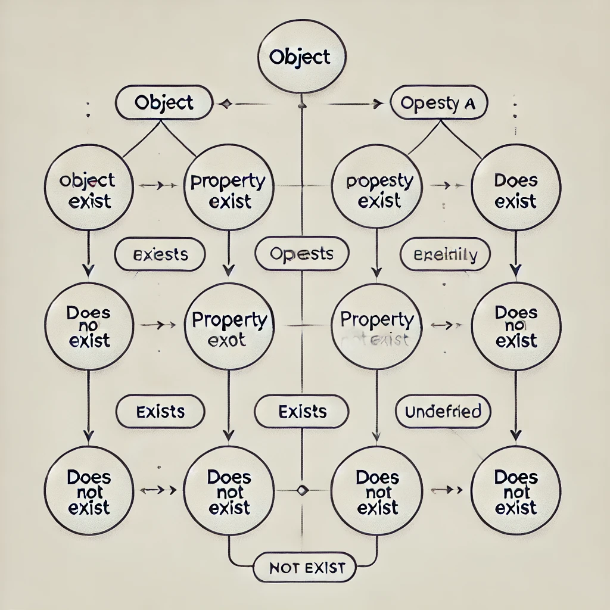

> 코드를 작성하다 보면 if, if, if.. null & undefined 처리를 일일이 작성하다 보면 코드가 더러워지고 가독성도 떨어지게 된다. 이를 해결하기 위한 수단으로 옵셔널 체이닝과 논리 연산을 활용할 수 있다.



### 1. **옵셔널 체이닝 ( ?. )**

- **용도**: 객체나 배열에서 중첩된 속성에 접근할 때, 해당 경로 중간에 null 또는 undefined가 있을 경우 에러를 방지한다.
- **특징**:
  - 중간 단계에서 null 또는 undefined일 경우 바로 undefined를 반환.
  - 객체 접근에 안전하게 사용.

#### 예제:

```
const obj = { a: { b: null } }; 

console.log(obj?.a?.b); // null 
console.log(obj?.a?.c); // undefined 
console.log(obj?.x?.y); // undefined
```

---

### 2. **OR 연산자 ( || )**

- **용도**: **Falsy**(false-like) 값(예: null, undefined, 0, '', false)을 기본값으로 대체할 때 사용한다.
- **특징**:
  - 왼쪽 값이 **Falsy**면 오른쪽 값을 반환.
  - null이나 undefined뿐만 아니라 0, false, "" 같은 값도 기본값으로 대체됨.

#### 예제:

```
const obj = { a: { b: null } }; 
console.log(obj.a.b || '기본값'); // '기본값' (b는 null이므로 기본값 반환) 
console.log(obj.a.c || '기본값'); // '기본값' (c는 undefined이므로 기본값 반환) 
console.log(0 || '기본값'); // '기본값' (0은 Falsy 값)
```

---

### **비교 요약**

| &nbsp; | **주요 목적** | **처리 대상** | **작동 방식** |
| --- | --- | --- | --- |
| <u>**옵셔널 체이닝**</u>**( ?. )** | 안전하게 중첩된 속성 접근 | null 또는 undefined | 경로 중간에 null/undefined면 중단 |
| <u>**OR 연산자**</u>**( \|\| )** | 기본값 대체 | 모든 Falsy 값 (예: null, undefined, 0, '') | 왼쪽 값이 Falsy이면 오른쪽 값을 반환 |

### **혼합 사용 예**

둘을 함께 사용하여 더 안전하게 처리할 수도 있다.

```
const value = obj?.a?.b || '기본값';
```

- obj?.a?.b: 안전하게 접근.
- || '기본값': null, undefined, 또는 다른 Falsy 값일 때 기본값 반환.

---

### **결론**

- **?.**: 중첩된 객체/배열의 특정 값에 접근할 때 안전성을 확보.
- **||**: Falsy 값에 대해 기본값을 설정할 때 적합.
- 용도에 따라 상황에 맞게 선택하거나, 필요한 경우 조합해서 사용하는 것이 좋다.

*- 끝 -*
