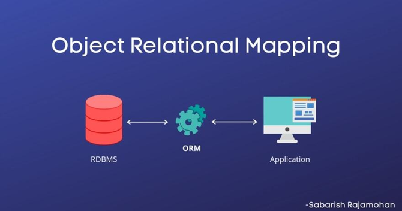
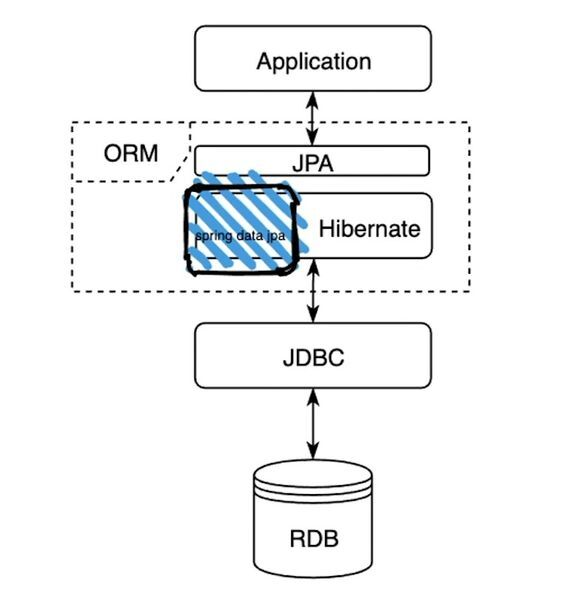

#### **JPA (Java Persistence API) 란?**

- 자바 진영에서 ORM(Object-Relational Mapping) 기술 표준으로 사용되는 인터페이스의 모음이다.
- 그 말은 즉, 실제적으로 구현된것이 아니라 구현된 클래스와 매핑을 해주기 위해 사용되는 프레임워크이다.
- JPA를 구현한 대표적인 오픈소스로는 Hibernate가 있다.

#### 우선 ORM에 대해 알아야 한다!

- 애플리케이션 Class와 DataBase테이블을 매핑(연결)해준다.
- 즉 애플리케이션의 객체를 RDB 테이블에 자동으로 영속화 해주는 것이다.

### **장점**

- SQL문이 아닌 Method를 통해 DB를 조작할 수 있어, 개발자는 객체 모델을 이용하여 비즈니스 로직을 구성하는데만 집중할 수 있음.(내부적으로는 쿼리를 생성하여 DB를 조작함. 하지만 개발자가 이를 신경 쓰지 않아도됨)
- Query와 같이 필요한 선언문, 할당 등의 부수적인 코드가 줄어들어, 각종 객체에 대한 코드를 별도로 작성하여 코드의 가독성을 높임
- 객체지향적인 코드 작성이 가능하다. 오직 객체지향적 접근만 고려하면 되기때문에 생산성 증가
- 매핑하는 정보가 Class로 명시 되었기 때문에 ERD를 보는 의존도를 낮출 수 있고 유지보수 및 리팩토링에 유리
- 예를들어 기존 방식에서 MySQL 데이터베이스를 사용하다가 PostgreSQL로 변환한다고 가정해보면, 새로 쿼리를 짜야하는 경우가 생김. 이런 경우에 ORM을 사용한다면 쿼리를 수정할 필요가 없음

### **단점**

- 프로젝트의 규모가 크고 복잡하여 설계가 잘못된 경우, 속도 저하 및 일관성을 무너뜨리는 문제점이 생길 수 있음
- 복잡하고 무거운 Query는 속도를 위해 별도의 튜닝이 필요하기 때문에 결국 SQL문을 써야할 수도 있음
- 학습비용이 비쌈

---

#### **JPA 특징**

> **생산성**

INSERT 쿼리를 작성하는 반복적인 작업을 JPA가 대신 처리해준다. 데이터베이스 설계 중심의 패러다임을 객체 설계 중심으로 역전시킬 수 있다.

> **유지보수**

엔티티에 필드가 추가될때마다 대응해야하는데 등록/수정/조회 쿼리를 수정할 필요 없이 JPA가 모두 대신 처리해준다.

유지보수해야하는 코드 수가 줄어든다.

> **패러다임의 불일치 해결**

상속, 연관관계, 객체 그래프 탐색, 비교하기와 같은 패러다임의 불일치 문제를 해결해준다.

> **성능**

애플리케이션과 데이터베이스 사이에서 다양한 성능 최적화 기회를 제공한다. JPA는 애플리케이션과 데이터베이스 사이에서 동작한다.

> **데이터 접근 추상화와 벤더 독립성**

관계형 데이터베이스는 같은 기능도 벤더마다 사용법이 다르다. 각각 데이터베이스마다 다른 점에 상관없이 기술에 종속되지 않을 수 있다. 데이터베이스를 변경하게되면 JPA에게 다른 데이터베이스를 사용한다고 알려주기만 하면 된다.

> **표준**

JPA는 자바 진영의 ORM 기술 표준이다. 표준을 사용하면 다른 구현 기술로 손쉽게 변경할 수 있다.

---

#### **Jpa 구조도**

### ORM (Object-Relational Mapping)

- 데이터베이스와 애플리케이션 연결
- Jpa를 인터페이스로 정의하여 제공

### Hibernate

- Jpa의 실제 구현 클래스를 모아둔 것

### spring data jpa

- Hibernate의 클래스 중 spring에서 많이 사용하는 것을 묶음으로 제공
- spring에서 사용하는 JPA는 spring data jpa이다.
