#### JPA에서 사용되는 어노테이션!

## **1. @Entity**

- JPA를 사용해 테이블과 매핑할 클래스에 붙여주는 어노테이션이다.
- JPA가 해당 클래스를 관리하게 된다.

| 속성 | 기능 |
| --- | --- |
| name | JPA에서 사용할 엔티티 이름 지정. name을 쓰지 않을 경우 (default) 클래스 이름을 entity 이름으로 지정 |

> @Entity의 name = "user2"로 함으로써 user2 테이블이 생성된 것을 볼 수 있다.

```java
@Entity(name = "user2")
public class User {}
```

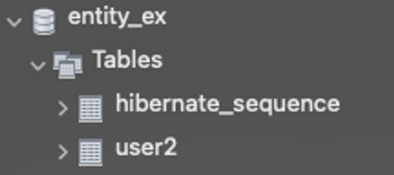

> 주의 사항

- 기본 생성자가 꼭 필요 (@NoArgsConstructor)
- final, enum, interface, inner class에서는 사용 불가
- 필드(변수)를 final로 선언 불가

---

## **2. @Table**

- 엔티티와 매핑할 테이블을 지정

| 속성 | 기능 |
| --- | --- |
| name | 매핑할 테이블 이름. 생략시 엔티티 이름(@Entity(name="~") 사용 |
| catalog | catalog 기능이 있는 DB에서 catalog 매핑 |
| schema | schema기능이 있는 DB에서 schema 매핑 |
| uniqueContraints | DDL 생성시 유니크 제약조건 생성. ※ 스키마 자동 생성 기능을 사용해 DDL을 만들 때만 사용 |

> @Table의 테이블 이름이 name값으로 설정이 되고 생략 시 Entity이름으로 테이블이 만들어지는 것을 확인할 수 있다.

```java
@Entity
@Table(name = "user3")
@Getter
@Setter
public class User {
    @Id
    @GeneratedValue
private Long id;
private String name;
}
```

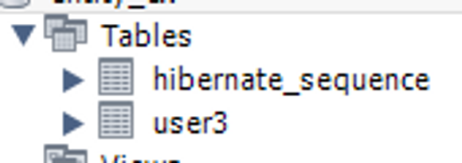

```java
@Entity(name="user2")
@Table
@Getter
@Setter
public class User {
    @Id
    @GeneratedValue
private Long id;
private String name;
}
```

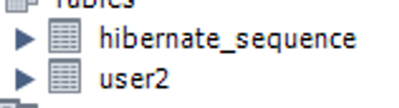

---

## **3. @Id**

- 특정 속성을 기본키로 설정하는 어노테이션이다.

```java
@Entity
@Table(name = "User")
public class User {
    @Id
private Long id;
private String name;
}
```

> @Id 어노테이션만 적게될 경우 기본키 값을 직접 부여해줘야 한다.

> 보통 기본키는 직접 부여하지 않고 Mysql AUTO_INCREMENT처럼 자동 부여되게끔 한다.

```java
@Entity(name="user2")
@Table
@Getter
@Setter
public class User {
    @Id
    @GeneratedValue(strategy = GenerationType.IDENTITY)
private Long id;
private String name;
}
```

> **@GeneratedValue** 어노테이션을 사용하면 기본값을 DB에서 자동으로 생성하는 전략을 사용 할 수 있다.

> 전략에는 IDENTITY, SEQUENCE, TABLE 3가지가 있다.

| 속성 | 기능 |
| --- | --- |
| @GeneratedValue(strategy = GenerationType.IDENTITY) | 기본 키 생성을 DB에 위임 (Mysql) |
| @GeneratedValue(strategy = GenerationType.SEQUENCE) | DB시퀀스를 사용해서 기본 키 할당 (ORACLE) |
| @GeneratedValue(strategy = GenerationType.TABLE) | 키 생성 테이블 사용 (모든 DB 사용 가능) |
| @GeneratedValue(strategy = GenerationType.AUTO) | 선택된 DB에 따라 자동으로 전략 선택 |

> 위 처럼 다양한 전략이 있는 이유는 DB마다 지원하는 방식이 다르기 때문이다.

> AUTO 같은 경우DB에 따라 전략을 JPA가 자동으로 선택한다. 이로 인해 DB를 변경해도 코드를 수정할 필요 없다는 장점이 있다.

---

## **4. @Column**

- 객체 필드를 테이블 컬럼과 매핑한다.

```java
@Column
private String name;
```

| 속성 | 기능 |
| --- | --- |
| name | 필드와 매핑할 테이블의 컬럼 이름 지정. default는 필드 이름으로 대체 |
| insertable | true : 엔티티 저장 시 필드값 저장 / false : 필드 값이 저장되지 않음 |
| updatable | true : 엔티티 수정 시 값이 수정 / false : 엔티티 수정시 값이 수정 되지 않음 |
| table | 하나의 엔티티를 두 개 이상의 테이블에 매핑할 때 사용 |
| nullable | null값 허용 여부 설정 (false : not null 제약 조건) |
| unique | 컬럼에 유니크 제약조건 부여 |
| columnDefinition | 데이터베이스 컬럼 정보를 직접 부여 |
| length | 문자 길이 제약조건 String 타입일 때 사용 |
| precision, scale | BigDecimal 타입에서 사용 (precision : 소수점을 포함한 전체 자릿수 설정 / scale : 소수의 자릿수) |

### **insertable**

```java
//Entity
@Entity(name="user2")
@Builder
@AllArgsConstructor
@NoArgsConstructor
public class User {
    @Id
    @GeneratedValue
private Long id;
    @Column(insertable = false)
private String name;
private String age;
}

//Service
@Service
@RequiredArgsConstructor
public class TestService {
private final EntityManager em;
    @Transactional
public void test() {
        **User user = User.builder()
                .age("12")
                .name("test")
                .build();
        em.persist(user);**
    }
}
```


> 위의 결과는 User 엔티티에 name 컬럼에 "test"를 입력해도 DB에는 값이 들어가지 않는다.

### **updatable**

```java
//Entity
@Entity(name="user2")
@Builder
@AllArgsConstructor
@NoArgsConstructor
@Setter
public class User {
    @Id
    @GeneratedValue
private Long id;
    @Column(updatable = false)
private String name;
private String age;
}

//Service
@Service
@RequiredArgsConstructor
public class TestService {
private final EntityManager em;
    @Transactional
public void test() {
        **User user = User.builder()
                .age("12")
                .name("test")
                .build();
        em.persist(user);
        user.setName("change test");**
    }
}
```

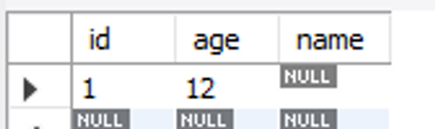

> 위의 결과는 User 엔티티 name 컬럼에 "test"를 입력하고 "change test"로 변경해도 변경값이 적용되지 않는다.

### **nullable**

```java
@Entity(name="user2")
@Builder
@AllArgsConstructor
@NoArgsConstructor
@Setter
public class User {
    @Id
    @GeneratedValue
private Long id;
    **@Column(nullable = false)
private String name;
    @Column(nullable = true)
private String age;**
}
```

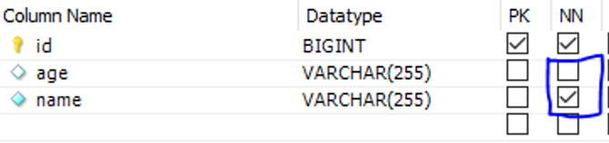

> 위의 결과는 nullable true, false에 따라 not null이 적용되는지 여부이다.

### **unique**

```java
@Entity(name="user2")
@Builder
@AllArgsConstructor
@NoArgsConstructor
@Setter
public class User {
    @Id
    @GeneratedValue
private Long id;
    **@Column(unique = true)
private String name;
    @Column(unique = false)
private String age;**
}
```

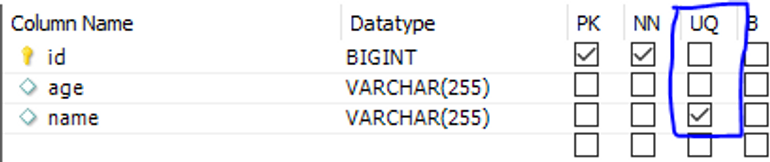

### **columnDefinition**

```java
@Entity(name="user2")
@Builder
@AllArgsConstructor
@NoArgsConstructor
@Setter
public class User {
    @Id
    @GeneratedValue
private Long id;
    @Column(unique = true)
private String name;
    @Column(columnDefinition = "VARCHAR(15) NOT NULL")
private String age;
}
```

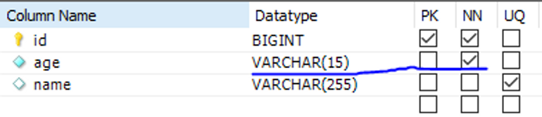

### **length**

```java
@Entity(name="user2")
@Builder
@AllArgsConstructor
@NoArgsConstructor
@Setter
public class User {
    @Id
    @GeneratedValue
private Long id;
    @Column(length = 11)
private String name;
    @Column(columnDefinition = "VARCHAR(15) NOT NULL")
private String age;
}
```

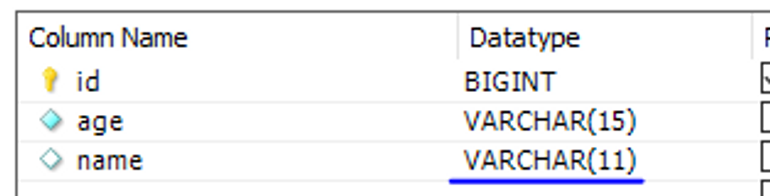

---

## **5. @Access**

- JPA가 엔티티 데이터에 접근하는 방식을 지정한다.

| 접근 방식 | 기능 |
| --- | --- |
| AccessType.FIELD | 필드에 직접 접근. 필드 접근 권한이 private여도 접근 가능 |
| AccessType.PROPERTY | getter를 통해 접근 |

> 디폴트 값은 @Id의 위치를 기준으로 접근 방식 설정

```java
@Entity(name = "user2")
@Table(name = "user3")
@Getter
@Setter
public class User {
    @Id
    @GeneratedValue
private Long id;
}
```

> @Id가 필드에 설정되면 @Access(AccessType.FIELD)로 설정된 아래 코드랑 같다.

```java
@Entity(name = "user2")
@Table(name = "user3")
@Getter
@Setter
@Access(AccessType.FIELD)
public class User {
    @Id
    @GeneratedValue
private Long id;
}
```

> getter에 @Id를 설정함으로 써 프로퍼티 접근으로 할 수 있다. @Id가 getter에 위치하므로 @Access를 생략할 수 있다.

```java
@Entity(name = "user2")
@Table(name = "user3")
@Setter
@Access(AccessType.PROPERTY)
public class User {

    @GeneratedValue
private Long id;

    @Id
public Long getId() {
return id;
    }
}
```

> 필드 접근과 프로퍼티 접근을 혼합하여 아래처럼 사용할 수 있다.

```java
//Entity
@Entity(name = "user2")
@Table(name = "user3")
@Getter
@Setter
public class User {
    @Id
    @GeneratedValue
private Long id;

    @Transient
private String name;

    @Access(AccessType.PROPERTY)
public String getFullName() {
return name + " hello";
    }
protected void setFullName(String firstName) { }
}

//Service
@Service
@RequiredArgsConstructor
public class TestService {
private final EntityManager em;
    @Transactional
public void test() {
        User user = new User();
        user.setName("aaa");
        em.persist(user);
    }
}
```

> getter에 AccessType.PROPERTY를 함으로써 getter의 fullName을 column으로 지정한다.

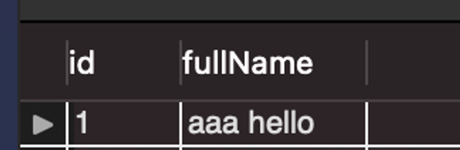

---

## **6. @Enumerated**

- 자바 enum 타입을 매핑할 때 사용한다.

| 속성 | 기능 | &nbsp; |
| --- | --- | --- |
| value | EnumType.ORDINAL : enum 순서를 DB에 저장. EnumType.STRING : enum이름을 DB에 저장. | &nbsp; |

```java
//Enum 클래스
public enum RoleType {
    ADMIN, USER
}

//Entity
@Entity(name = "user2")
@Table(name = "user3")
@Getter
@Setter
public class User {
    @Id
    @GeneratedValue
private Long id;
private String name;
    @Enumerated(value = EnumType.ORDINAL)
private RoleType ordinal;
    @Enumerated(value = EnumType.STRING)
private RoleType string;
}

//Service
@Service
@RequiredArgsConstructor
public class TestService {
private final EntityManager em;
    @Transactional
public void test() {
        User user = new User();
        user.setName("test");
        user.setOrdinal(RoleType.ADMIN);
        user.setString(RoleType.ADMIN);
        em.persist(user);
    }
}
```

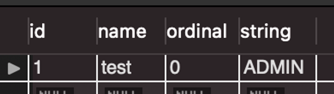

> 결과를 보면 EnumType.ORDINAL은 ADMIN의 순서인 0이 저장되고, EnumType.STRING은 문자열 자체가 저장된다.

> 사용할 때 주의점은 ADMIN, USER 사이에 enum이 하나 추가되면 USER가 순서상 2번이 된다. 하지만 DB에서는 기존 번호 USER를 1로 저장했기 때문에 문제가 발생할 수 있으므로 되도록이면 EnumType.STRING사용을 권장한다.

---

## **7. @Temporal**

- 날짜 타입을 매핑할 때 사용한다.

| 속성 | 기능 |
| --- | --- |
| value | TemporalType.DATE : 날짜, DB date 타입과 매핑(예 : 2020-02-12) TemporalType.TIME : 시간, DB time 타입과 매핑(예: 12:12:12) TemporalType.TIMESTAMP : 날짜와 시간 DB timestamp타입과 매핑(예 : 2020-02-12 12:12:12) |

```java
//Entity
@Entity(name = "user2")
@Table(name = "user3")
@Getter
@Setter
public class User {
    @Id
    @GeneratedValue
private Long id;
private String name;
    @Enumerated(value = EnumType.ORDINAL)
private RoleType ordinal;
    @Enumerated(value = EnumType.STRING)
private RoleType string;
    @Temporal(value = TemporalType.DATE)
private Date date;
    @Temporal(value = TemporalType.TIME)
private Date time;
    @Temporal(value = TemporalType.TIMESTAMP)
private Date timeStamp;
}

//Service
@Service
@RequiredArgsConstructor
public class TestService {
private final EntityManager em;
    @Transactional
public void test() {
        User user = new User();
        Date date = new Date();
        user.setName("test");
        user.setOrdinal(RoleType.ADMIN);
        user.setString(RoleType.ADMIN);
        user.setTime(date);
        user.setDate(date);
        user.setTimeStamp(date);
        em.persist(user);
    }
}
```

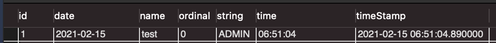

---

## **8. @Lob**

- DB BLOB, CLOB 타입과 매핑. @Lob은 정의할 속성이 따로 없다.
- 필드 타입이 문자열이면 CLOB, 나머지는 BLOB을 매핑

```java
//Entity
@Entity(name = "user2")
@Table(name = "user3")
@Getter
@Setter
public class User {
    @Id
    @GeneratedValue
private Long id;
private String name;
    @Enumerated(value = EnumType.ORDINAL)
private RoleType ordinal;
    @Enumerated(value = EnumType.STRING)
private RoleType string;
    @Temporal(value = TemporalType.DATE)
private Date date;
    @Temporal(value = TemporalType.TIME)
private Date time;
    @Temporal(value = TemporalType.TIMESTAMP)
private Date timeStamp;
    @Lob
private String stringLob;
    @Lob
private Integer integerLob;
}

//Service
@Service
@RequiredArgsConstructor
public class TestService {
private final EntityManager em;
    @Transactional
public void test() {
        User user = new User();
        Date date = new Date();
        user.setName("test");
        user.setOrdinal(RoleType.ADMIN);
        user.setString(RoleType.ADMIN);
        user.setTime(date);
        user.setDate(date);
        user.setTimeStamp(date);
        user.setStringLob("hello");
        user.setIntegerLob(2);
        em.persist(user);
    }
}
```

> Mysql에서의 결과를 보면 <u>**stringLob**</u>은 LONGTEXT, **<u>integerLob</u>**은 LONGBLOB으로 매핑된 것을 확인할 수 있다.

---

## **9. @Transient**

- 이 어노테이션을 붙인 필드는 DB에 저장하지도 조회하지도 않는다.
- 객체에 임시로 값을 보관하고 싶을 때 사용

```java
@Entity(name = "user2")
@Table(name = "user3")
@Getter
@Setter
public class User {
    @Id
    @GeneratedValue
private Long id;
private String name;
    @Enumerated(value = EnumType.ORDINAL)
private RoleType ordinal;
    @Enumerated(value = EnumType.STRING)
private RoleType string;
    @Temporal(value = TemporalType.DATE)
private Date date;
    @Temporal(value = TemporalType.TIME)
private Date time;
    @Temporal(value = TemporalType.TIMESTAMP)
private Date timeStamp;
    @Lob
private String stringLob;
    @Lob
private Integer integerLob;

    //임시 사용
    @Transient
private String trans;
}
```

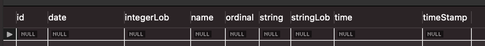

> @Transient를 단 trans필드가 DB컬럼에 추가되지 않는것을 확인할 수 있다.

---

## **10. @Transactional**

- DB와 관련된(Entity), 트랜잭션이 필요한 서비스 클래스나 메서드에 사용한다.
- @Transactional이 붙은 메서드는 메서드가 포함하고 있는 작업 중에 하나라도 실패할 경우 전체 작업을 취소한다.
- 해당 클래스나 메서드의 마지막에 AutoFlush(commit)가 발생한다.

**flush()**

- 즉시 DB에 커밋 시켜준다.
- userRepository.flush()

---

## **@PrePersist**

- 새로운 엔티티가 삽입(insert)되기 전에 어떠한 동작을 실행시킨다.
- DB에 insert하기 전에 어떤 로직을 수행하고 싶을 때 사용한다.

**Ex >**

```java
@PrePersist
public void prePersist() {
	this.createdAt = LocalDateTime.now();
	this.updatedAt = LocalDateTime.now();
}
```

> 위와 같이 메서드에 사용해 자동으로 생성, 수정 시간 업데이트 시킬 수 있다.

**@PrePersist**

- 삽입(insert) 전 실행

**@PreUpdate**

- 수정(update) 전 실행

**@PreRemove**

- 삭제(delete) 전 실행

**@PostPersist**

- 삽입(insert) 후 실행

**@PostUpdate**

- 수정(update) 후 실행

**@PostRemove**

- 삭제(delete) 후 실행

**@PostLoad**

- 검색(select) 후 실행
