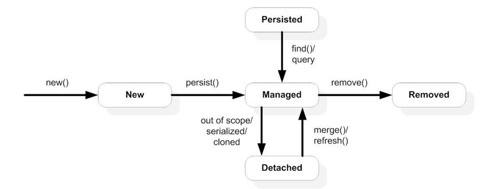
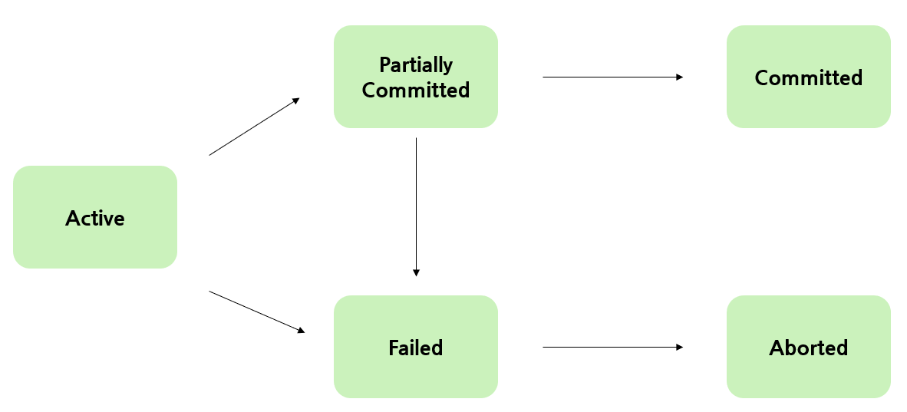

> EntityManager는 JPA에서 Entity를 관리하고 DataBase와의 통신을 담당하는 인터페이스이다.



EntityManager는 주로 Entity의 생명주기를 관리하고, Entity와 DataBase간의 상호 작용을 처리한다.

#### 영속성 컨텍스트란?

- 영속성 컨텍스트는 JPA에서 Entity객체들을 관리하는 논리적인 영역이다. <u>System <-> 영속성 컨텍스트 <-> DataBase</u>
- 이런 중개자 같은 개념으로 System에서 Entity가 DB에 바로 접근하지 않고, 영속성 컨텍스트에 의해 관리되며 Transaction단위로 commit, rollback 등의 작업을 수행한다.
- 캐싱, 쓰기 지연, 변경 감지 등의 기능으로 이미 조회한 데이터를 영속성 컨텍스트에서 가져오거나 직접적으로 DB에 접근하지 않기 때문에 데이터 안정성 측면에도 유리하다.

### **Entity 생명주기**

**비영속 (New / Transient):**

- 영속성 컨텍스트에 속해있지 않으며, DB와 아무 관련이 없는 상태이다.
- 새로운 객체를 생성한 경우 해당한다.
- 영속성 컨텍스트에 등록되지 않았기 때문에 상태 변화가 반영되지 않는다.

**영속 (Managed):**

- 영속성 컨텍스트에 의해 관리되며, DB와 동기화된 상태로 Entity가 변경되면 DB에 자동으로 반영된다.
- EntityManager를 통해 persist메서드를 호출하거나 DB에서 조회한 Entity를 변경하면 영속 상태가 된다.
- 영속성 컨텍스트에 등록되어 있으므로, Entity의 상태 변화가 Transaction을 Commit시 DB에 반영된다.

**준영속 (Detached):**

- 영속성 컨텍스트에서 분리된 상태로 영속성 컨텍스트에서 관리되지 않는다.
- EntityManager의 detach메서드를 호출하거나 Transaction이 종료되면 분리된다.
- 영속성 컨텍스트에서 분리되었기 때문에, Entity의 변경이 DB에 반영되지 않는다.

**삭제 (Remove):**

- 영속성 컨텍스트에서 삭제되어 DB에서도 삭제될 예정인 상태이다.
- EntityManager를 통해 remove메서드를 호출하면 삭제 상태가 된다.
- Transaction이 커밋될 때 해당 Entity가 DB에서 삭제된다.

**병합 (Managed - Detached):**

- 영속성 컨텍스트에서 분리된 상태지만 다시 등록될 수 있는 상태이다.
- EntityManager의 merge메서드를 사용하여 영속성 컨텍스트로 병합할 수 있다.
- 병합 상태가 되면 다시 영속 상태가 되므로 Entity의 변경이 DB에 반영된다.

### **EntityTransaction**

EntityTransaction은 JPA에서 Transaction을 관리하는 인터페이스로 Entity에 대한 조작들을 묶어서 Transaction 단위로 처리할 수 있다.

**주요 메서드:**

- begin() - 새로운 트랜잭션 시작
- commit() - 현재 트랜잭션을 커밋하여 DB에 반영
- rollback() - 현재 트랜잭션을 롤백하여 이전 상태로 되돌림
- isActive() - 현재 트랜잭션이 활성 상태인지 확인



***Example >***

```java
import javax.persistence.*;

public class Main {
    public static void main(String[] args) {
        EntityManagerFactory entityManagerFactory = Persistence.createEntityManagerFactory("my-persistence-unit");
        EntityManager entityManager = entityManagerFactory.createEntityManager();

        // 비영속 상태 (New / Transient)
        User user = new User();
        user.setName("John Doe");
        user.setEmail("john.doe@example.com");

        // 영속 상태 (Managed)
        EntityTransaction transaction = entityManager.getTransaction();
        transaction.begin();
        entityManager.persist(user);
        transaction.commit();

        // 준영속 상태 (Detached)
        entityManager.detach(user);

        // 수정된 상태
        user.setName("John Doe Updated");

        // 다시 영속 상태로 만들기 (병합 상태)
        transaction = entityManager.getTransaction();
        transaction.begin();
        User mergedUser = entityManager.merge(user);
        transaction.commit();

        // 삭제 상태 (Removed)
        transaction = entityManager.getTransaction();
        transaction.begin();
        entityManager.remove(mergedUser);
        transaction.commit();

        // EntityManager 및 EntityManagerFactory 닫기
        entityManager.close();
        entityManagerFactory.close();
    }
}
```

reference.

[https://www.baeldung.com/hibernate-entitymanager](https://www.baeldung.com/hibernate-entitymanager)

[https://gmlwjd9405.github.io/2019/08/08/jpa-entity-lifecycle.html](https://gmlwjd9405.github.io/2019/08/08/jpa-entity-lifecycle.html)
