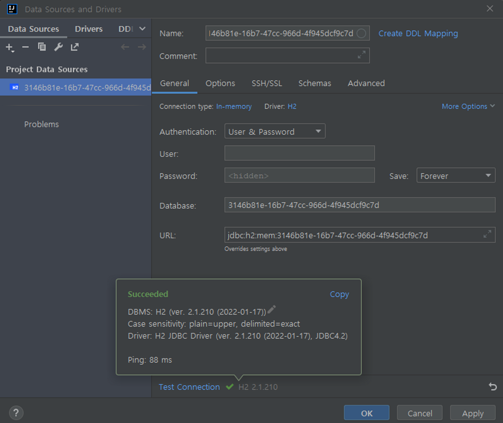
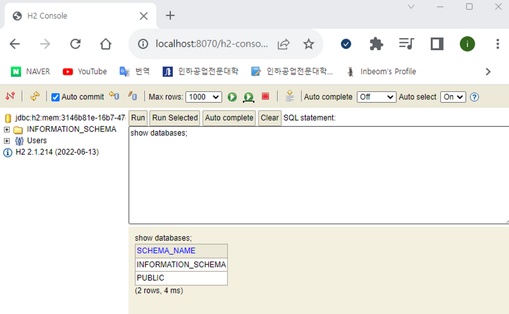

#### **H2 Database 란?**

*자바로 작성된 관계형 데이터베이스 관리 시스템이다.*

### **장점**

- 따로 설치가 필요없다
- 용량이 매우 가볍다
- 웹용 콘솔(쿼리툴) 제공하여 개발용 로컬DB로 사용 용이

### **특징**

- JAVA로 작성된 오픈소스 RDBMS
- 스프링 부트가 지원하는 인메모리 관계형 데이터베이스
- 인메모리로 띄우면 애플리케이션 재기동 때마다 초기화
- 로컬 환경, 테스트 환경에서 많이 쓰임

### <u>In-Memory DB</u>

- 컴퓨터가 꺼지면 모든 내용이 날라감
- 연속성이 없음
- 연속성을 주는 방법이 있지만, 그 방법을 쓰려면 그냥 일반 DB모드로 쓰면 된다.

#### 설정하기 (application.yml)

H2 콘솔에 접속하려면 먼저 콘솔 기능을 켜고, 접속할 DB의 JDBC URL을 지정해줘야 한다.

```yaml
spring:
  h2:
    console:
      enabled: true
      path: /h2-console
  datasource:
    url: jdbc:h2:mem:testdb # 원하는 DB 이름으로 고정 가능 (매번 랜덤 UUID로 안 바뀌게)
    driver-class-name: org.h2.Driver
    username: sa
    password:
```

`spring.datasource.url`을 `jdbc:h2:mem:testdb`처럼 고정 이름으로 지정해두면, 재기동할 때마다 콘솔에 찍히는 랜덤 UUID 문자열(`jdbc:h2:mem:3146b81e-...`)을 매번 복사할 필요 없이 항상 같은 URL로 접속할 수 있다.

#### **사용하기**

> **Intellij에서 간단하게 사용하는 방법**

1. 서버 실행
2. Run의 Console창에서 “H2 console available at '/h2-console'. Database available at 'jdbc:h2:mem:3146b81e-16b7-47cc-966d-4f945dcf9c7d’” 밑줄 친 부분을 복사한다.
3. 우측 메뉴에서 Database → ‘+’버튼 → DataSource → H2 선택
4. URL 부분에 jdbc:h2:mem:3146b81e-16b7-47cc-966d-4f945dcf9c7d 입력 후 테스트하여 OK



> **웹에서 사용**

1. 서버 실행 후 [http://localhost:8070/h2-console](http://localhost:8070/h2-console) 주소로 접속한다.
2. Run의 Console창에서 “H2 console available at '/h2-console'. Database available at 'jdbc:h2:mem:3146b81e-16b7-47cc-966d-4f945dcf9c7d’” 밑줄 친 부분을 복사한다.
3. 복사한 주소를 H2 DB의 JDBC URL로 입력 후 Connect하여 DB에 접속한다.


