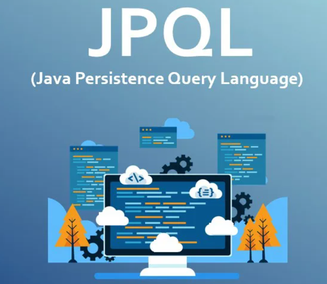

> JPQL은 JPA에서 사용하는 객체지향적인 쿼리 언어로 JPQL을 사용하여 Entity객체를 대상으로 쿼리를 작성할 수 있다.



**객체 중심 쿼리 언어:**

- JPQL은 데이터베이스 테이블이 아닌 Entity객체를 대상으로 쿼리를 작성한다.
- SQL과 유사하지만 테이블이 아닌 Entity와 그 Entity의 속성을 사용한다.
- select, from, where, group by, having, order by 등 표준 SQL과 기본 문법은 같다.

**특징:**

- JPQL은 객체지향적이며 Entity객체를 대상으로 쿼리를 작성하기 때문에 데이터베이스에 종속적이지 않다.
- JPQL을 사용하면 Entity객체 사이의 관계를 활용하여 복잡한 쿼리도 작성할 수 있다.
- Query문에서 <u>*FROM [Entity] [EntityAlias]*</u> 로 무조건 Entity의 별칭을 지정해서 사용해야 한다. (FROM Student s)

**단점 및 주의사항:**

- Query를 문자열로 작성하기 때문에 컴파일 시 에러를 발생시키지 않는다.
- 동적 쿼리를 작성하는데 비효율적이다.

**문법:**

**쿼리 타입**

- <u>TypeQuery<Entity></u> - 특정 타입(entity)의 결과를 반환하기 위해 사용.
- <u>Query</u> - Object 타입으로 결과를 반환받음. (타입을 특정할 수 없는경우 사용)

**반환 메서드**

- <u>getResultList()</u> - 쿼리 실행 결과를 리스트로 반환. 여러개의 결과를 가져올 때 사용한다. (결과가 없으면 빈 리스트 반환)
- <u>getSingleResult()</u> - 쿼리 실행 결과를 단일 값으로 반환. 결과가 없거나 여러개인 경우 예외가 발생한다.

> Hibernate 의존성 추가

```html
<dependency>
    <groupId>org.hibernate</groupId>
    <artifactId>hibernate-core</artifactId>
    <version>5.4.24.Final</version>
</dependency>
```

**Example >**

```java
EntityManagerFactory entityManagerFactory = Persistence.createEntityManagerFactory("yourPersistenceUnitName");
EntityManager entityManager = entityManagerFactory.createEntityManager();

// 예제 1: 모든 사용자 조회
TypedQuery<User> query1 = entityManager.createQuery("SELECT u FROM User u", User.class);
List<User> users1 = query1.getResultList();

// 예제 2: 특정 조건의 사용자 조회
TypedQuery<User> query2 = entityManager.createQuery("SELECT u FROM User u WHERE u.name = :name", User.class);
query2.setParameter("name", "John Doe");
List<User> users2 = query2.getResultList();

// 예제 3: 특정 속성만 조회
TypedQuery<String> query3 = entityManager.createQuery("SELECT u.name FROM User u", String.class);
List<String> userNames = query3.getResultList();

// 예제 4: 조인 사용
TypedQuery<User> query4 = entityManager.createQuery(
    "SELECT u FROM User u JOIN u.address a WHERE a.city = :city", User.class);
query4.setParameter("city", "New York");
List<User> usersInNewYork = query4.getResultList();

// 예제 5: 집계 함수 사용
TypedQuery<Long> query5 = entityManager.createQuery("SELECT COUNT(u) FROM User u", Long.class);
Long userCount = query5.getSingleResult();

entityManager.close();
```

### **데이터 삽입 / 수정 / 삭제**

JPQL은 UPDATE, DELETE 벌크 연산은 지원하지만 INSERT는 지원하지 않는다.

그렇기 때문에 데이터를 삽입할 때는 EntityManager의 persist()를 사용해야 한다.

**삽입 (Insert)**

```
EntityManager entityManager = entityManagerFactory.createEntityManager();
EntityTransaction transaction = entityManager.getTransaction();
transaction.begin();

User user = new User();
user.setName("John Doe");
user.setEmail("john.doe@example.com");
entityManager.persist(user);

transaction.commit();
entityManager.close();
```

**수정 (Update)**

```
EntityManager entityManager = entityManagerFactory.createEntityManager();
EntityTransaction transaction = entityManager.getTransaction();
transaction.begin();

User user = entityManager.find(User.class, userId); // userId는 수정할 엔터티의 식별자
user.setEmail("new.email@example.com");

transaction.commit();
entityManager.close();
```

**삭제 (Delete)**

```
EntityManager entityManager = entityManagerFactory.createEntityManager();
EntityTransaction transaction = entityManager.getTransaction();
transaction.begin();

User user = entityManager.find(User.class, userId); // userId는 삭제할 엔터티의 식별자
entityManager.remove(user);

transaction.commit();
entityManager.close();
```
