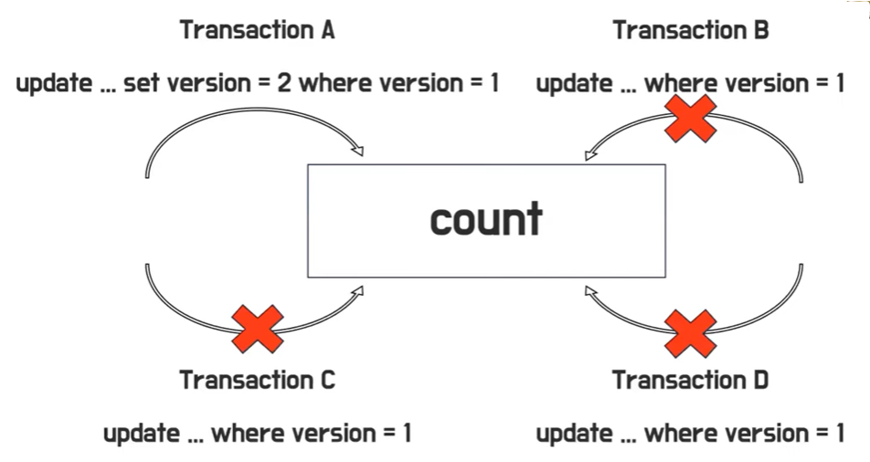
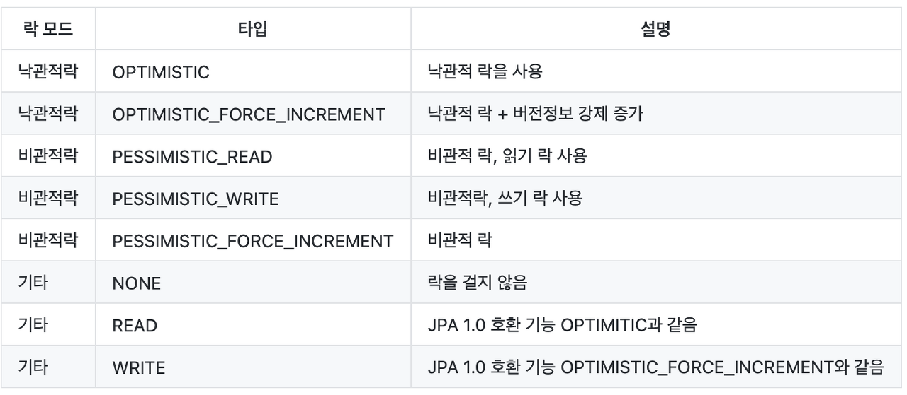

JPA(Java Persistence API)에서의 락(Lock)은 동시에 여러 사용자가 같은 데이터를 수정할 때 데이터 일관성을 유지하기 위한 메커니즘이다.

이를 통해 여러 트랜잭션이 동시에 동일한 데이터를 수정할 때 발생할 수 있는 문제를 해결할 수 있다.

*즉 트랜잭션에 포함되어 있는 개념이라고 할 수 있다.*



<u>이와 같이 하나의 Transaction이 특정 데이터에 접근하게 되면 해당 데이터에 대한 연산작업을 진행하는 동안 LOCK을 걸어 다른 트랜잭션에서 접근하지 못하게 한다.</u>

### **Optimistic Lock (낙관적 락):**

- 낙관적 락은 데이터를 읽을 때 락을 걸지 않고, 데이터를 업데이트할 때 버전 번호 등을 체크하여 충돌이 발생하지 않도록 하는 방식이다.
- 버전 관리를 위한 필드에 @Version 어노테이션을 사용하여 설정한다.

```java
@Entity
public class Product {
    @Id
    private Long id;
    
    private String name;
    
    @Version
    private int version; // Optimistic Lock을 위한 버전 필드
    // ...
}

@Transactional
public void updateProductName(Long productId, String newName) {
    Product product = entityManager.find(Product.class, productId);
    product.setName(newName);

    // 여기까지는 DB에 변경사항이 반영되지 않습니다.

    // 트랜잭션을 커밋하려고 할 때, Optimistic Lock 검사가 수행됩니다.
    // 다른 트랜잭션에서 이미 데이터를 수정한 경우 예외가 발생합니다.
}
```

### **Pessimistic Lock (비관적 락):**

- 비관적 락은 데이터를 읽을 때부터 락을 걸고, 해당 데이터를 업데이트할 때까지 락을 유지하는 방식이다.
- EntityManager의 lock 메서드나 JPQL의 SELECT ... FOR UPDATE 문을 사용하여 설정한다.

```java
@Transactional
public void purchaseProduct(Long productId) {
    Product product = entityManager.find(Product.class, productId, LockModeType.PESSIMISTIC_WRITE);
    // PESSIMISTIC_WRITE 모드로 락을 걸어 해당 데이터를 다른 트랜잭션이 변경하지 못하게 합니다.

    // 이후 로직에서 해당 데이터를 조작합니다.
}
```

---

#### *Lock Mode*



참고.

[https://www.youtube.com/watch?v=LDi5muN2kgI&t=24s](https://www.youtube.com/watch?v=LDi5muN2kgI&t=24s)
