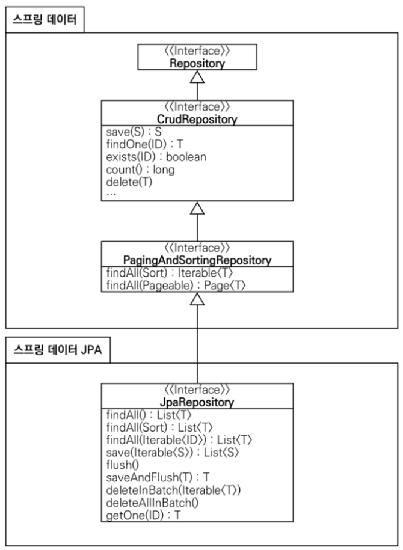
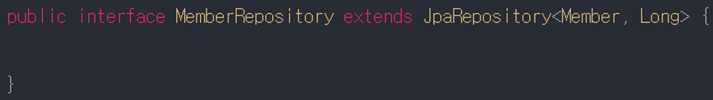
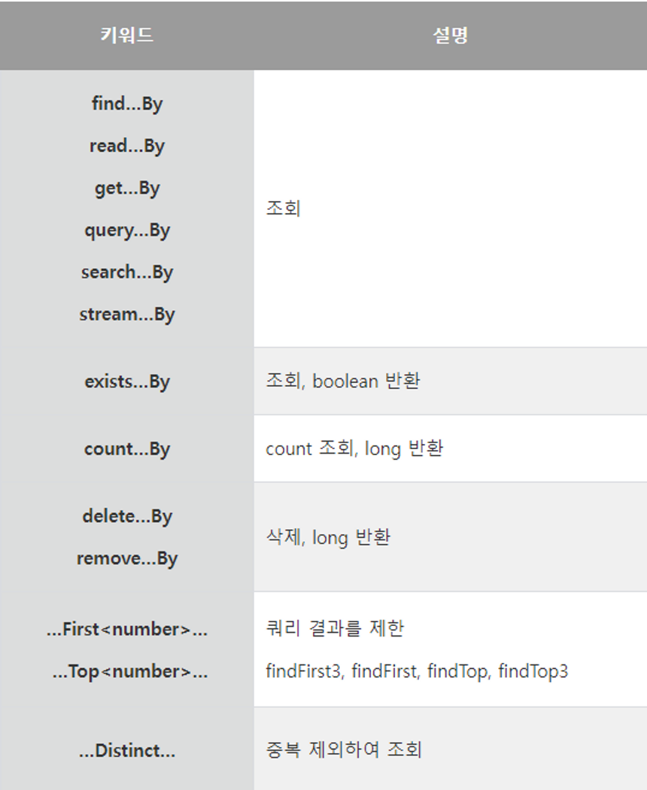
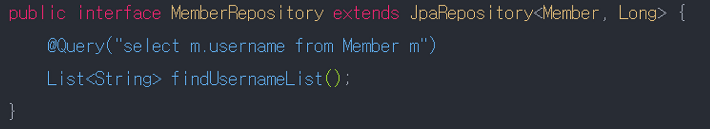

> **Spring Data JPA에서 제공하는 공동 인터페이스는 기본적인 CRUD를 제공해준다. (JpaRepository)**



### **JpaRepository<T, ID>**

1. Entity의 클래스명 + Repository 로 인터페이스 생성
2. JpaRepository 상속 (extends)
3. <>속성으로 ‘Entity의 클래스명’, ‘Entity기본키(Id)의 타입’ 지정

```java
public interface MemberRepository extends JpaRepository<Member, Long> {

}
```



#### **QueryMethod 이름 지정**

- 간단한 쿼리일 경우 이와 같은 쿼리 메서드를 이용한다.
- 같은 분류의 메서드는 이름만 다를 뿐 똑같은 기능을 한다.
- (조회 : find..By, read..By, get…By 등)

| 키워드 | 설명 |
| --- | --- |
| find...By, read...By, get...By, query...By, search...By, stream...By | 조회 |
| exists...By | 조회, boolean 반환 |
| count...By | count 조회, long 반환 |
| delete...By, remove...By | 삭제, long 반환 |
| ...First\<number\>..., ...Top\<number\>... | 쿼리 결과를 제한 (findFirst3, findFirst, findTop, findTop3) |
| ...Distinct... | 중복 제외하여 조회 |



> [spring data JPA - 참조 문서 (spring.io)](https://docs.spring.io/spring-data/jpa/docs/current/reference/html/#repositories.query-methods.query-creation)

### QueryMethod 필터 조건

| 쿼리 조건 | 메서드명 | 실제 쿼리문 |
| --- | --- | --- |
| Distinct | findDistinctByLastnameAndFirstname | select distinct …​ where x.lastname = ?1 and x.firstname = ?2 |
| And | findByLastnameAndFirstname | … where x.lastname = ?1 and x.firstname = ?2 |
| Or | findByLastnameOrFirstname | … where x.lastname = ?1 or x.firstname = ?2 |
| Is, Equals | findByFirstname, findByFirstnameIs, findByFirstnameEquals | … where x.firstname = ?1 |
| Between | findByStartDateBetween | … where x.startDate between ?1 and ?2 |
| LessThan | findByAgeLessThan | … where x.age < ?1 |
| LessThanEqual | findByAgeLessThanEqual | … where x.age <= ?1 |
| GreaterThan | findByAgeGreaterThan | … where x.age > ?1 |
| GreaterThanEqual | findByAgeGreaterThanEqual | … where x.age >= ?1 |
| After | findByStartDateAfter | … where x.startDate > ?1 |
| Before | findByStartDateBefore | … where x.startDate < ?1 |
| IsNull, Null | findByAge(Is)Null | … where x.age is null |
| IsNotNull, NotNull | findByAge(Is)NotNull | … where x.age not null |
| Like | findByFirstnameLike | … where x.firstname like ?1 |
| NotLike | findByFirstnameNotLike | … where x.firstname not like ?1 |
| StartingWith | findByFirstnameStartingWith | … where x.firstname like ?1 (parameter bound with appended %) |
| EndingWith | findByFirstnameEndingWith | … where x.firstname like ?1 (parameter bound with prepended %) |
| Containing | findByFirstnameContaining | … where x.firstname like ?1 (parameter bound wrapped in %) |
| OrderBy | findByAgeOrderByLastnameDesc | … where x.age = ?1 order by x.lastname desc |
| Not | findByLastnameNot | … where x.lastname <> ?1 |
| In | findByAgeIn(Collection<Age> ages) | … where x.age in ?1 |
| NotIn | findByAgeNotIn(Collection<Age> ages) | … where x.age not in ?1 |
| True | findByActiveTrue() | … where x.active = true |
| False | findByActiveFalse() | … where x.active = false |
| IgnoreCase | findByFirstnameIgnoreCase | … where UPPER(x.firstname) = UPPER(?1) |

> 메서드 정의

```
List<User> findByCreatedAtAfter(LocalDateTime localDateTime);
```

> 메서드 활용

```java
System.out.println("findByCreatedAtAfter : " + userRepository.findByCreatedAtAfter(LocalDateTime.now().minusDays(1)));
```

### @Query

- @Query 어노테이션을 사용해 Custom으로 쿼리문을 지정할 수 있다.

```java
public interface MemberRepository extends JpaRepository<Member, Long> {

    @Query("select m.username from Member m")
    List<String> findUsernameList();
}
```

메서드 이름 규칙만으로 표현하기 애매한 쿼리(여러 테이블 조인, 특정 컬럼만 조회 등)는 이렇게 `@Query`로 JPQL을 직접 써주는 게 오히려 더 명확하다.


