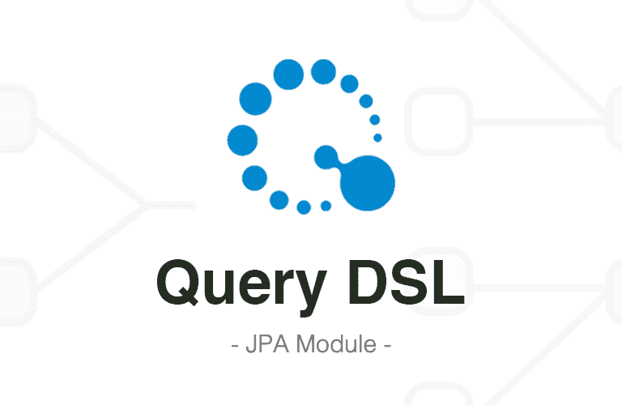

> QueryDSL은 JPA를 사용하여 데이터베이스 쿼리를 작성하고 실행하기 위한 유용한 도구이다. QueryDSL을 사용하면 Java 코드로 쿼리를 작성할 수 있어서, 컴파일 타임 오류확인 및 IDE의 자동완성 기능을 사용할 수 있다.



**QueryDSL?:**

- JPA Entity와 관련된 쿼리를 생성하기 위한 builder 라이브러리이다.
- SQL을 직접 작성하는 대신, Java 코드를 사용하여 query를 작성할 수 있다.

**Entity와 Q타입:**

- Entity의 메타 모델을 사용하여 query를 작성하기 때문에 Entity클래스에 대응하는 Q타입 클래스가 필요하다. ex) Customer -> QCustomer

**문법:**

- QueryDSL은 Java코드로 작성되며, MethodChaining을 사용하여 query를 작성한다.
- (select, from, where, join, fetch) 등의 메서드를 사용하여 qeury를 구성한다.

**특징:**

- **컴파일 타입 검증** - Java 코드로 작성되기 때문에 컴파일 시 문법 오류를 확인 가능.
- **자동 완성** - IDE의 자동 완성이나 코드 어시스트를 받을 수 있음.
- **타입 안전성** - Entity 속성 이름이나 조건은 컴파일 시 검증되기 때문에 타입에 안전함.

> *Plugin&Dependency 추가*

```
plugins {
    id 'com.ewerk.gradle.plugins.querydsl' version '1.0.10'
}

dependencies {
    implementation 'com.querydsl:querydsl-jpa:{버전}'
    implementation 'com.querydsl:querydsl-apt:{버전}'
}
```

#### Example >

> **Entity 생성**

```java
@Entity
public class Person {

    @Id
    @GeneratedValue(strategy = GenerationType.IDENTITY)
    private Long id;

    @Column
    private String firstName;

    @Column
    private String surname;
    
    Person() {
    }

    public Person(String firstName, String surname) {
        this.firstName = firstName;
        this.surname = surname;
    }

    // standard getters and setters

}
```

<u>**JPAQueryFactory**</u>

- QueryDSL의 핵심 클래스로 JPAQuery를 생성하고 실행하는데 사용된다.
- JPAQueryFactory로부터 계속 JPAQuery객체를 생성하고 사용할 수 있기 때문에 한번만 객체를 생성하면 된다.

<u>**JPAQuery**</u>

- 개별적인 JPAQuery를 생성하고 실행하는데 사용된다.
- JPAQuery는 한 번 사용한 후에는 재사용할 수 없다.

> **Q타입과 JPAQuery 객체 생성**

```
// Q Type
QPerson person = QPerson.person;
/* QPerson person = new QPerson("customPerson"); */

// JPAQueryFactory
JPAQueryFactory queryFactory = new JPAQueryFactory(entityManager);

// JPAQuery 
/* JPAQuery query = new JPAQuery(entityManager); */
```

#### JPAQueryFactory 주요 메서드

**selectFrom():**

쿼리의 시작을 나타내며 모든 컬럼(\*)을 반환하게 된다.

ex> selectFrom(user)

**from():**

쿼리의 시작을 나타내며 select() 메서드로 반환할 컬럼을 지정할 수 있다. ex> select(user.name).from(user)

**where():**

필드값을 비교하는 등의 조건을 추가한다.

ex> where(user.name.eq("John"))

**orderBy():**

쿼리 결과를 정렬한다.

ex> orderBy(user.name.asc())

**groupBy():**

그룹화를 위해 사용하며, having()은 그룹화된 결과에 대한 조건을 추가한다.

ex> groupBy(user.name).having(user.age.avg().gt(30))

**fetch():**

쿼리를 실행하고 결과를 가져오는 역할을 한다. fetchFirst(): 첫 번째 결과

ex> selectFrom(user).fetch();

**join():**

Entity간의 내부조인 수행. (leftJoin, rightJoin)

on() 으로 조건을 지정할 수 있지만 자동으로 Entity간의 관계를 이용하여 매핑된다.

ex> innerJoin(user.address, address)

**limit():**

가져올 결과의 개수를 제한한다.

ex> limit(5)

**offset():**

시작 위치를 지정한다. (주로 페이징 처리에 사용) ex> offset(1)

**transform():**

결과를 특정 타입으로 변환할 때 사용된다.

ex> transform(Transformers.aliasToBean(UserDTO.class))

> **JPAQueryFactory로 데이터 조회**

```java
// JPAQueryFactory 생성
JPAQueryFactory queryFactory = new JPAQueryFactory(entityManager);

// 여러 데이터 List로 조회
List<Person> persons = queryFactory
        .selectFrom(person)
        .where(person.firstName.eq("Kent"))
        .fetch();

// 가장 큰 age 조회
NumberExpression<Integer> maxAge = person.age.max();
int maxAgeResult = queryFactory
        .select(maxAge)
        .from(person)
        .fetchOne();

// AND 조건
List<Person> andConditionResult = queryFactory
        .selectFrom(person)
        .where(person.firstName.eq("Kent")
                .and(person.surname.eq("Beck")))
        .fetch();

// OR 조건
List<Person> orConditionResult = queryFactory
        .selectFrom(person)
        .where(person.firstName.eq("Kent")
                .or(person.surname.eq("Beck")))
        .fetch();

// GroupBy 집계
Map<String, Integer> groupByResult = queryFactory
        .select(person.firstName, person.age.max())
        .from(person)
        .groupBy(person.firstName)
        .transform(GroupBy.groupBy(person.firstName).as(GroupBy.max(person.age)));
```

reference.

[https://www.baeldung.com/querydsl-with-jpa-tutorial](https://www.baeldung.com/querydsl-with-jpa-tutorial)
