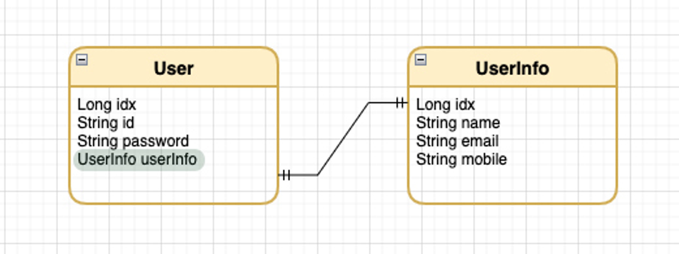
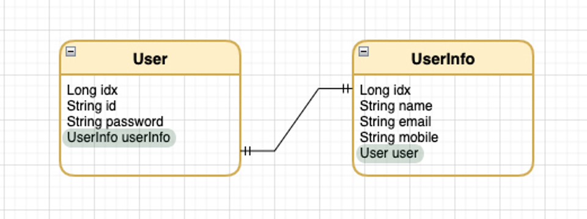
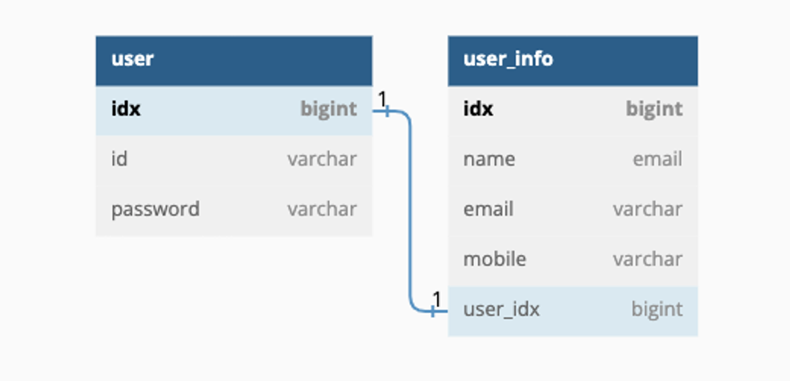

#### **1대1 관계 설정**

**1:1** 관계에서는 **@OneToOne** 어노테이션을 사용하여 관계를 정의해 줄 수 있다.

- 일대다(1:N), 다대일(N:1) 관계에서는 다(N) 쪽이 항상 외래 키를 가지고 있다.
- 하지만 일대일(1:1) 관계에서는 주 테이블이나 대상이 되는 테이블 양쪽 모두 외래 키를 가질 수 있다.
- 그렇기 때문에 일대일 관계를 적용할 때는 주 테이블과 대상이 되는 테이블, 어느 쪽에 외래 키를 둘지 선택 해야 한다.
- JPA에서는 외래키를 갖는 Entity가 연관 관계의 주인이 되어 외래키를 관리(등록,수정,삭제) 할 수 있다.

1-1. 일대일 연관 관계에서 <u>외래 키가 주 테이블</u>에 있는 경우 - **단방향**

1-2. 일대일 연관 관계에서 <u>외래 키가 주 테이블</u>에 있는 경우 - **양방향**

2-1. 일대일 연관 관계에서 <u>외래 키가 대상 테이블</u>에 있는 경우 - **양방향**

(1:1 관계에서 대상 테이블에 외래 키가 있는 단방향 관계는 JPA에서 지원하지 않는다.)

### **1. 외래키가 주 테이블에 있는 경우**

- 주 테이블에 외래 키를 두고 대상 테이블을 찾는 방식이다.
- 만약 값이 없는 경우 외래 키에 Null을 허용해야 한다.

**1-1. 일대일 단방향 (주 테이블에 외래키가 있는 경우)**



- **User Entity**

```java
@Table(name = "user")
@Entity
public class User {
	...
	@OneToOne(fetch = FetchType.LAZY)
	@JoinColumn(name = "user_info_idx", referencedColumnName = "idx")
	private UserInfo userInfo;
}
```

> @JoinColumn 의 name = ‘매핑할 외래키 이름’, referencedColumnName = ‘해당 외래키가 참조할 컬럼의 이름’

**1-2. 일대일 양방향 (주 테이블에 외래키가 있는 경우)**



- **User Entity**

```java
@Table(name = "user")
@Entity
public class User {
	...
	@OneToOne(fetch = FetchType.LAZY)
	@JoinColumn(name = "user_info_idx", referencedColumnName = "idx")
	private UserInfo userInfo;
}
```

- **UserInfo Entity**

```java
@Table(name = "user_info")
@Entity
public class UserInfo {
	...
	@OneToOne(mappedBy = "userInfo")
	private User user;
}
```

> 양방향 매핑의 경우 대상 테이블 (UserInfo)의 외래키에 @OneToOne( **mappedBy**=userInfo )속성을 통해 주테이블의 외래키를 연관 관계의 주인으로 설정한다.

#### **<u>2. 외래키가 대상 테이블에 있는 경우</u> - 자주사용!**



- 대상 테이블은 존재하는데 주 테이블이 존재하지 않는 경우는 없다.
- 대상 테이블의 외래키에 NULL이 허용될 필요가 없다는 장점이 있다.
- 일대일(1:1)에서 일대다(1:N) 관계로 바뀌었을 때도 테이블 구조를 유지할 수 있다. (확장성)
- 외래 키가 대상 테이블에 있는 단방향 관계는 JPA에서 지원하지 않는다.

**2-1. 일대일 양방향 (대상 테이블에 외래 키가 있는 경우)**


- **User Entity**

```java
@Table(name = "user")
@Entity
public class User {
	...
	@OneToOne(mappedBy = "user")
	private UserInfo userInfo;
}
```

- **UserInfo Entity**

```java
@Table(name = "user_info")
@Entity
public class UserInfo {
	...
	@OneToOne(fetch = FetchType.LAZY)
	@JoinColumn(name = "user_idx", referencedColumnName = "idx")
	private User user;
}
```

> 대상 테이블의 외래키에 **@JoinColumn(name = "user_idx", referencedColumnName = "idx")**으로 주 테이블의 참조할 키를 지정하고, 주 테이블에서 **@OneToOne(mappedBy = "user")** mappedBy = “”속성으로 연관 관계의 주인을 대상 테이블의 외래키로 지정하면 된다.

(주 테이블의 일대일 양방향의 반대 형태)

[JPA @OneToOne 일대일 연관 관계 정리 및 LazyLoding 이슈](https://wildeveloperetrain.tistory.com/186)
