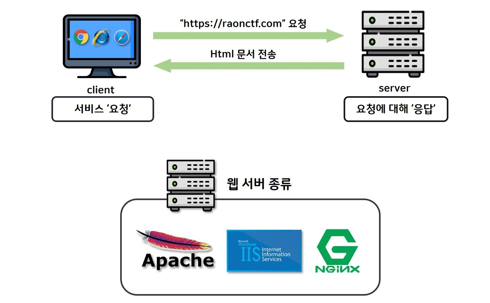
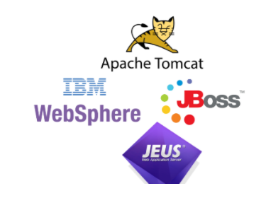
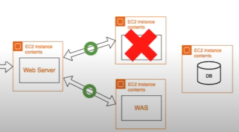
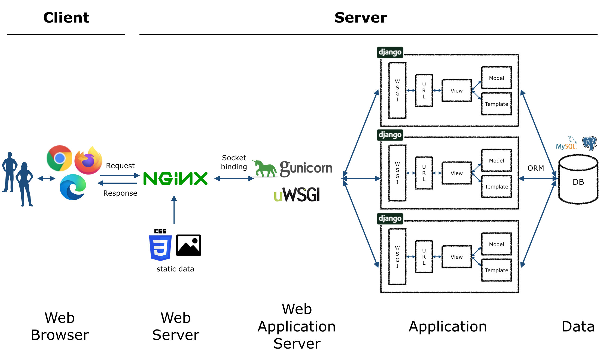

#### **웹서버 (WebServer)란?**

웹 서버는 크게 하드웨어와 소프트웨어로 나뉠 수 있지만 우리가 흔히 말하는 웹 서버는 소프트웨어로 크롬이나 익스플로러 같은 웹 브라우저로부터 HTTP 요청을 받아들이고, HTML 문서와 같은 웹 페이지에서 흔히 찾아 볼 수 있는 자료 컨텐츠에 따라 HTTP 응답을 해주는 프로그램을 말한다.

<u>웹 서버의 주된 기능은 웹 페이지를 클라이언트에게 전달하는 것이다.</u>

클라이언트와 서버와의 커뮤니케이션은 HTTP (Hypertext Transfer Protocol) 을 사용하여 수행된다. 웹 페이지는 대부 분 HTML 문서 형태로 전달이 되며, HTML 에는 각종 이미지 들과 스타일 시트, 스크립트 등이 포함되어 있다.

#### **웹애플리케이션서버 (WAS)란?**

자바 웹 애플리케이션을 실행하기 위해 서버에 필요한 기능들이 있다. 이런 기능들을 제공하는 게 WAS이다. 개발자는 WAS를 활용해서 애플리케이션을 개발한다

<u>DB 조회나 로직 처리를 요구하는 동적 컨텐츠를 제공</u>하기 위해 만들어진 Application Server로 Web container 혹은 Servlet Container라고도 불린다. 주요 기능은 프로그램 실행 환경과 DB 접속 기능 제공, 여러 개의 트랜잭션 관리기능, 업무 처리하는 비즈니스 로직수행 등의 역할을 한다.

**종류** > Tomcat, Websphere, Weblogic, Jeus, JBoss, Resin 등이 있다.

> **차이점과 구성도**

가장 큰 차이점은 <u>**WebServer**에서는 WebBrowser의 요청에 있어 html, css, js, img 등 **정적인 컨텐츠**를 제공</u>하며, <u>**WAS**는 WebServer에서 처리하지 못하는 **동적인 컨텐츠**를 제공</u>한다.

보통 위와 같이 WebServer 한대에 여러대의 WAS를 사용하여 **로드 밸런싱** 기술을 활용하여 클라이언트의 요청에 대한 부하를 분산시키고, **Health Check**를 통해 WAS가 정상 동작하는지 확인하고 서비스 불가능하다면 다른 WAS로 요청을 보내는 등의 기능을 수행한다.

#### **WebServer 전체 구성도**

