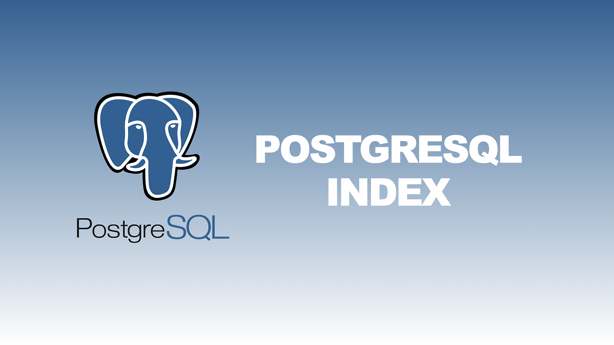
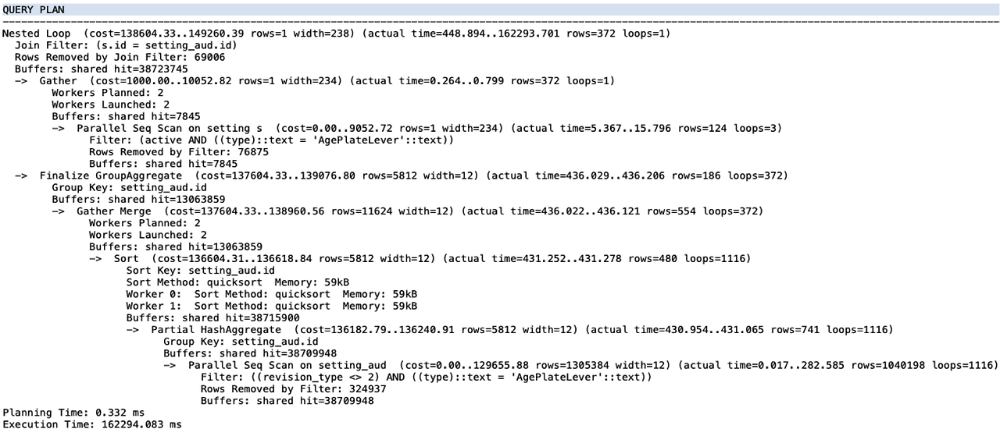
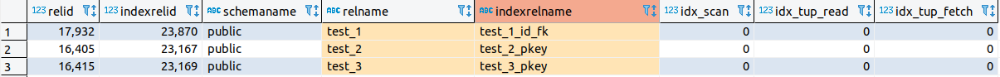

> Postgre에서 인덱스를 조회, 생성, 삭제, 확인하는 방법과 인덱스를 어디에 어떻게 생성해야 할까



> 인덱스는 조회 속도를 향상시킬 수 있는 중요한 역할을 한다. 하지만 인덱스를 막 사용하게 되면 인덱스를 효율적으로 사용하지 못하기도 하고, 오히려 삽입, 수정, 삭제 등의 연산 작업을 느리게 하여 역효과가 날 수 있다.

#### 인덱스는 어떤 컬럼에 걸어야 할까?

**기본키(Primary Key):**

기본키는 테이블에서 각 행을 고유하게 식별하는데 사용되기 때문에 <u>자동으로 인덱스가 생성</u>된다.

**외래키(Foreign Key):**

외래키를 포함하는 컬럼은 다른 테이블과의 관계를 나타내므로 <u>조인 연산 및 외래키 제약조건 검색을 최적화</u>하는데 도움된다.

**조회(검색)가 자주 발생하는 컬럼:**

데이터 검색 (<u>WHERE, JOIN, ORDER BY, GROUP BY, BETWEEN</u>)이 자주 일어나는 컬럼에 사용하는 것이 효과적이다.

**데이터 카디널리티가 높은 컬럼:**

중복된 값이 적은 컬럼에 인덱스를 걸면 그만큼 중복 값을 확인하지 않아도 되기 때문에 더 높은 효과를 기대할 수 있다.

> 인덱스는 보통 한 테이블에 3~5개 정도를 사용하며, 이 외에도 다양한 상황을 고려하여 적정한 테이블의 컬럼에 적용하면 된다.

---

## 인덱스 사용하기

#### 인덱스 조회

PostgreSQL의 시스템 카탈로그 테이블 중 인덱스에 대한 정보를 가지고 있는 **pg\_indexes**에서 인덱스 이름(indexname), 인덱스 정의(indexdef) 조회.

- select indexname, indexdef from pg\_catalog.pg\_indexes where tablename = '테이블명';

```sql
select indexname, indexdef from pg_catalog.pg_indexes where tablename = 'user_role';
```

#### 인덱스 생성

생성할 인덱스 이름과 적용할 테이블명(컬럼명)으로 작성하며, 여러 컬럼을 지정하여 복합 인덱스(Composite Index)를 생성할 수 있다.

> 인덱스명 작성 규칙 예) *테이블명\_인덱스명* or *테이블명\_설명*

- create index 인덱스명 on 테이블명(컬럼1, 컬럼2 .. );

```
create index user_role_id_dept on user_role(id, dept);
```

#### 인덱스 삭제

인덱스를 제거할 때는 어느 스키마에 속한 인덱스인지 명시해 줘야 한다.

- drop index 스키마명.인덱스명;

```
drop index master.user_role_id_dept;
```

#### 인덱스 사용 확인 및 분석

<u>Explain은 쿼리의 실행 계획</u>을 보여주고, <u>Analyze는 실제로 쿼리를 실행하면서 통계 정보</u>를 수집하는 명령문이다.

두 명령문을 함께 사용하여 쿼리문의 상단에 붙인 후 실행하면 PostgreSQL 옵티마이저가 어떤 방식으로 쿼리를 해석하고 실행하는지, 각 단계에서 어떤 비용이 소요되는지 등에 대한 통계(분석) 정보를 확인할 수 있다.

- EXPLAIN ANALYZE SELECT \* FROM 테이블명 WHERE 인덱스 사용 컬럼명 = '조건값';

```sql
EXPLAIN ANALYZE SELECT * FROM user_role WHERE id = 'admin123';
```

Ex >



**Analyze:**

키워드가 표시되면, 쿼리를 실행하면서 통계 정보를 수집했다는 것을 의미.

**Query Plan:**

<u>쿼리의 실행 계획.</u>

**Node Types:**

<u>각 실행 계획 노드의 유형</u>. (Seq Scan, Index Scan, Nested Loop 등)

**Total Cost:**

쿼리 <u>실행에 소요된 총 예상 비용</u>. (비용 => 자원 사용량)

**Startup Cost:**

쿼리가 <u>처음 실행될 때 소요되는 예상 비용</u>으로 인덱스 스캔, 정렬과 같은 초기 작업 비용.

**Rows:**

각 실행 계획 <u>노드에서 반환되는 행의 예상 수</u>.

**Width:**

각 행의 <u>평균 폭</u>(너비).

**Actual Total Time:**

실제로 쿼리가 <u>실행된 총 시간</u>.

**Actual Startup Time:**

실제로 쿼리가 <u>시작된 시간.</u>

**Actual Rows:**

각 실행 계획 <u>노드에서 실제로 반환된 행의 수</u>.

**Actual Loops:**

실제로 <u>반복된 노드의 수</u>. (일부 노드는 반복적 실행될 수 있다)

#### 인덱스 통계 정보

PostgreSQL에서 현재 사용자에 대한 인덱스 통계 정보를 가지고 있는 **pg\_stat\_user\_indexes**에서 특정 테이블의 인덱스 통계 정보를 간단하게 조회하여 인덱스 성능 모니터링 및 최적화를 수행할 수 있다.

- SELECT \* FROM pg\_stat\_user\_indexes WHERE relname = '테이블명';

```sql
SELECT * FROM pg_stat_user_indexes WHERE relname = 'user_role';
```

Ex >



**idx\_scan:**

<u>인덱스가 스캔된 횟수</u>를 나타낸다.

- 이 값이 높을수록 해당 인덱스가 쿼리에서 자주 사용된다는 것을 의미한다.
- 인덱스 스캔은 특정 값이나 범위를 검색하는데 사용된다.

**idx\_tup\_read:**

<u>인덱스로부터 읽은 튜플(레코드)의 수</u>를 나타낸다.

- 특정 인덱스의 스캔 작업으로 인해 얼마나 많은 행이 읽혔는지를 보여준다.
- 이 값이 높을 경우 해당 인덱스가 검색에 많이 활용되고 있다고 판단할 수 있다.

**idx\_tup\_fetch:**

<u>인덱스로부터 가져온 튜플(레코드)의 수</u>를 나타낸다.

- 인덱스 스캔 후에 가져온 행의 수를 나타낸다.
- 이 값이 높을 경우 해당 인덱스가 효과적으로 데이터를 추출하는데 활용되고 있다고 볼 수 있다.

> 자세한 내용은 Postgres 공식 사이트의 문서에서 확인 할 수 있다.

[https://www.postgresql.org/docs/current/sql-explain.html](https://www.postgresql.org/docs/current/sql-explain.html)

*- 끝 -*

reference.

[https://www.postgresql.org/docs/current/sql-explain.html](https://www.postgresql.org/docs/current/sql-explain.html)

[https://velog.io/@elsa/PostgreSQL%EA%B3%BC-index](https://velog.io/@elsa/PostgreSQL%EA%B3%BC-index)
