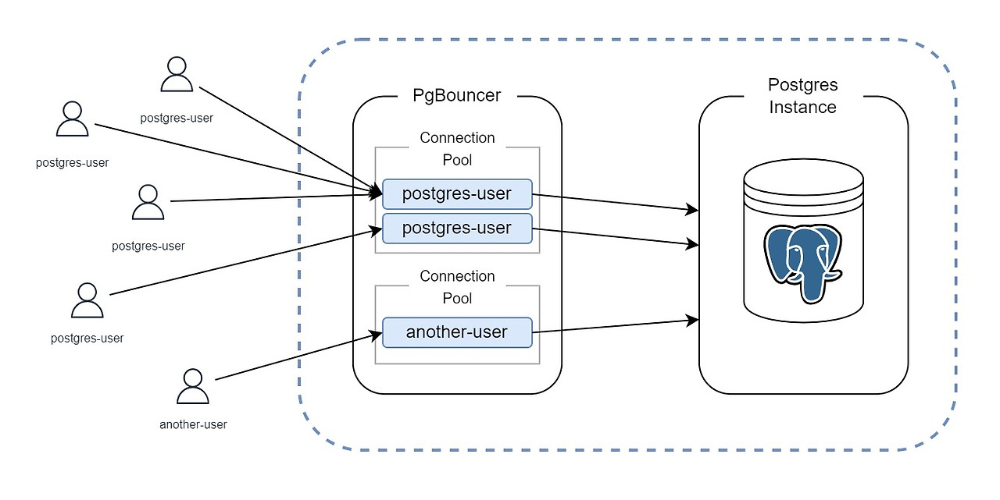

> PostgreSQL에 직접적으로 연결하지 말고, pgBouncer 커넥션 풀을 통해 관리하자



## 서버 리소스 최적화

회사 내부 개발서버를 장기적으로 운영하다 보면 시간이 흐를수록 캐시, 데이터 등이 계속 쌓이며 Disk, Memory를 차지하게 되고.. 여러 개발자들이 사용하며 다양한 애플리케이션을 구동시키기 때문에 Cpu 사용량도 계속해서 증가 할 것이므로 **주기적으로 정리가 필요**하다.

### 1. DB(Elasticsearch) 오래된 데이터 정리

서비스에 따라 다양한 Database를 사용하겠지만 Elasticsearch(nosql)와 Postgres(rdb) 기준으로 본다면 Postgres는 RDB로 보통 설정 값이나 사용자 정보 등 일정한 데이터를 저장하는 용도로 사용하기 때문에 시간이 지나도 용량이 매우 커지지는 않아 데이터 정리가 꼭 필요하지는 않다.

하지만 Elasticsearch와 같은 NoSQL을 사용하는 경우 Doc기반으로 로그와 같이 지속적으로 데이터가 쌓이는 구조로 사용하는 경우가 많기 때문에 <u>시간이 지날수록 Doc(index)가 쌓이며 리소스를 매우 많이 잡아먹게 된다</u>. 이에 대한 해결 방법으로 오래되어 사용되지 않는 인덱스를 정책을 설정하거나 주기적으로 Close하여 Cpu, Mem 사용량을 줄이고, 불필요한 인덱스라면 아예 Delete하여 Disk 용량까지 확보할 수 있다.

```
# 인덱스 확인
GET _cat/indices?v

# 인덱스 닫기 
POST /my-index/_close

# 인덱스 제거
DELETE /my-index
```

### 2. 애플리케이션 heap mem 사이즈 제한 ⛔️

우선 서버에서 htop(top)을 사용하여 리소스를 많이 먹는 프로세스 들을 찾아보자.. htop에서 RES(Resident memory)기준으로 정렬하면 메모리를 많이 사용하는 순서대로 정렬된다. 이렇게 정렬하면 어떤 프로세스가 어느정도 메모리를 사용하고 있는지 한눈에 확인 가능하다.

프로세스들이 메모리를 적정 범주로 사용하고 있다면 문제가 없지만 가끔 <u>혼자 다 잡아먹고 있는 프로세스가 있을 수 있다</u>. 이런 프로세스는 PID를 확인하여 ps 명령으로 어떤 애플리케이션인지 확인하고 Jvm 기반 애플리케이션이라면 Heap 메모리 설정을 조정하여 메모리 최대 사용량을 제한해주는 것이 좋다.

> 만약 Heap 메모리를 제한해도 해당 프로세스가 메모리를 많이 먹는다면 Jvm외부(Native) 메모리를 사용할 수 있으니 Native 메모리도 확인해야 한다

```
# 시스템 모니터링
htop

# 프로세스 정보 확인
ps -eLf | grep <PID>

# Heap/Native 메모리 사용량 확인
jcmd <PID> GC.heap_info
jcmd <PID> VM.native_memory summary

# Tomcat(catalina.sh) 설정
JAVA_OPTS="$JAVA_OPTS -Xms512m -Xmx1024m -XX:MaxDirectMemorySize=512m"
```

### 3. 로그파일 정리 및 정책 설정 ⚙️

대부분의 시스템, 애플리케이션들은 동작 중 진행 상황이나 상태 등을 알려주기 위해 계속해서 로그를 찍어내고 별도의 파일로 남기게 된다. 그렇다면 위에서 얘기한 데이터와 동일하게 <u>시간이 지날수록 로그가 쌓이고 Disk를 점점 잡아먹게 된다.</u>

물론 애플리케이션에서 Log4j2같은 로그 프레임워크를 사용하여 관리한다면 문제되지 않지만 모든 로그를 관리하기는 힘들다.

하지만 수동으로 각 애플리케이션, 시스템 경로에 접근하여 확인해서 지우고, 압축하는 것은 매우 귀찮고 시간낭비이기 때문에 리눅스에서는 별도 패키지로 <u>**logrotate**라는 자동 로그 관리 유틸리티</u>를 제공한다. logrotate는 <u>logrotate.d 경로에 설정 파일을 작성해두면 자동으로 cron.daily에 등록되어 매일 실행</u>된다.

```
# logrotate 설치
yum install logrotate
logrotate --version

# 설정 파일 작성
vi /etc/logrotate.d/myapp

/var/log/myapp/*.log {
    daily        # 하루 단위로 회전
    rotate 7     # 최근 7개만 보관
    compress     # 이전 로그 gzip 압축
    missingok    # 로그가 없어도 오류 없음
    notifempty   # 비어 있으면 회전 안 함
}

# 실행
sudo logrotate -d /etc/logrotate.d/myapp   # dry-run (실제 동작 X)
sudo logrotate -f /etc/logrotate.d/myapp   # 강제 실행
```

### 4. 불필요한 서비스/프로세스 종료

리소스를 최적화하기 위해 가장 좋은 방법은 리소스를 사용하는 프로세스들을 다 죽이는 것이지만 물론 그럴 수 없으니 좀비 프로세스나 불필요한 프로세스(서비스)가 실행중인지 확인하고 종료하면 된다.

> 잘 모르는 서비스는 왠만하면 GPT랑 상의 후 결정하는게 좋다

```
# 서비스 확인 
systemctl list-units --type=service --state=running 
# 서비스 종료 
systemctl stop <서비스명> 
systemctl disable <서비스명> # 부팅 시 자동 시작 방지 

# 프로세스 확인 
ps aux --sort=-%mem | head -n 20 # 메모리 점유율 상위 20개 
ps aux --sort=-%cpu | head -n 20 # CPU 점유율 상위 20개 
# 프로세스 종료 
kill -9 <PID>
```

### 5. Docker 컨테이너 정리

대부분 내부 개발, 테스트 환경은 Docker기반 컨테이너 환경으로 사용하는 추세인 것 같은데 서버 자원이 충분하지 않다면 하나의 서버에 많은 컨테이너를 띄워야 하는데 <u>컨테이너 환경이라도 결국 물리 서버 리소스를 나눠쓰는 것이기 때문에 점점 부하가 커진다</u>.

이러한 상황에서는 최대한 경량화된 이미지를 사용하고, 사용하지 않는 컨테이너들을 모니터링해서 제거하거나 필요하다면 이미지로 압축하여 백업해둘 수 있다. 컨테이너를 중지하더라도 Disk는 계속 차지하기 때문에 되도록 삭제하거나 이미지화 하는게 좋다.

```
# 컨테이너 확인
docker ps -a

# 컨테이너 중지 및 삭제
docker stop <컨테이너ID>
docker rm <컨테이너ID>

# 컨테이너 이미지화 및 압축
docker commit <컨테이너ID> myimage:latest
docker save -o myimage.tar myimage:latest
gzip myimage.tar
```

---

> Disk 용량은 많이 확보했고 Memory, Cpu 사용량은 줄긴 했지만.. PostgreSQL 커넥션들이 매우 많은 Cpu를 사용하고 있었다.

## PostgreSQL 커넥션 관리 : **pgBouncer**

우선 Postgres는 특성 상 Connection(session)을 연결하면 그에 1:1로 대응하는 하나의 백엔드 프로세스가 생기는데 <u>session이 오래 연결되어 있을수록 해당 백엔드 프로세스의 메모리 점유율이 올라가는 현상이 발생</u>하는데 이에 대한 해결 방법으로 Postgres 공식(한국) 커뮤니티에서는 "주기적인 연결 세션의 재접속"을 하면 되지만 이는 과도한 연결 비용을 감수해야 하기 때문에 3rd party 연결관리 솔루션인 pgBouncer를 사용하라고 권장하고 있다.

pgBouncer은 **오직 연결 관리를 위한 솔루션**으로 클라이언트가 요청하면 준비된 연결을 제공하고, 다 쓴 연결을 다시 연결 대기 상태로 두고, 각 설정에 맞춰 timeout 작업을 해서 데이터베이스 서버쪽 부담을 줄이는 역할을 한다.

그럼 기존 문제였던 여러 개발자들이 DB Tools, 애플리케이션 등을 통해 직접적으로 Postgres에 연결하여 많은 세션들이 생기고 오래 유지되면서 리소스를 많이 차지하던 이슈는 pgBouncer를 통해 연결하여 session을 관리해주면 해결된다.

> Dbeaver는 하나의 DB를 연결할 때 session을 3개나 생성한다..

### 설치 및 설정 방법

pgbouncer는 CentOS 기본 저장소에는 없기 때문에 EPEL 저장소나 PostgreSQL 공식 저장소에서 다운받을 수 있다.

설치 후 "--version" 명령으로 정상 설치가 확인되었다면 설정파일을 수정하고 실행하면 끝이다.

```
# 설치
yum install -y epel-release
yum install -y pgbouncer
pgbouncer --version
```

실행하기 전 설정파일의 설정을 개발 환경에 맞게 수정해야 한다.

**[ pgbouncer.ini ]**

| 설정 | 값 | 설명 |
| --- | --- | --- |
| pool\_mode | transaction | 커넥션 풀링 모드. **session**: 세션 유지, **transaction**: 트랜잭션 단위로 연결 공유, **statement**: 쿼리 단위로 연결 공유. 개발/운영 대부분 transaction 권장. |
| default\_pool\_size | 20 | 각 DB당 PgBouncer가 유지하는 최대 서버 커넥션 수. 클라이언트 동시 접속 수와 DB 부하 고려해 조정. |
| max\_client\_conn | 100 | PgBouncer가 동시에 허용하는 클라이언트 연결 수. 클라이언트 요청이 서버 커넥션보다 많으면 큐잉 처리. |
| database | mydb = host=postgres port=5432 dbname=mydb user=myuser password=mypass | 실제 연결할 DB 정보. 여러 DB 등록 가능. |
| auth\_type | trust | 인증 방식. 개발 서버용으로 암호 없이 허용(trust), 운영 서버는 md5 또는 scram-sha-256 권장. |
| server\_lifetime | 3600 | 서버 커넥션이 최대 유지되는 시간(초). 지정 시간 후 주기적으로 연결 재생성. |
| server\_idle\_timeout | 600 | 사용하지 않는 DB 커넥션을 끊는 시간(초). Idle 상태 연결 최소화. |
| listen\_addr | 0.0.0.0 | PgBouncer가 수신할 IP 주소. 외부 접속 허용 시 0.0.0.0, 내부만 사용 시 127.0.0.1. |

이 외에 Port는 기본 6432이고, 로그 파일이나 PID 파일은 /pgbouncer 경로에 생기니 따로 변경하지 않아도 된다. 추가적으로 auth file인 userlist.txt 파일이 있는데 pgbouncer의 user를 정의하는 파일이니 사용자와 비밀번호를 작성해주면 된다.

> 설치하면 생기는 pgbouncer 계정은 실행용이기 때문에 로그인이 막혀있다. 필요하다면 "usermod -s /bin/bash pgbouncer" 명령으로 해제하여 로그인할 수 있지만 보안을 위해 root가 아닌 pgbouncer 전용 계정으로 실행하는게 좋다.

```
# 설정파일 수정
vi /etc/pgbouncer/pgbouncer.ini

# 백그라운드 실행
su -s /bin/bash -c "pgbouncer /etc/pgbouncer/pgbouncer.ini -d" pgbouncer
```

pgbouncer를 실행하여 6432포트가 열린 것을 확인하고, DB tool과 애플리케이션들의 PostgreSQL connection 설정을 6432 포트와 pgbouncer 사용자, 정의한 데이터베이스 명칭으로 연결하면 정상 동작하는 것을 확인할 수 있다.

**⚠️ 주의사항**

- pgBouncer는 기본적으로 모든 이벤트를 로그로 남기기 때문에 적정한 로깅 레벨이나 로테이션 설정을 하지 않으면 Disk 사용량이 급증할 수 있다.
- pool mode를 트랜잭션으로 사용할 시 커넥션을 여러 클라이언트가 공유하기 때문에 server-side prepared statement 사용 시, 커넥션을 재사용할 때 이전 statement와 충돌 할 수 있으므로 server-side prepared statement를 사용하면 안된다.
