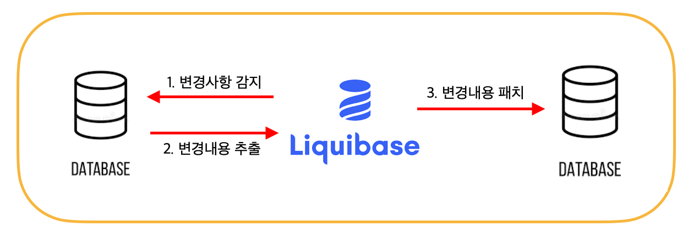

> 기존에 Test Server가 따로 없어 Dev Server의 DB를 사용하여 Test Case들을 작성했더니 데이터가 변경되며 문제가 생겨 Test용 DB Server를 구축하는 과정이다..


## Postgres 서버 세팅하기

우선 개발 서버의 데이터베이스의 스키마와 데이터를 포함한 전체를 그대로 복사해와야 하기 때문에 개발 서버의 PostgreSQL 버전과 설치 경로 등을 먼저 확인하고 똑같은 경로에 설치 후 접근 권한이나 사용자 권한 등을 세팅해주면 된다.

서버 세팅이 끝났으면 데이터베이스를 복사해오면 되는데 그 전에 꼭 해줘야 할 작업이 있다.

**! 테이블 스페이스 디렉터리 생성 !**

PostgreSQL의 dumpall은 전체 데이터베이스 클러스터를 덤프하는 유틸리티로 데이터베이스 객체의 스키마와 데이터를 덤프하지만 테이블 스페이스의 경로까지 직접 생성해주지는 않는다.

즉, 기존 데이터베이스에서 테이블 스페이스를 지정해 사용하던 디렉터리 경로를 그대로 생성해줘야 한다.

(이 문제 때문에 Dump중 경로를 찾을 수 없다는 에러와 함께 터져서 많은 시도를 했다...)

> **Table Space:**
> 테이블 스페이스는 데이터 파일을 저장하는 위치를 지정하기 위한 것이며, 데이터 파일이 저장되는 디렉터리이다. 테이블 스페이스를 생성할 때에는 특정한 데이터 파일이 저장될 디렉터리를 미리 만들어줘야 한다.

## 개발 서버 DB 전체 복사(DumpAll)해오기

1. 개발 서버에서 Dumpall로 파일 생성하기

```
# Dump하며 tar.gz파일로 압축시키고 progress로 진행 상황을 확인한다.
pg_dumpall | gzip | progress -m -t -w | tar czf backup.tar.gz -
```

> pg_dumpall 유틸리티는 보통 PostgreSQL이 설치된 디렉터리에 포함되어 있다.
> ex) /usr/postgres/bin/pg_dumpall

⭐️데이터베이스 용량이 커서 Dump중 터질 수 있는데 그럴 경우는 split으로 pg\_dumpall의 출력을 분할시켜 각각의 분할된 파일이 압축된 후에 생성되게 할 수 있다.

```
# split으로 분할하여 dump 받기
pg_dumpall | gzip | progress -m -t -w | split -b 100m - backup_part
```

*분할하게 되면 백업 파일의 일부가 손실될 수 있으므로 분할된 파일을 복원할 때 문제가 발생할 수 있다. 주의 필요*

2. 생성한 Dump 파일을 테스트 서버로 옮기기

```
# SCP 사용하여 테스트 서버로 파일 전송
scp backup.tar.gz username@remote_server_ip:/path/to/destination
```

접근 권한 등의 이유로 scp를 사용할 수 없다면 FileZilla를 사용하면 된다!

3. Dump 파일 패치하기

```
# 압축 풀기
tar xzf backup.tar.gz
# Dump 파일 패치
psql -d [database_name] -f [backup_file]
```

분할하여 Dump 받았다면 먼저 파일을 결합시켜 줘야 한다.

```
cat backup_part* > backup.tar.gz
```

---

## Database Schema 동기화

일반적으로 Database 동기화는 여러 DB 간의 데이터를 데이터가 일치하도록 하는 것 인데 이번에는 테스트용 DB 서버기 때문에 데이터 연동이 아니라 스키마 연동이 필요하다.

Junit으로 테스트 코드를 작성해 놨기 때문에 데이터가 변경되면 Test Case들에 영향을 줄 수 있다. 하지만 DB Schema는 개발 서버와 일치해야 하기 때문에 Research를 통해 여러 자료들을 찾아 본 결과 현재 상황에서 사용 가능한 방법 두가지를 찾을 수 있었다.

### 1. 리퀘베이스 (Liquibase)


**Liquibase란?**

데이터베이스 변경 관리 파이프라인이다.

liquibase로 데이터베이스에 관련된 다양한 작업을 할 수 있지만 그중 데이터베이스 스키마의 변경 사항을 감지하고, 변경된 내용(DDL)을 추출하며, 다른 데이터베이스에 반영하는 작업을 수행할 수 있다.



**구성 방법**

1. 개발 서버와 테스트 서버에 Liquibase설치

```
# Download & Unzip
wget https://github.com/liquibase/liquibase/releases/download/vX.X.X/liquibase-X.X.X.tar.gz
tar -xvzf liquibase-X.X.X.tar.gz
cd liquibase-X.X.X
```

2. properties 파일 작성

```
# DEV Server ( liquibase-dev.properties )
url=jdbc:postgresql://dev-server:5432/mydb
username=dev_user
password=dev_password
changeLogFile=src/main/resources/db/changelog/db.changelog-master.yaml

# TEST Server ( liquibase-test.properties )
url=jdbc:postgresql://test-server:5432/mydb
username=test_user
password=test_password
changeLogFile=src/main/resources/db/changelog/db.changelog-master.yaml
```

3. 개발 서버 변경 사항 감지 및 추출

```
# DEV Server
liquibase --defaultsFile=liquibase-dev.properties generateChangeLog > src/main/resources/db/changelog/generated-changelog.xml
```

4. 테스트 서버에 변경 사항 패치

```
# TEST Server
liquibase --defaultsFile=liquibase-test.properties update
```

이렇게 세팅해두면 Liquibase를 사용하여 쉽고 간단하게 데이터베이스의 변경 사항을 다른 서버에 똑같이 반영하여 데이터베이스 스키마를 동기화 시킬 수 있고, 데이터베이스 동기화가 아니더라도 Liquibase를 사용해 변경 내용을 추출해서 Log 파일로 저장하여 변경 사항 관리도 쉽게 할 수 있다.

---

### 2. SVN Hook


**SVN이란?**

svn은 중앙 집중식 버전 관리 시스템(CVCS)로 중앙 집중식 이라는 특징을 제외하면 Git과 매우 비슷한 소프트웨어 버전 관리 시스템이다.

이러한 버전 관리 시스템에는 commit 이벤트 발생 시 특정 동작을 수행할 수 있도록 commit hook이라는 기능이 존재한다. commit hook 기능을 활용하여 데이터베이스 스키마 변경 쿼리(DDL)를 svn 저장소에 commit 할 때 hook 이벤트가 발생되어 커밋된 소스코드를 추출하여 테스트 서버에 패치하는 방식으로 구성할 수 있다.

Post-commit hook, Pre-commit hook 등이 있는데 그중 커밋이 완료된 후 실행되는 Post-commit hook을 사용하여 commit이 성공적으로 완료된 경우에만 hook 이벤트를 발생시키도록 한다.

**구성 방법**

svn 저장소의 hooks 디렉터리 밑에 post-commit 이라는 이름의 파일을 만들고 실행 권한을 부여하면 커밋이 발생할 때 자동으로 실행되며 commit hook이 실행될 때 인자값으로 (1)저장소 경로, (2)리비전 번호를 받을 수 있다.

> ~/svn/hooks/post-commit.sh

```bash
#!/bin/bash

REPOS="$1" #저장소 경로
REV="$2" #리비전 번호
OUTPUT_DIR="/path/to/save/changes"

# DB 연결 정보
DB_HOST="localhost"
DB_USER="user"
DB_PASS="password"
DB_NAME="name"

# Output 디렉터리 생성
mkdir -p "$OUTPUT_DIR"

# 커밋된 파일 목록 
CHANGED_FILES=$(svnlook changed "$REPOS" -r "$REV" | awk '{print $2}')

for FILE in $CHANGED_FILES; do
    # 파일 형식 확인(*.sql)
    if [[ $FILE == *.sql ]]; then
        # 파일 내용 추출
        OUTPUT_FILE="$OUTPUT_DIR/$(basename "$FILE")"
        svnlook cat "$REPOS" -r "$REV" "$FILE" > "$OUTPUT_FILE"
        
        # Test Server DB에 패치
        PGPASSWORD="$DB_PASS" psql -h "$DB_HOST" -U "$DB_USER" -d "$DB_NAME" -f "$OUTPUT_FILE"
        
        echo "Applied DDL changes from $FILE to the database."
    fi
done
```

> 실행 권한 부여

```
chmod +x ~/svn/hooks/post-commit.sh
```

> 위의 방법으로 동기화 할 수 없는 경우 직접 스크립트를 작성하여 해결할 수 있다.

[https://inbeom.tistory.com/entry/Linux-Postgres-TestServer-DB-%EC%9E%90%EB%8F%99%EC%9C%BC%EB%A1%9C-Patch%ED%95%98%EA%B8%B0](https://inbeom.tistory.com/entry/Linux-Postgres-TestServer-DB-%EC%9E%90%EB%8F%99%EC%9C%BC%EB%A1%9C-Patch%ED%95%98%EA%B8%B0)

*- 끝 -*
