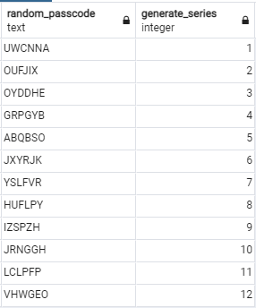
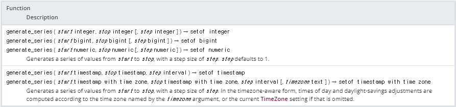

> Query에서 숫자 또는 날짜에 대한 시퀸스 데이터를 생성하여 사용할 수 있다.



Query문을 작성하다 보면 반복되는 숫자, 날짜 데이터가 필요한 경우가 있는데 Postgresql에서는 generate\_series() 함수로 순차적인 숫자 또는 날짜 데이터를 생성할 수 있도록 지원한다.

> python의 for문과 비슷한 형식이다.

## generate\_series() 함수란?

'generate\_series()' 함수는 PostgreSQL에서 사용되는 유용한 함수 중 하나로, 숫자 또는 날짜에 대한 범위 데이터를 생성하는데 사용된다. 주로 테이블에 가상의 데이터를 생성하거나 특정 범위에 대한 반복 작업을 수행할 때 유용하다.

```
generate_series(start, stop, step)
```

**start**: 시작 값

**stop**: 종료 값

**step**: 증감 값 (default = 1)



> 위의 표와 같이 숫자는 integer, bigint, numeric 날짜는 timestamp, time zone 유형을 사용할 수 있다.

#### 사용 예시

**숫자 시퀸스 생성:**

```sql
-- 1부터 5까지의 정수 시퀀스 생성
SELECT generate_series(1, 5);

[결과]
 generate_series
-----------------
               1
               2
               3
               4
               5
(5 rows)
```

**날짜 시퀸스 생성:**

```sql
-- 2022년 1월 1일부터 2022년 1월 5일까지의 날짜 시퀀스 생성
SELECT generate_series('2022-01-01'::date, '2022-01-05'::date, '1 day'::interval);

[결과]
 generate_series
-------------------
 2022-01-01 00:00:00
 2022-01-02 00:00:00
 2022-01-03 00:00:00
 2022-01-04 00:00:00
 2022-01-05 00:00:00
(5 rows)
```

#### 다양한 활용 방법

1. 날짜 범위에 대한 통계 계산

```sql
-- 2022년 1월 1일부터 현재 날짜까지의 날짜별 통계 계산
SELECT
  generate_series AS date,
  COUNT(*) AS count
FROM
  generate_series('2022-01-01'::date, CURRENT_DATE, '1 day'::interval)
GROUP BY
  generate_series;
```

2. 일일 판매량 예측을 위한 더미 데이터 생성

```sql
-- 2022년 1월 1일부터 2022년 12월 31일까지의 더미 판매량 데이터 생성
SELECT
  generate_series AS sale_date,
  ROUND(RANDOM() * 100) AS daily_sales
FROM
  generate_series('2022-01-01'::date, '2022-12-31'::date, '1 day'::interval);
```

3. 균등 분포를 따르는 무작위 데이터 생성

```sql
-- 0 이상 10 미만 범위에서 균등 분포를 따르는 1000개의 무작위 숫자 생성
SELECT
  generate_series AS id,
  RANDOM() * 10 AS random_value
FROM
  generate_series(1, 1000);
```

4. 시간 간격에 따른 이벤트 시뮬레이션

```sql
-- 현재 시간부터 5일 동안 1시간 간격으로 이벤트 발생 시뮬레이션
SELECT
  NOW() + generate_series * interval '1 hour' AS event_time,
  'Event ' || generate_series AS event_description
FROM
  generate_series(1, 5);
```

5. 숫자 범위에 대한 계산

```sql
-- 1부터 10까지의 정수의 제곱 및 세제곱 계산
SELECT
  generate_series AS num,
  generate_series ^ 2 AS square,
  generate_series ^ 3 AS cube
FROM
  generate_series(1, 10);
```

> 잘 사용한다면 이렇게 다양한 상황에서 매우 유용하게 활용할 수 있다

*- 끝 -*

reference.

[https://www.postgresql.org/docs/current/functions-srf.html](https://www.postgresql.org/docs/current/functions-srf.html)
