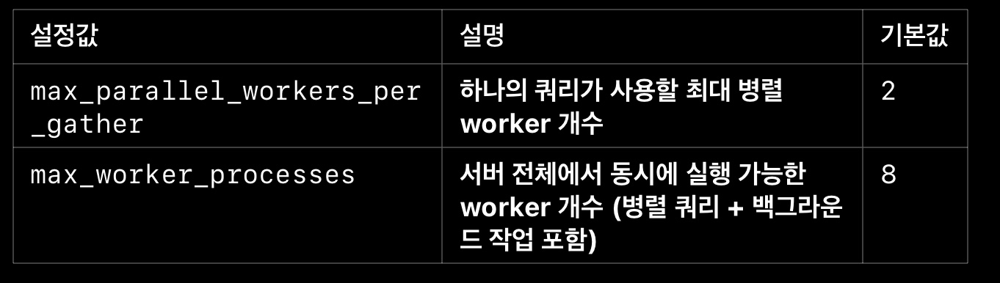

PostgreSQL에서 "worker"라고 부르는 프로세스는 한 종류가 아니다. 클라이언트 연결마다 뜨는 백엔드 프로세스 외에도, 병렬 쿼리를 나눠 처리하는 **parallel worker**, 죽은 튜플을 정리하는 **autovacuum worker**, 백그라운드에서 도는 여러 확장 기능용 worker들이 있고, 이들이 전부 `max_worker_processes`라는 하나의 풀을 나눠 쓴다. 그래서 병렬 쿼리 worker를 넉넉히 늘렸다가 autovacuum이 밀리는 식의 트레이드오프가 생길 수 있다.

### 서버 전체 worker 설정

<u>동시 접속자가 많고, 멀티 스레드를 자주 사용</u>하는 경우

**(postgresql.conf)**

max\_worker\_processes = 8

- 전체 시스템에서 사용할 수 있는 worker 프로세스 개수

(CPU 코어 수보다 크게 설정 X).

max\_parallel\_workers = 8

- 병렬 작업에 사용할 수 있는 최대 worker 개수.

work\_mem = 64MB

- 개별 쿼리 작업을 위한 메모리 크기. 너무 작으면 디스크 I/O가 증가할 수 있음.

---

### 병렬 쿼리 worker 설정

<u>대용량 데이터를 조회</u>하는 경우

**(postgresql.conf)**

max\_parallel\_workers\_per\_gather = 4

- 하나의 Parallel Query에서 사용할 최대 worker 개수 (기본값: 2).

parallel\_tuple\_cost = 0.1

- 병렬 쿼리의 비용 계산을 조정하여 병렬 실행이 더 자주 선택되도록 설정.

parallel\_setup\_cost = 1000

- 병렬 쿼리를 사용할 기준 비용. 낮출수록 병렬 실행이 더 자주 활성화됨.

force\_parallel\_mode = on

- 플래너가 원래는 병렬 실행이 이득 없다고 판단한 쿼리도 강제로 병렬 계획을 세우게 만드는 옵션. 실제 성능 개선용이라기보다는 **병렬 안전성을 테스트하기 위한 디버깅용 설정**에 가까워서, 운영 환경에 상시로 켜두는 건 권장되지 않는다. (공식 문서에도 테스트 목적으로 명시되어 있다.)

### 설정이 실제로 부족한지 확인하는 법

worker 관련 설정은 무작정 늘린다고 좋은 게 아니라서, 손대기 전에 실제로 부족한지 먼저 확인하는 게 순서다.

```sql
-- 병렬 쿼리가 worker를 못 받아서 계획보다 적게 실행됐는지 확인
EXPLAIN ANALYZE SELECT ...;
-- 결과에 "Workers Planned: N" vs "Workers Launched: M" 이 다르면 worker가 부족했다는 뜻
```

```sql
-- 현재 활성 worker 수 확인
SELECT * FROM pg_stat_activity WHERE backend_type LIKE '%worker%';
```

`Workers Launched`가 `Workers Planned`보다 지속적으로 적다면 `max_worker_processes`나 `max_parallel_workers`를 늘리는 걸 고려하고, 그게 아니라면 굳이 기본값을 건드릴 필요는 없다.
