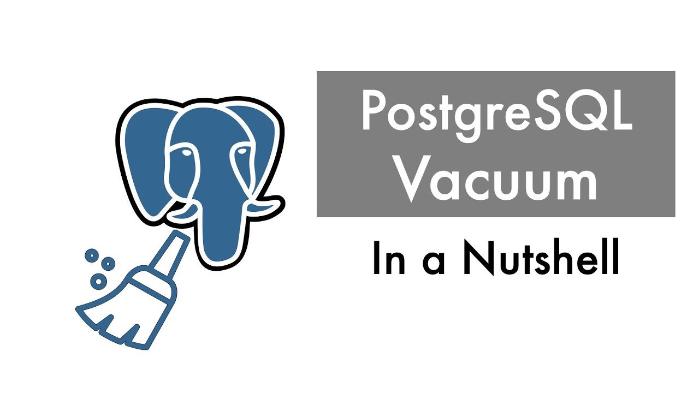

> PostgreSQL은 높은 확장성, 표준 준수, 유연성, 다양한 데이터 타입 지원 등의 이유와 또 무료라는 장점 때문에 많이 활용되고 있다.

우선 PostgreSQL은 아래와 같은 특징들을 가지고 있다.

**1. 오픈 소스:**

완전한 오픈 소스 데이터베이스로, 커뮤니티에 의해 활발하게 개발 및 유지보수 되고 있다.

오픈 소스이기 때문에 무료로 사용할 수 있으며, 소스 코드를 수정하여 자신만의 버전을 만들 수 있다.

**2. 표준 준수:**

SQL 표준을 엄격하게 준수하기 때문에 다른 SQL 데이터베이스와의 호환성과 이식성이 높다.

**3. 확장성 및 유연성:**

사용자 정의 데이터 타입, 함수, 연산자, 도메인 등을 쉽게 추가할 수 있다.

JSON 데이터 타입을 지원하여 NoSQL 기능도 제공한다.

**4. ACID 준수:**

트랜잭션의 원자성(Atomicity), 일관성(Consistency), 고립성(Isolation), 지속성(Durability)을 보장하여 데이터 무결성을 유지한다.

**5. 다양한 데이터 타입:**

배열, hstore(key-value), JSON/JSONB, XML, RANGE 등 다양한 데이터 타입을 지원한다.

**6. 다양한 인덱싱 기법:**

B-tree, Hash, GIST, SP-GIST, GIN, BRIN 등 다양한 인덱스 타입을 지원한다.

**7. 복제 및 고가용성:**

스트리밍 복제, 논리 복제 등 다양한 복제 기법을 지원하여 고가용성을 보장한다.

복제본을 사용하여 읽기 작업을 분산시킬 수 있다.

**8. 확장 가능한 아키텍처:**

분산 데이터베이스 확장 프로젝트인 Citus를 통해 수평 확장을 지원한다.

---

### Vacuum

> 다른 RDB에는 없는 Vacuum이라는 개념..?

Vacuum은 간단하게 정의하자면 테이블의 디스크 공간을 회수하고 성능을 최적화하기 위해 PostgreSQL에서 사용되는 기능이다.

**왜 필요한가**

PostgreSQL은 MVCC(Multi-Version Concurrency Control) 방식으로 동시성을 제어한다. row를 UPDATE하거나 DELETE해도 기존 row를 바로 지우지 않고, "죽은 row(dead tuple)"로 표시만 해둔 채 새 버전을 추가하는 식으로 동작한다. 그래야 다른 트랜잭션이 그 시점의 데이터를 그대로 읽을 수 있기 때문이다.

문제는 이 dead tuple이 자동으로 청소되지 않는다는 것. UPDATE/DELETE가 잦은 테이블일수록 dead tuple이 계속 쌓여서 실제 디스크 사용량과 스캔해야 하는 페이지 수가 늘어나고, 결국 쿼리 성능이 떨어진다. Vacuum이 바로 이 dead tuple을 정리해서 공간을 회수해주는 작업이다.

**일반 VACUUM vs VACUUM FULL**

- **VACUUM**: dead tuple을 정리해서 테이블 내부적으로 재사용 가능한 공간으로 표시한다. OS에 디스크 공간을 반환하진 않지만, 테이블을 잠그지 않고 읽기/쓰기와 동시에 실행할 수 있다.
- **VACUUM FULL**: 테이블을 통째로 재작성해서 디스크 공간을 OS에 실제로 반환한다. 그만큼 테이블에 배타적 락(exclusive lock)을 걸기 때문에 그동안 해당 테이블에 대한 읽기/쓰기가 모두 막힌다.

**Transaction ID Wraparound 방지**

Vacuum이 단순히 "있으면 좋은" 최적화가 아니라 필수인 이유가 하나 더 있다. PostgreSQL은 트랜잭션마다 32비트 트랜잭션 ID(XID)를 부여하는데, 이 값이 한계치에 도달하면 오래된 트랜잭션이 마치 미래의 트랜잭션처럼 보이는 심각한 문제(wraparound)가 생길 수 있다. Vacuum은 오래된 row를 "얼려서(freeze)" 이 문제를 방지하는 역할도 겸한다. 그래서 방치된 테이블이 이 한계에 가까워지면 PostgreSQL은 아예 쓰기를 막아버리는 경고 모드로 들어간다.

**autovacuum**

이런 이유로 실무에서는 수동으로 Vacuum을 돌리기보다, 백그라운드에서 조건(dead tuple 비율 등)에 따라 자동으로 실행해주는 **autovacuum** 데몬을 켜두는 게 기본이다. 다만 대량 삭제/갱신이 몰리는 배치 작업 직후처럼 autovacuum 주기를 못 기다리는 상황에서는 `VACUUM ANALYZE table_name;`을 수동으로 돌려주기도 한다.

**참고로 다른 RDB는 왜 이 개념이 없을까**

MySQL(InnoDB)도 내부적으로는 MVCC를 쓰지만, 옛날 버전의 row를 테이블 자체가 아니라 별도의 undo log에 보관하고 필요 없어지면 purge 스레드가 정리하는 방식이라 "Vacuum"이라는 이름의 별도 명령이 노출되지 않는다. 즉 오래된 데이터를 청소해야 하는 문제 자체는 MVCC를 쓰는 DB라면 공통이고, PostgreSQL은 그 청소 작업을 테이블 안에서 직접 하고 사용자에게 명령어로 노출한다는 점이 다른 것이다.
