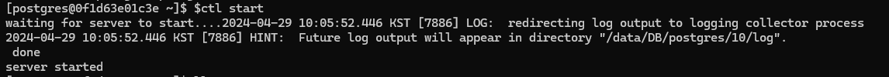

> Postgres 서버가 죽었는데 재시작이 안되는 문제가 종종 있다..

Linux(CentOS)에서 postgres 서버를 올려 사용하고 있는데 갑자기 PostgreSQL 연결이 끊겨 서버를 확인해보니 postgres 서버가 죽어있어 재시작 하려고 하니 밑의 문구가 나오며 서버 시작이 되지 않았다.

```
psql: could not connect to server: No such file or directory
    Is the server running locally and accepting
    connections on Unix domain socket "/tmp/.s.PGSQL.5432"?
```

에러 로그 상으로는 Postgres 서버가 실행되지 않았거나, 소켓 파일이 존재하지 않거나 올바른 위치에 있지 않을 수 있다고 하는데 postgres 서버가 다른 포트에서 실행중인 것도 아니고 "/tmp/.s.PGSQL.5432" 해당 경로에 파일도 존재했다.

이 외에도 구글링 해보면 많은 원인들이 있지만 특별한 동작을 하지 않았는데 갑자기 발생할 경우 나 같은 경우 항상 PID 파일 충돌로 발생한 문제였다.

이런 경우 postgresql 자체를 지우고 재설치 하라고 하는 경우가 많지만 간단하게 <u>postmaster.pid 파일을 제거</u>하여 해결할 수 있다.

다만 지우기 전에 **postmaster.pid에 적힌 PID로 실제 프로세스가 살아있는지 먼저 확인**해야 한다. 파일만 지우고 새 서버를 띄웠는데 기존 프로세스가 진짜로 살아서 같은 데이터 디렉터리에 접근 중이었다면, 두 프로세스가 동시에 같은 파일을 건드리면서 데이터가 깨질 수 있다.

```
// postmaster.pid 첫 줄에 적힌 PID로 실제 프로세스가 떠있는지 확인
$ head -1 /usr/local/var/postgres/postmaster.pid
$ ps -p <위에서 확인한 PID>

// 프로세스가 없는 걸 확인했다면 postmaster.pid 파일 제거
$ rm /usr/local/var/postgres/postmaster.pid

// postgres 서버 시작
$ sudo systemctl start postgresql
```

서버 정상적으로 시작됨!!



*PostgreSQL에서 제공하는 클라이언트 도구인 pg\_ctl을 환경변수 ctl로 등록해둔 상태.*

- 끝 -
