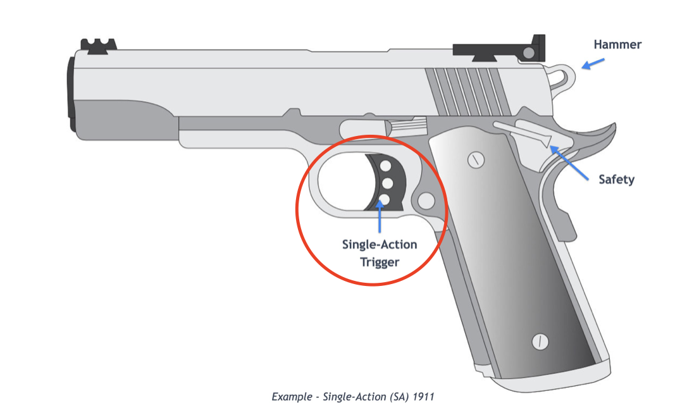
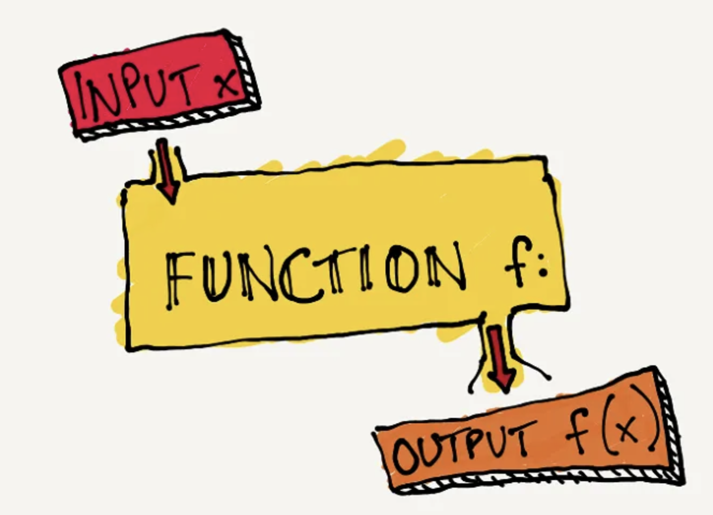

> trigger, procedure, function은 각각 무엇을 의미하며 어떻게 사용하는가


trigger와 procedure 그리고 function은 다양한 데이터베이스 관리 시스템(DBMS)에서 사용되는 개념이다. 각 DBMS마다 구현 방식이나 지원 여부에는 조금씩 차이가 있으며, 이 글에서는 postgresql에 대한 개념을 정리했다.

### Trigger

트리거(trigger)는 <u>특정 이벤트 (INSERT, UPDATE, DELETE)가 테이블에서 발생할 때 자동으로 실행되는 일련의 명령문</u>으로 총이 방아쇠를 당겨 총알을 발사 하듯이 이벤트가 발생했을 때 특정한 기능을 실행시키는 것이다.



- 트리거는 테이블이나 뷰에 대해 설정된다.
- BEFORE, AFTER, INSTEAD OF 시점에 설정할 수 있다.
- 행(row) 레벨과 문(statement) 레벨로 설정할 수 있다.
- 데이터 무결성 및 자동화된 데이터 변경 작업에 유용하다.

*Ex >*

**Before Trigger**: 새로운 행이 삽입될 때 급여(salary)가 음수인지 확인하는 트리거

```sql
CREATE TABLE employees (
    id SERIAL PRIMARY KEY,
    name VARCHAR(100),
    salary NUMERIC
);

-- 함수 생성
CREATE OR REPLACE FUNCTION check_salary() RETURNS TRIGGER AS $$
BEGIN			     -- NEW는 삽입되거나 수정된 행을 참조한다.
    IF NEW.salary < 0 THEN   -- 삽입된 행의 salary값이 음수인 경우 예외를 발생시켜 삽입을 중단한다.
        RAISE EXCEPTION 'Salary cannot be negative';
    END IF;
    RETURN NEW;
END;
$$ LANGUAGE plpgsql;

-- 트리거 생성
CREATE TRIGGER check_salary_before_insert
BEFORE INSERT ON employees       -- employees테이블의 insert 전에 실행됨.
FOR EACH ROW                     -- 트리거가 각 행에 대해 한 번씩 실행됨
EXECUTE FUNCTION check_salary(); -- 트리거가 실행될 때 check_salary 함수 호출
```

---

### Procedure

프로시저(procedure)는 여러 SQL 명령문을 하나의 실행 단위로 그룹화하여 호출할 수 있는 저장된 코드 블록이다.


- CALL 문을 통해 호출되어 재사용성이 높다.
- 트랜잭션 제어(커밋, 롤백 등)를 포함할 수 있다.
- 반환 값이 없으며, 주로 데이터 처리 작업에 사용된다.
- 복잡하거나 절차적인 작업을 처리할 때 유용하다.

*Ex >*

**Procedure:** 특정 직원의 급여를 인상하는 프로시저

```sql
-- 프로시저 생성
CREATE PROCEDURE raise_salary(emp_id INT, increase NUMERIC)
LANGUAGE plpgsql
AS $$
BEGIN
    UPDATE employees SET salary = salary + increase WHERE id = emp_id;
END;
$$;

-- 프로시저 호출
CALL raise_salary(1, 500);
```

---

### Function

함수(function)은 <u>입력 값을 받아서 결과 값을 반환</u>하는 코드 블록이다. 주로 특정 작업을 수행하고 결과를 반환하는데 사용된다.



- 함수는 SELECT 문이나 다른 SQL 문 내에서 호출될 수 있다.
- 값을 반환할 수 있다.
- 다양한 반환 타입을 지원한다. (단일 값, 레코드, 테이블 등)

*Ex >*

**Function:** 사원의 급여를 조회하는 함수

```sql
-- 함수 생성
CREATE OR REPLACE FUNCTION get_salary(emp_id INT) RETURNS NUMERIC AS $$
DECLARE
    result NUMERIC; -- 변수 정의
BEGIN
    SELECT salary INTO result FROM employees WHERE id = emp_id;
    RETURN result; -- 결과를 변수에 담아 리턴
END;
$$ LANGUAGE plpgsql;

-- 함수 호출
SELECT get_salary(1);
```

*- 끝 -*

reference.

[https://junhkang.tistory.com/3#google\_vignette](https://junhkang.tistory.com/3#google_vignette)
