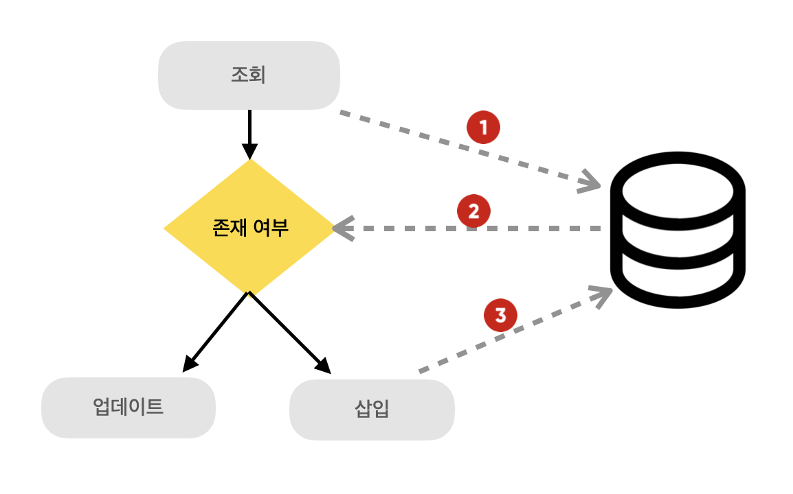

> 데이터를 삽입하는데 충돌이 발생하면 충돌한 기존 데이터를 업데이트 하자


### **UPSERT 란?**

UPSERT 는 **[Insert + Update]**의 합성어로, <u>고유 키나 제약 조건을 기준으로 기존 레코드의 존재 여부를 판단</u>하여 존재하면 UPDATE, 존재하지 않으면 INSERT를 수행하는 복합 연산이다. 주로 사용되는 <u>대부분의 DBMS</u>(MySQL, Oracle, PostgreSQL, Mongo..)에서 고유 문법에 따라 <u>UPSERT를 지원</u>하고 있으며, 실제로도 많이 사용되고 있다.

하지만 SQL 표준 문법은 아니고, 비슷한 기능의 표준 문법으로 Oracle, SQL Server 등에서 MERGE를 지원하고 있다.

**MERGE**는 상대적으로 <u>복잡한 조건의 병합 처리</u>에 유리하고, **UPSERT**는 <u>충돌 시 단순 삽입/수정</u> 하는 간결한 처리에 쉽게 사용할 수 있다. 상황에 따라 UPSERT 또는 MERGE를 사용할 수 있으나 복잡한 연산은 애플리케이션의 서비스로직에서 처리하는게 효과적이며, 가독성도 좋다고 생각하기 때문에 UPSERT를 주로 사용한다.

### **⁉️ 이런 기능은 왜 필요할까.**

이는 데이터의 <u>무결성을 유지하면서 중복 삽입을 방지</u>하고, 단일 쿼리로 삽입과 갱신을 동시에 처리할 수 있게 해준다.

중복 데이터가 있을 수 있는 상황에서 기존의 가장 간단한 문제해결 방법은 삽입할 데이터를 조건으로 조회하여 같은 조건에 해당하는 데이터가 있는지 확인한 후 없다면 삽입하도록 할 수 있다.



위와 같은 방법은 간단하지만 Database에 여러번 접근해야 하기 때문에 비효율적이다. 이런 상황을 해결하기 위해 UPSERT를 사용할 수 있다.


### 작성 방법

DBMS에 따라 문법이 다르지만 PostgreSQL 같은 경우 INSERT문 마지막에 ON CONFLICT ~ DO UPDATE ~ 이런 식으로 사용한다.

> 어떤 컬럼에서 충돌이 발생할 경우 업데이트를 수행할 것인지
> (중복 여부를 체크할 수 있는 Column이나 Key를 사용해야 함)

```
ON CONFLICT (column)
```

> 충돌 발생 후 어떤 작업을 수행할 것인지

```
// 충돌이 발생할 경우 실행할 업데이트문
DO UPDATE SET ~;
// 충돌이 발생해도 아무 동작도 하지 않음.
DO NOTHING;
```

**Ex) user가 이미 있다면 email 정보 업데이트**

```sql
INSERT INTO users (user_id, email)
VALUES ('johndoe', 'johndoe@example.com')
ON CONFLICT (user_id) 
DO UPDATE SET email = EXCLUDED.email;
```
