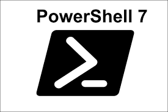

> PowerShell 7의 설치 방법과 주요 장점, 그리고 SSH 접속 후에도 편리한 자동완성을 사용하는 방법



리눅스 서버를 운영하다 보면 Windows 환경에서 SSH 접속이나 스크립트 작업을 할 일이 많다. 그동안 Windows에 기본 설치된 PowerShell 5.1을 사용해왔는데, 최근 PowerShell 7로 업그레이드하면서 자동 완성, 명령어 예측 등 다양한 개선 사항을 체감할 수 있었다.

## ✅ PowerShell 5.1 vs PowerShell 7

Windows에 기본 탑재된 PowerShell은 5.1 버전이며 PowerShell 7은 .NET Core/.NET 기반으로 재작성된 크로스 플랫폼 버전이다.

- **PowerShell 5.1**: Windows 전용, .NET Framework 기반
- **PowerShell 7**: Windows, macOS, Linux 지원, .NET Core/.NET 기반

두 버전은 병렬로 설치 가능하며, PowerShell 7은 pwsh 명령어로 실행된다.

## 주요 장점

**1. 향상된 자동 완성 기능**

PowerShell 7은 PSReadLine 2.1 이상을 기본 탑재하여 강력한 자동 완성을 제공한다.

**예측형 IntelliSense (Predictive IntelliSense)**

- 명령어 히스토리를 기반으로 다음에 입력할 명령을 회색 글씨로 미리 보여준다
- → 키를 눌러 제안된 명령을 바로 채택할 수 있다

```
# 예: ssh 명령어를 자주 사용하면
ssh dev-server01  # 입력 후
# 다음번에 "ssh"만 입력해도 "ssh dev-server01"을 자동으로 제안
```

**2. 크로스 플랫폼 지원**

Windows, macOS, Linux에서 동일한 스크립트를 실행할 수 있어 멀티 플랫폼 환경에서 일관된 작업이 가능하다.

**3. 파이프라인 병렬 처리**

ForEach-Object -Parallel 파라미터를 사용해 파이프라인 작업을 병렬로 처리할 수 있다.

```
1..10 | ForEach-Object -Parallel {
    "Processing item $_"
    Start-Sleep -Seconds 1
} -ThrottleLimit 5
```

**4. 삼항 연산자 지원**

간결한 조건문 작성이 가능하다.

```
$status = $service.Status -eq 'Running' ? 'OK' : 'Error'
```

**5. 더 나은 오류 처리**

$ErrorView 변수로 오류 출력 형식을 조절할 수 있다.

```
$ErrorView = 'ConciseView'  # 간결한 오류 메시지
```

**6. 성능 개선**

.NET Core/.NET의 성능 개선 덕분에 전반적인 스크립트 실행 속도가 향상되었다.

---

## Windows에서 PowerShell 7 설치하기

#### 방법 1: Microsoft Store (권장)

가장 간편한 방법이다. Microsoft Store는 자동 업데이트를 지원한다.

1. **Microsoft Store 앱 실행**
2. **검색창에 "PowerShell" 입력**
3. **"PowerShell" (게시자: Microsoft Corporation) 선택**
4. **"설치" 버튼 클릭**

#### 방법 2: winget 사용

Windows Package Manager를 사용하는 방법이다.

```
winget install --id Microsoft.Powershell --source winget
```

---

## 실무에서 유용한 PowerShell 설정

#### PSReadLine 옵션 설정

$PROFILE 파일에 다음 설정을 추가하면 더 편리하게 사용할 수 있다

```
# 프로필 파일 편집
notepad $PROFILE

# 아래 내용 추가
Set-PSReadLineOption -PredictionSource History
Set-PSReadLineOption -PredictionViewStyle ListView
Set-PSReadLineOption -EditMode Windows
```

> **PredictionSource** : 명령어 예측 데이터 소스 설정. History로 설정하면 이전에 입력했던 명령어 히스토리를 기반으로 예측
> **PredictionViewStyle** : 예측 명령어를 표시하는 방식 설정. ListView로 설정하면 여러개의 예측 결과를 리스트로 표시하여 선택 가능

#### SSH 접속용 함수 설정

자주 사용하는 명령을 함수로 등록하여 사용할 수 있다.

```
function Connect-DevServer {
    ssh user@dev-server-ip
}

function Connect-ProdServer {
    ssh user@prod-server-ip
}
```
