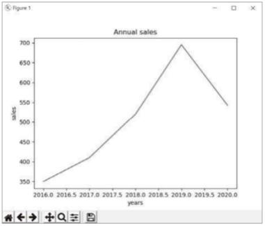
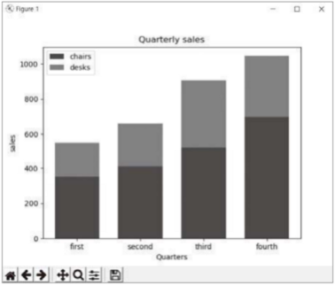

### **matplotlib**

- 라인플롯 차트, 바 차트, 파이 차트, 히스토그램, 산점도 등의 다양한 차트 그리기를 지원하는 library이다.
- 데이터 탐색 & 분석 결과를 시각화 하기 위해 사용한다.


## **matplotlib-LinePlot**

> matplotlib를 사용하기 위해서는 **import matplotlib**를 통해 import한다.

> matplotlib의 주요 모듈 **import matplotlib.pyplot as plt**도 import한다.

### #LinePlot Chart

- 데이터가 시간, 순서 등에 따라 어떻게 변화하는지 보여주는 선 그래프

### 1. 데이터 준비

```
x = [2016, 2017, 2018, 2019, 2020]
y = [350, 410, 520, 695, 543]
```

### 2. 라인플롯 생성

```
plt.plot(x, y)
```

### 3. 차트 제목 설정

```
plt.title('Annual sales')
```

### 4. x축 레이블 설정

```
plt.xlabel('years')
```

### 5. y축 레이블 설정

```
plt.ylabel('sales')
```

### 6. 라인플롯 표시

```
plt.show()
```



## **matplotlib-BarChart**

> matplotlib를 사용하기 위해서는 **import matplotlib**를 통해 import한다.

> matplotlib의 주요 모듈 **import matplotlib.pyplot as plt**도 import한다.

### #Bar Chart

- 막대 그래프

### 1. 데이터 준비

```
y1 = [350, 410, 520, 695]
y2 = [200, 250, 385, 350]

# y1 길이만큼의 리스트 [0, 1, 2, 3] 생성
x = range(len(y1))
```

### 2. 바 차트 생성

```
# x축, y축 지정
plt.bar(x, y1, width=0.7, color="blue")
plt.bar(x, y2, width=0.7, color="red", bottom=y1)
```

### 3. 차트 제목 설정

```
plt.title('Quarterly sales')
```

### 4. x축 레이블 설정

```
plt.xlabel('Quarters')
```

### 5. y축 레이블 설정

```
plt.ylabel('sales')
```

### 6. 눈금 이름 리스트 생성

```
xLabel = ['first', 'second', 'third', 'fourth']
```

### 7. x축 눈금 이름 설정

```
plt.xticks(x, xLabel, fontsize=10)
```

### 8. 범례 설정

```
plt.legend(['chairs', 'desks'])
```

### 9. 바 차트 표시

```
plt.show()
```


