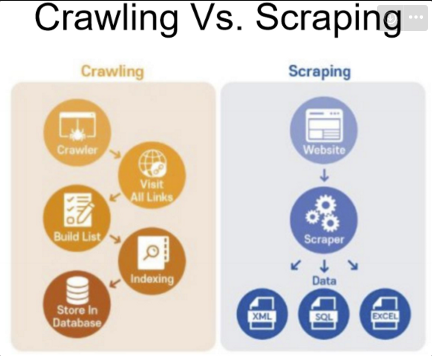
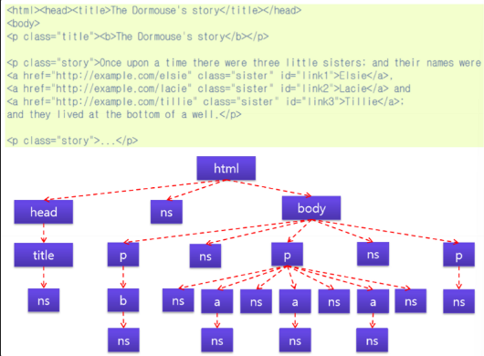
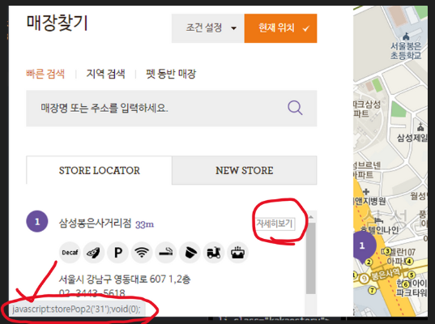

#### **Data Scraping**

- 컴퓨터 프로그램이 웹 페이지나 프로그램 화면에서 데이터를 자동으로 추출하는 것



#### **PyPI** (Python package Index)

자유 소프트웨어 라이센스 또는 POSIX와의 호환성 같은 메타데이터에 대해 키워드를 기준으로 패키지를 검색하거나 필터를 통해 패키지를 검색할 수 있다.

[PyPI · The Python Package Index](https://pypi.org/)

> 스크래핑을 하기 위해선 HTML계층도를 이해해야 한다.



## Requests

**Requests**

- Requests는 단순하지만 우아한 HTTP 라이브러리이다.
- 다양한 WEB http요청을 쉽게 다룰 수 있도록 도와주는 패키지이다.


```python
import requests
res = requests.get("https://blog.replit.com/")

if res.status_code == 200:
    print(res.content)
```

**Ex>**

```
>>> import requests
>>> r = requests.get('https://httpbin.org/basic-auth/user/pass', auth=('user', 'pass'))
>>> r.status_code
200
>>> r.headers['content-type']
'application/json; charset=utf8'
>>> r.encoding
'utf-8'
>>> r.text
'{"authenticated": true, ...'
>>> r.json()
{'authenticated': True, ...}
```

## Beautiful Soup

**Beautiful Soup**

- 웹 페이지에서 정보를 쉽게 긁어낼 수 있게 해주는 라이브러리이다.
- HTML 또는 XML 파서 위에 위치하여 구문 분석 트리를 반복, 검색 및 수정하기 위한 Python 관용구를 제공한다.


```python
from bs4 import BeautifulSoup
soup = BeautifulSoup(res.content, 'html.parser')
```

**Ex>**

```python
from bs4 import BeautifulSoup

html_doc = """
<html><head><title>The Dormouse's story</title></head>
<body>
<p class="title"><b>The Dormouse's story</b></p>

<p class="story">Once upon a time there were three little sisters; and their names were
<a href="http://example.com/elsie" class="sister" id="link1">Elsie</a>,
<a href="http://example.com/lacie" class="sister" id="link2">Lacie</a> and
<a href="http://example.com/tillie" class="sister" id="link3">Tillie</a>;
and they lived at the bottom of a well.</p>

<p class="story">...</p>
"""

soup = BeautifulSoup(html_doc, 'html.parser')

soup.prettify()
soup.title
soup.title.name
soup.title.string
soup.p['class']
soup.find_all('a')
soup.find(id="link3")
soup.find_all('a', class_="sister")
soup.html.body.p.b
soup.html.body.contents[2]
soup.html.body.next_element
```

## Selenium

> 자동화된 브라우저.

- BeautifulSoup은 강력하지만 자바스크립트가 동적으로 생성되는 정보는 가져올 수 없는데 Selenium은 그것을 가능하게 해준다.
- 또한, 사이트에서 다양한 이벤트(마우스 클릭, 키보드 입력 및 반복적인 업무 등)를 만들어 수행할 수 있다.

**Ex > CoffeeBean 매장 찾기 중 자세히 보기를 눌렀을 때 나오는 페이지 스크래핑**



```python
from selenium import webdriver
from selenium.webdriver.chrome.options import Options
```

- 커피빈의 매장 정보 중 storePop2(333) 버튼을 클릭하여 나온 페이지의 리소스를 스크래핑 한다.

```python
options = Options()
options.add_argument("--no-sandbox")
options.add_argument("--disable-dev-shm-usage")
wd = webdriver.Chrome(options=options)

# 해당 URL에서 JavaScript코드 'storePop2(333)'를 실행한 결과
# 페이지 전체를 크롤링해옴.
wd.get('https://www.coffeebeankorea.com/store/store.asp')
wd.execute_script('storePop2(333)')

print(wd.page_source)
```
