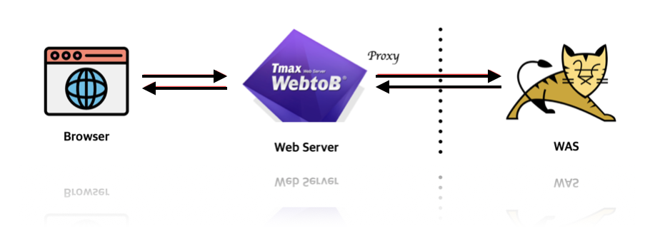
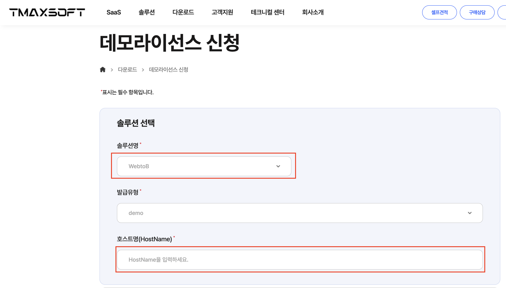
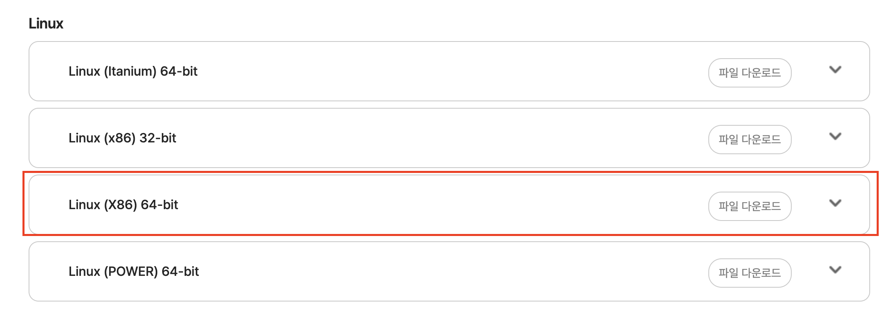

> WebtoB의 Reverse Proxy를 이용하여 외부 서버에 WebtoB를 두고 내부 서버에 WAS를 두어 연동하는 방식은 보안, 성능, 유지보수 측면에서 유리하기 때문에 많이 사용된다.



> WebtoB는 TmaxSoft에서 제공하는 고성능 웹 서버이다.

WAS는 일반적으로 HTTP Listener를 가지고 있는데, WebtoB는 reverse proxy 설정을 통해 WAS의 HTTP Listener와 연결을 맺어 연동하게 된다.

### WebtoB 라이센스 발급

우선 WebtoB를 실제 운영 시스템에 사용하는 것이 아니라 학습 또는 테스트 목적으로 진행할 경우 데모 라이선스를 발급받아 일정 기간동안 무료로 사용할 수 있다.

> 데모 라이선스는 제품 구입 전 테스트 및 검토를 위하여 제한된 기간 동안 발급받아 사용 가능한 라이선스 입니다.
> 명시된 유효기간 내에서만 사용 가능하며, 테스트 및 검토 용도가 아닌 실제 운영시스템에 사용하는 것은 당사 라이선스 정책에 위배됨을 알려 드립니다.
> 데모 라이선스는 하나의 솔루션에 대해 최대 3회까지 발급이 가능합니다. 3회 이상의 데모 라이선스 발급을 원하신다면, 담당 영업대표를 통해 발급 요청을 하시기 바랍니다.

WebtoB의 데모 라이센스 발급 및 다운로드를 하려면 먼저 회원가입을 진행 후 아래 링크에서 데모 라이선스를 신청하면 된다.

[https://www.tmaxsoft.com/kr/download/demo-license/apply](https://www.tmaxsoft.com/kr/download/demo-license/apply)

솔루션명은 WebtoB로 선택하고 호스트명은 WebtoB를 설치하고자 하는 리눅스 서버에서 *hostname* 명령어로 호스트명을 확인하여 입력해주면 된다.



*데모라이선스를 신청하면 1~2시간 내에 라이선스를 발급해 주는 것 같다.*

*라이선스는 당장 필요한게 아니라 다운로드 후 wsboot 명령어로 WebtoB를 실행할 때 사용되는 것이니까 신청해둔 상태로 다운로드를 진행하면 된다.*

### WebtoB 다운로드 및 기본 설정

[https://www.tmaxsoft.com/kr/download/middleware/WebtoB/download?seq=34](https://www.tmaxsoft.com/kr/download/middleware/WebtoB/download?seq=34)

위의 다운로드 페이지에서 서버에 맞는 파일을 다운로드 하면 된다.

<u>메뉴얼도 있으니 다운받아 읽어보는 것이 좋다.</u>



파일을 다운받았으면 SSH 또는 FileZilla등의 활용하여 다운로드 파일을 리눅스 서버로 옮겨준다.

그 후의 설정 및 설치 방법에 대해서는 이 글에 자세히 설명되어 있다.

[https://betwe.tistory.com/entry/Tmaxsoft-WebtoB-50-%EC%9B%B9%EC%84%9C%EB%B2%84-%EA%B5%AC%EC%B6%95%ED%95%98%EA%B8%B0](https://betwe.tistory.com/entry/Tmaxsoft-WebtoB-50-%EC%9B%B9%EC%84%9C%EB%B2%84-%EA%B5%AC%EC%B6%95%ED%95%98%EA%B8%B0)

### Proxy 설정하여 WAS 연동

WebtoB 다운로드 및 기본 설정이 끝났다면 Proxy를 설정하여 WAS(Tomcat)을 연동한다.

Proxy 설정에 대한 내용은 해당 메뉴얼에 자세히 설명되어 있다. => WebtoB\_5.0\_Administrator-Guide.pdf

**Guide 4.6. 다른 WAS 연동** (184p)

```
*REVERSE_PROXY_GROUP
rproxyG1
	VhostName = "vhost1",
	PathPrefix = "/before/",
	RegExp = "\.(do|jsp)$",
	ServerPathPrefix = "/after/",
	RewriteHtmlUrl = "/after/ /before/",
	HtmlUrl = "a href",
	HtmlUrl = "img src",
	HtmlUrl = "link href",
	HtmlUrl = "script src",
	RewriteHtmlMaxSize = 4194304,
	WBRoutingCookieKey = "W2BRID"
	#SessionIDCookieKey = "JSESSIONID"

*REVERSE_PROXY
rproxy1
	ServerAddress = "127.0.0.1:8088",
	ReverseProxyGroupName = "rproxyG1",
	MinPersistentServerConnections = 1,
	MaxPersistentServerConnections = 20,
	PersistentServerCheckTime = 50,
	PersistentServerTimeout = 300,
	PersistentServerCheckUrl = "/after/ping.html",
	MaxWebSocketConnections = 20
	#StickySessionRoutingID = "was1_servlet_engine",
    	#ProxySSLFlag = Y,
	#ProxySSLName = pssl1
```

이 코드는 기본적으로 Proxy를 설정하기 위한 설정 내용이다.

다중 WAS를 사용하는 경우 여러 Proxy 설정들을 Proxy Group으로 묶어 관리할 수 있다.

#### REVERSE\_PROXY\_GROUP

**1. VhostName = "vhost1"**

- Reverse Proxy가 처리할 가상 호스트 이름을 지정한다. 그냥 원하는 이름을 지정하면 된다.

**2. PathPrefix = "/before/"**

- 요청 URL의 경로 접두사로, 이 접두사가 URL에 포함되어 있는 경우에만 이 Reverse Proxy 설정이 적용된다. 예를 들어, 요청 URL이 /before/로 시작하면 이 설정이 적용된다.

**3. RegExp = "\.(do|jsp)$"**

- 요청 URL의 파일 확장자를 정규 표현식으로 지정한다. 이 경우 .do 또는 .jsp로 끝나는 요청에만 이 Reverse Proxy 규칙이 적용된다. 예를 들어, /example.do 또는 /example.jsp 파일에 대해서만 이 규칙이 적용된다.

**4. ServerPathPrefix = "/after/"**

- Reverse Proxy가 백엔드 서버로 요청을 전달할 때 사용할 경로 접두사이다. PathPrefix로 지정한 경로가 /before/인 요청을 처리하면서, 백엔드 서버에는 /after/ 접두사를 붙여서 요청을 전달한다.

**5. RewriteHtmlUrl = "/after/ /before/"**

- HTML 문서 내의 URL 경로를 재작성하는 규칙이다. 이 설정은 RewriteHtmlMaxSize로 지정된 크기 이하의 HTML 파일에서, /before/로 시작하는 URL을 /after/로 재작성한다. 즉, 클라이언트에게 전달된 HTML에서 경로를 변환하여 요청을 백엔드 서버로 전달할 때 URL 경로를 조정한다.

**6. HtmlUrl = "a href"**

- HTML 문서에서 `<a>` 태그의 href 속성에 포함된 URL을 대상으로 재작성 규칙을 적용한다. 이 설정은 HTML 파일의 링크 URL을 재작성할 때 사용된다.
- 사용 예시) img src, link href, script src ..

#### REVERSE\_PROXY

**1. ServerAddress = "127.0.0.1:8088"**

- Reverse Proxy가 요청을 전달할 백엔드 서버의 주소를 지정한다.

**2. ReverseProxyGroupName = "rproxyG1"**

- Reverse Proxy의 그룹 이름을 지정한다. 여러 Reverse Proxy 서버를 그룹화하여 관리하거나 설정할 때 유용하다.

이 외에는 WAS와의 연결에 대한 세부 설정인데 실제 운영할 것이 아니라면 Default 값으로 둬도 문제 없다.

WAS에서 확인해야 할 사항

> ● WebtoB가 WAS로 연결할 HTTP Listener 설정(Listen IP, Port, thread 수)
> ● WebtoB와 WAS의 연결을 persistent connection으로 유지하고자 하는 경우 PING 체크를 위한 application 설정
> ● Sticky Session routing을 사용하고자 하는 경우 routing id
> ● WebtoB와 WAS간 SSL 암호화 통신을 하고자 하는 경우 HTTP Listener에 대한 SSL 설정

*- 끝 -*
