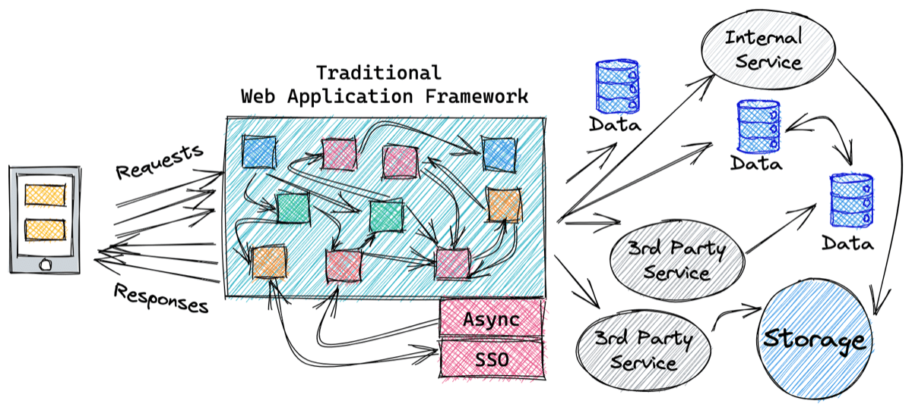
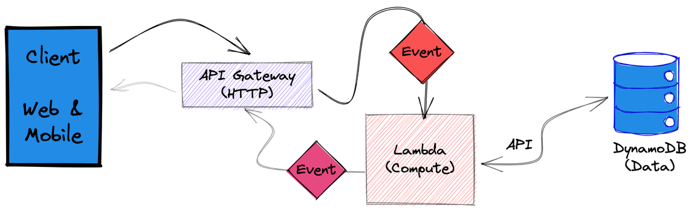
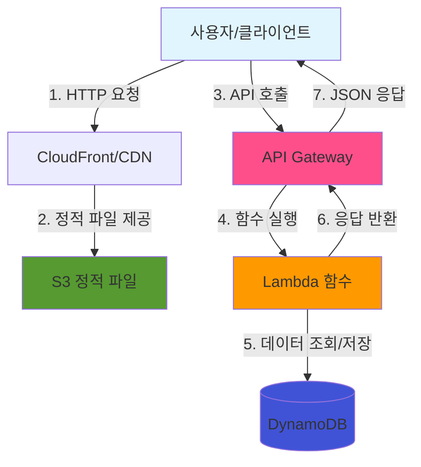
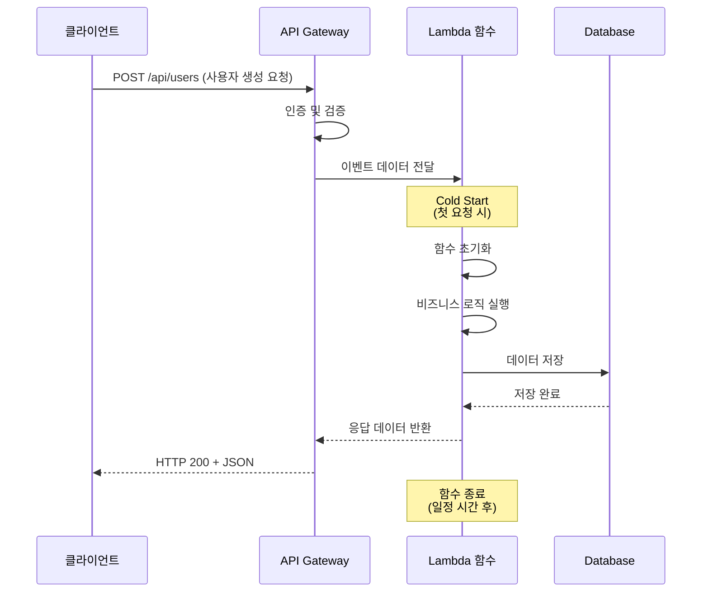
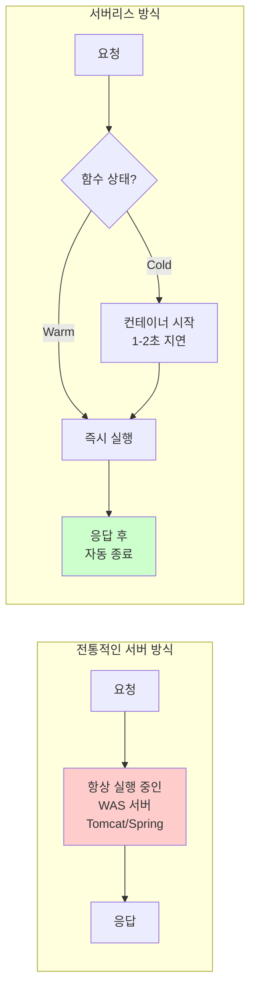
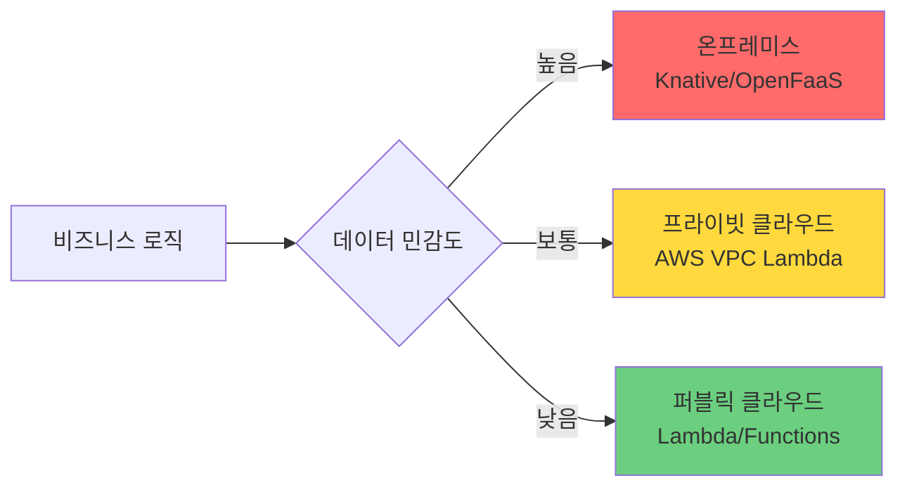
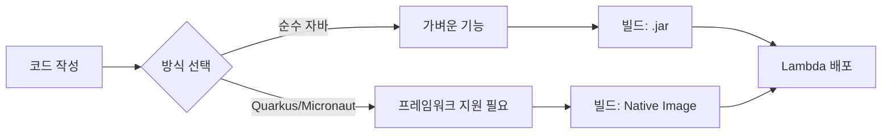

## 들어가며

최근 클라우드 컴퓨팅 환경에서 자주 등장하는 키워드 중 하나가 바로 '서버리스(Serverless)'다. AWS Lambda, Google Cloud Functions 같은 서비스들이 바로 서버리스 컴퓨팅의 대표적인 예다. 하지만 이름과는 달리, 서버리스는 서버가 없다는 의미가 아니다. 이 글에서는 서버리스의 개념부터 실제 구현까지 자세히 알아본다.

---

## 1. 서버리스란 무엇인가?

### 1.1 기본 개념

서버리스(Serverless)는 말 그대로 서버가 없다는 뜻이 아니라, "사용자가 신경 써야 할 서버 관리 작업이 없다"는 의미다.

비유하자면:

- **전통적인 서버 방식**: 매일 직접 차를 관리하고 운전하기
- **서버리스**: 택시나 우버를 타는 것 - 차는 존재하지만 관리는 할 필요 없이 목적지까지 가는 서비스만 이용

### 1.2 서버리스의 특징

#### 이벤트 기반 실행

- 특정 이벤트(웹사이트 버튼 클릭, 이미지 업로드 등)가 발생할 때만 코드가 실행된다.

#### 짧은 생명주기

- 요청이 들어오면 클라우드 업체가 짧은 순간 컨테이너를 띄워 코드를 실행
- 처리가 끝나면 즉시 리소스를 회수

#### 종량제 과금

- 서버를 24시간 켜둘 필요가 없음
- 코드가 실행된 시간과 횟수만큼만 과금

---

## 2. 서버리스 아키텍처 구성

서버가 없는데 어떻게 웹사이트를 배포할 수 있을까? 전통적인 방식은 서버 한 대를 통째로 빌려 사용했지만, 서버리스 환경에서는 역할을 분담한다.

| 구성 요소 | 서버리스 방식의 역할 | AWS 예시 |
| --- | --- | --- |
| 프론트엔드 | 정적 파일을 저장소에 올려두면 전 세계로 배포 | S3 + CloudFront |
| 백엔드(로직) | 특정 API 요청이 올 때만 함수를 실행해 데이터 처리 | API Gateway + Lambda |
| 데이터베이스 | 서버 크기를 정하지 않고 데이터 양에 따라 자동 조절 | DynamoDB |

### 배포 과정

1. **프론트엔드**: 정적 파일들을 클라우드 저장소(S3 등)에 업로드
2. **백엔드**: 회원가입, 게시글 쓰기 같은 로직을 각각의 함수 단위로 쪼개서 업로드
3. **연결**: 사용자가 접속하면 저장소의 화면이 보이고, 버튼을 누르면 해당 순간에만 백엔드 함수를 실행해 응답

---

## 3. 서버리스의 장단점

### 3.1 장점

#### 비용 절감

- 사용자가 없을 때는 0원
- 실제 사용한 만큼만 과금

#### 무한 확장성

- 갑자기 사용자가 100만 명 몰려도 클라우드 업체가 자동으로 함수 개수를 늘려 대응

#### 관리 부담 제로

- OS 업데이트, 보안 패치 등 인프라 관리 불필요

### 3.2 단점

#### 콜드 스타트(Cold Start)

- 오랫동안 사용하지 않다가 실행하면 서버를 깨우는 데 1~2초 정도 지연 발생

#### ⏱️ 시간 제한

- 보통 하나의 함수는 최대 15분까지만 실행 가능
- 아주 무거운 작업에는 부적합

#### 벤더 종속성

- 특정 클라우드 플랫폼에 의존하게 됨

---

## 4. 서버리스를 언제 사용해야 할까?

### 4.1 적합한 경우

#### 불규칙한 트래픽

- 이벤트성 페이지 (선착순 이벤트, 한시적 캠페인)
- 스타트업 초기 단계
- 백오피스/관리자 도구

#### 이벤트 기반 처리

- 이미지/동영상 처리 (썸네일 생성, 용량 압축)
- 데이터 파이프라인 (로그 분석, 데이터 이동)
- 알림 발송 (결제 완료 시 푸시 알림)

#### 마이크로서비스 아키텍처

- 기능을 독립적으로 쪼개서 관리
- 특정 기능만 업데이트 가능
- 빠른 배포 주기

#### 챗봇 및 간단한 API

- 카카오톡 챗봇, 슬랙 봇
- 간단한 REST API 서버

### 4.2 부적합한 경우

#### 지속적으로 높은 트래픽

- 24시간 내내 많은 요청이 들어오는 경우
- 일반 서버가 오히려 저렴할 수 있음

#### 실시간 응답이 매우 중요

- 콜드 스타트로 인한 지연을 허용할 수 없는 금융권 서비스
- 실시간 게임

#### 긴 실행 시간이 필요

- 몇 시간씩 걸리는 딥러닝 학습
- 대규모 데이터 렌더링

---

## 5. AWS Lambda 언어 지원

많은 사람들이 AWS Lambda가 JavaScript(Node.js)만 지원한다고 생각하지만, 실제로는 거의 모든 주요 프로그래밍 언어를 지원한다.

### 5.1 기본 지원 런타임

- **JavaScript / TypeScript** (Node.js)
- **Python** - 데이터 분석, AI 스크립트용으로 인기
- **Java** - 기업형 서비스에서 많이 사용
- **C#** (.NET Core)
- **Go** - 빠른 실행 속도와 가벼움
- **Ruby**

### 5.2 커스텀 런타임

공식 지원 목록에 없어도 커스텀 런타임 기능을 사용하면 사실상 모든 언어 사용 가능:

- PHP, Rust, C++, Kotlin, Swift 등

### 5.3 도커 컨테이너 지원

최근에는 도커 이미지 자체를 Lambda에 올릴 수 있어 언어의 제약이 완전히 사라졌다.

### 5.4 언어별 Cold Start 성능

| 속도 | 언어 | 특징 |
| --- | --- | --- |
| ⚡ 빠름 | Python, Node.js, Go | 가볍고 순식간에 실행, 웹 API나 챗봇에 유리 |
| 상대적으로 느림 | Java, C# | JVM 등 실행 환경 준비 시간 필요, 하지만 실행 성능은 강력 |

---

## 6. 서버리스 아키텍처 구성도

서버리스 환경에서 실제로 어떻게 요청이 처리되는지 시각적으로 살펴본다.

### 6.1 전체 아키텍처 흐름



### 6.2 요청 처리 과정 상세



### 6.3 전통적인 서버 vs 서버리스 비교



---

## 7. API Gateway vs Lambda Function URL

클라이언트가 Lambda 함수를 호출하려면 어떻게 해야 할까?

### 7.1 API Gateway 방식 (전통적)

Lambda 자체는 함수일 뿐이라 인터넷 주소(URL)가 없다. API Gateway가 Lambda에 URL을 부여하는 역할을 한다.

#### 주요 역할

- **주소 부여**: Lambda에 [https://my-api.com/hello](https://my-api.com/hello) 같은 URL 할당
- **인증/보안**: API 키 검증, 특정 IP 차단
- **트래픽 조절**: 초당 요청 수 제한으로 서버 보호
- **데이터 변환**: 클라이언트 데이터를 Lambda가 이해하기 쉽게 가공

### 7.2 Lambda Function URL (최신)

API Gateway 없이 Lambda 함수 설정에서 버튼 클릭 한 번으로 직접 호출 가능한 URL을 생성할 수 있다.

#### 언제 사용?

- 보안이나 복잡한 설정이 필요 없을 때
- 테스트 용도나 개인 프로젝트
- 간단한 웹훅(Webhook)

### 7.3 비교표

| 구분 | API Gateway + Lambda | Lambda Function URL |
| --- | --- | --- |
| 복잡도 | 높음 (설정 많음) | 낮음 (매우 간단) |
| 비용 | 추가 비용 발생 | 무료 (Lambda 비용만) |
| 기능 | 인증, 캐싱, 속도 제한 등 | 단순 URL 연결만 |
| 추천 용도 | 실제 서비스용, 상업용 앱 | 학습용, 개인용 |

### 7.4 클라이언트 관점

두 방식 모두 클라이언트 입장에서는 일반적인 REST API와 동일하다:

```
// 둘 다 똑같은 방식으로 호출
fetch('https://your-lambda-url.amazonaws.com/?name=kim')
  .then(response => response.json())
  .then(data => console.log(data));
```

---

## 8. 서버리스는 AWS Lambda만 있을까?

### 8.1 주요 클라우드 제공 업체의 서버리스 플랫폼

서버리스 컴퓨팅은 AWS만의 전유물이 아니다. 주요 클라우드 제공업체들이 모두 자체 서버리스 플랫폼을 제공하고 있다.

| 제공 업체 | 서비스 이름 | 특징 |
| --- | --- | --- |
| **AWS** | Lambda | 가장 오래되고 성숙한 플랫폼, 방대한 생태계 |
| **Google Cloud** | Cloud Functions | Firebase와의 완벽한 통합, 무료 티어 후함 |
| **Microsoft Azure** | Azure Functions | .NET 생태계와 완벽한 통합, 엔터프라이즈 친화적 |
| **Cloudflare** | Workers | 엣지 컴퓨팅, 전 세계 200+ 위치에서 실행, 매우 빠름 |
| **Vercel** | Vercel Functions | Next.js와 완벽 통합, 프론트엔드 개발자 친화적 |
| **Netlify** | Netlify Functions | Jamstack 생태계, Git 기반 자동 배포 |

### 8.2 오픈소스 서버리스 프레임워크

클라우드 없이 자체 인프라에서도 서버리스를 구축할 수 있다!

#### Knative

```
- Kubernetes 기반 서버리스 플랫폼
- 온프레미스나 프라이빗 클라우드에서 실행 가능
- Google, IBM, Red Hat이 주도하는 오픈소스 프로젝트
```

#### OpenFaaS

```
- Docker와 Kubernetes 위에서 동작
- 매우 간단한 배포 구조
- 모든 언어 지원
```

#### Apache OpenWhisk

```
- IBM이 오픈소스로 공개
- 복잡한 이벤트 처리에 강점
- Kubernetes나 Docker Compose로 배포 가능
```

#### Fission

```
- Kubernetes 네이티브 서버리스 프레임워크
- 빠른 Cold Start 성능
- 다양한 언어 런타임 지원
```

### 8.3 온프레미스 서버리스의 장점

자체 인프라에 서버리스 환경을 구축하면:

✅ **데이터 주권 보장**: 민감한 데이터가 외부로 나가지 않음

✅ **비용 예측 가능**: 클라우드 종량제 비용 걱정 없음

✅ **커스터마이징 자유**: 필요에 맞게 플랫폼 수정 가능

✅ **벤더 종속 회피**: 특정 클라우드 업체에 묶이지 않음

### 8.4 하이브리드 접근

많은 기업들은 하이브리드 전략을 사용한다:



### 8.5 선택 기준

| 상황 | 추천 옵션 | 이유 |
| --- | --- | --- |
| 빠른 프로토타입 | AWS Lambda / Vercel | 설정이 거의 없고 바로 시작 가능 |
| 엔터프라이즈 | Azure Functions | AD 통합, 기업 지원 |
| 글로벌 저지연 | Cloudflare Workers | 엣지 컴퓨팅으로 사용자와 가장 가까운 곳에서 실행 |
| 데이터 보안 중요 | Knative (온프레미스) | 데이터가 외부로 나가지 않음 |
| 이미 Kubernetes 사용 중 | Knative / Fission | 기존 인프라 활용 |

---

## 9. 자바(Java)로 서버리스 개발하기

자바 개발자들이 서버리스를 처음 접할 때 가장 당황하는 부분이다. Spring Framework의 무거운 기능들을 걷어내고 순수 자바 객체(POJO) 형태로 작성하는 것이 기본이다.

### 9.1 순수 자바로 Lambda 함수 작성

```java
import com.amazonaws.services.lambda.runtime.Context;
import com.amazonaws.services.lambda.runtime.RequestHandler;
import java.util.Map;

// RequestHandler 인터페이스를 상속받아 구현
public class HelloLambda implements RequestHandler<Map<String, String>, String> {

    @Override
    public String handleRequest(Map<String, String> event, Context context) {
        // event는 클라이언트가 보낸 데이터 (JSON이 Map으로 자동 변환)
        String name = event.getOrDefault("name", "Guest");
        
        // 비즈니스 로직 수행
        return "Hello, " + name + "! This is pure Java Lambda.";
    }
}
```

#### 특징

- 별도의 내장 WAS(Tomcat) 불필요
- Lambda 환경이 함수를 직접 호출
- 가볍고 실행 속도가 빠름

### 9.2 서버리스 전용 자바 프레임워크

전통적인 Spring Boot는 서버리스 환경에서 너무 무겁다. 이를 해결하기 위한 경량 프레임워크들:

#### Quarkus (쿠아커스)

- "Supersonic Subatomic Java" 슬로건
- Lambda에 최적화된 프레임워크

#### Micronaut (마이크로너트)

- 컴파일 시점에 의존성 주입 처리
- 메모리 사용량 획기적 감소

#### Spring Cloud Function

- 기존 Spring 개발자에게 익숙한 방식
- 결과물만 Lambda 함수로 배포
- 단점: 상대적으로 무거움

### 9.3 Cold Start 해결: GraalVM Native Image

자바의 최대 약점인 Cold Start를 해결하는 기술이다.

#### 동작 원리

- 자바 코드를 컴파일 단계에서 기계어(Binary)로 변환
- JVM 없이 실행
- 부팅 속도가 수 초에서 수십 밀리초(ms)로 단축

#### 결과

거의 Python 수준의 Cold Start 성능을 달성할 수 있다.

### 9.4 자바 서버리스 개발 흐름



1. **순수 자바**: 라이브러리 의존성이 거의 없는 가벼운 기능
2. **Quarkus/Micronaut**: DB 연결, 보안 등 프레임워크 도움이 필요하지만 성능도 챙겨야 할 때
3. **빌드**: .jar 파일 또는 GraalVM Native Image로 빌드
4. **배포**: 빌드된 파일을 AWS Lambda에 업로드

---

## 10. Spring vs 서버리스 비교

### 10.1 아키텍처 차이

| 구분 | Spring (WAS) | 서버리스 (Lambda) |
| --- | --- | --- |
| 단위 | 애플리케이션 전체 | 개별 기능 (함수) |
| 역할 | 모든 기능을 한 프로그램에 담음 | 기능별로 함수를 따로 작성 |
| 작동 방식 | 서버가 메모리에 상주하며 대기 | 요청 시에만 메모리에 로드 |
| 비유 | 모든 메뉴를 파는 뷔페 식당 | 주문 시에만 요리사가 나타나는 공유 주방 |

### 10.2 개발 방식 차이

#### Spring 방식

```
Controller → Service → Repository
복잡한 설정, 라우팅, DI 컨테이너 등
```

#### 서버리스 방식

```
Input → Logic → Output
핵심 로직에만 집중
```

### 10.3 Spring을 서버리스로?

가능하지만 권장되지 않는다:

- Spring Boot 전체를 Lambda에 담으면 Cold Start가 수 초 이상 소요
- 서버리스 환경에서는 가볍고 빨리 켜지는 프레임워크나 순수 함수 권장

---

## 11. 결론

서버리스는 "필요할 때만 잠깐 쓰고, 서버 관리는 하기 싫고, 사용한 만큼만 돈을 내고 싶을 때" 최적의 선택이다.

### 핵심 요약

1. **서버리스 ≠ 서버 없음**: 서버 관리가 불필요할 뿐, 서버는 존재
2. **이벤트 기반 실행**으로 필요할 때만 작동
3. **종량제 과금**으로 비용 효율적
4. **다양한 플랫폼**: AWS Lambda 외에도 Google Cloud Functions, Azure Functions, Cloudflare Workers 등
5. **온프레미스 구축 가능**: Knative, OpenFaaS 등으로 자체 인프라에 구축
6. **자바 개발**: 경량 프레임워크(Quarkus, Micronaut) 또는 순수 Java 권장
7. **GraalVM Native Image**로 Cold Start 문제 해결 가능
8. **REST API와 동일한 방식**으로 클라이언트 통신

### Java 개발자를 위한 추천 조합

- **프레임워크**: Quarkus 또는 Micronaut
- **빌드**: GraalVM Native Image로 컴파일
- **플랫폼**: AWS Lambda (시작하기 쉬움) 또는 Knative (온프레미스)
- **API 연결**: API Gateway (상용) 또는 Function URL (개발/테스트)
- **데이터베이스**: DynamoDB (NoSQL) 또는 Aurora Serverless (RDB)

서버리스는 특히 스타트업, 이벤트성 서비스, 마이크로서비스 아키텍처에 강력한 솔루션이다. 하지만 24시간 지속적인 트래픽이나 긴 실행 시간이 필요한 작업에는 전통적인 서버 방식이 더 적합할 수 있다.

---

## 참고 자료

### 클라우드 플랫폼

- [AWS Lambda 공식 문서](https://docs.aws.amazon.com/lambda/)
- [Google Cloud Functions](https://cloud.google.com/functions)
- [Azure Functions](https://azure.microsoft.com/ko-kr/products/functions)
- [Cloudflare Workers](https://workers.cloudflare.com/)

### 자바 프레임워크

- [Quarkus 공식 사이트](https://quarkus.io/)
- [Micronaut 공식 사이트](https://micronaut.io/)
- [GraalVM Native Image](https://www.graalvm.org/native-image/)

### 오픈소스 서버리스

- [Knative](https://knative.dev/)
- [OpenFaaS](https://www.openfaas.com/)
- [Apache OpenWhisk](https://openwhisk.apache.org/)
- [Fission](https://fission.io/)

### 배포 도구

- [Serverless Framework](https://www.serverless.com/)
- [AWS SAM](https://aws.amazon.com/serverless/sam/)

---
