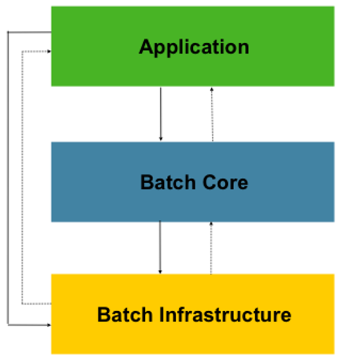

#### **[스프링 배치(Spring Batch)란?](https://devbksheen.tistory.com/284)**

- Spring Batch는 엔터프라이즈 시스템의 운영에 있어 대용량 일괄처리의 편의를 위해 설계된 가볍고 포괄적인 배치 프레임워크이다.
- Spring의 특성을 그대로 가져왔기 때문에 DI, AOP, 서비스 추상화 등 Spring 프레임워크의 3대 요소를 모두 사용할 수 있다.

### **사용 이유**

1. 대용량의 비즈니스 데이터를 복잡한 작업으로 처리해야하는 경우
2. 특정한 시점에 스케쥴러를 통해 자동화된 작업이 필요한 경우 (ex. 푸시알림, 월 별 리포트)
3. 대용량 데이터의 포맷을 변경, 유효성 검사 등의 작업을 트랜잭션 안에서 처리 후 기록해야하는 경우

> Spring Batch는 로깅/추적, 트랜잭션 관리, 작업 처리 통계, 작업 재시작, 건너뛰기, 리소스 관리 등 대용량 레코드 처리에 필수적인 재사용 가능한 기능을 제공한다. 또한 최적화 및 파티셔닝 기술을 통해 대용량 및 고성능 일괄 작업을 가능하게 하는 고급 기술 서비스 및 기능을 제공한다.

### Batch Application 만족 조건

- **대용량 데이터** : 대량의 데이터를 가져오거나, 전달하거나, 계산하는 등의 처리를 할 수 있어야 한다.
- **자동화** : 심각한 문제 해결을 제외하고는 사용자 개입 없이 실행되어야 한다.
- **견고성** : 잘못된 데이터를 충돌/중단 없이 처리할 수 있어야 한다.
- **신뢰성** : 무엇이 잘못 되었는지를 추적할 수 있어야 한다. (로깅, 알림)
- **성능** : 지정한 시간 안에 처리를 완료하거나 동시에 실행되는 다른 애플리케이션을 방해하지 않도록 수행되어야 한다.

### 스프링 배치 아키텍처



- **Application** : Spring Batch를 사용하여 개발자가 작성한 모든 배치 작업과 사용자 정의 코드
- **Batch Core** : 배치 작업을 시작하고 제어하는 데 필요한 핵심 런타임 클래스를 포함
- **Batch Infrastructure** : 개발자와 애플리케이션에서 사용하는 일반적인 Reader와 Writer 그리고 RetryTemplate과 같은 서비스를 포함

> 스프링 배치는 계층 구조가 위와 같이 설계되어 있기 때문에 개발자는 **Application** 계층의 비즈니스 로직에 집중할 수 있고, 배치의 동작과 관련된 것은 **Batch Core** 에 있는 클래스들을 이용하여 제어할 수 있다.

### 최소 구성 예시 (Job, Step)

Spring Batch에서 하나의 배치 작업은 **Job**이고, Job은 여러 개의 **Step**으로 구성된다. 각 Step은 보통 데이터를 읽는 **Reader**, 가공하는 **Processor**, 저장하는 **Writer** 세 단계로 이뤄진다 (Chunk 지향 처리).

```java
@Configuration
public class MemberBatchConfig {

    @Bean
    public Job memberJob(JobRepository jobRepository, Step memberStep) {
        return new JobBuilder("memberJob", jobRepository)
                .start(memberStep)
                .build();
    }

    @Bean
    public Step memberStep(JobRepository jobRepository,
                            PlatformTransactionManager transactionManager,
                            ItemReader<Member> reader,
                            ItemProcessor<Member, Member> processor,
                            ItemWriter<Member> writer) {
        return new StepBuilder("memberStep", jobRepository)
                .<Member, Member>chunk(100, transactionManager) // 100건씩 하나의 트랜잭션으로 처리
                .reader(reader)
                .processor(processor)
                .writer(writer)
                .build();
    }
}
```

- `chunk(100, transactionManager)`처럼 청크 크기를 지정하면, 100건을 읽고 가공할 때마다 한 번에 write + commit하는 식으로 처리한다. 그래서 중간에 실패해도 이미 커밋된 청크는 남고, 실패한 지점부터 재시작(restart)할 수 있다.
- 대용량 데이터를 한 번에 메모리에 올리지 않고 청크 단위로 흘려보내기 때문에, 앞서 말한 "대용량 데이터 처리"와 "견고성" 요구사항을 이 구조 자체로 만족시킬 수 있다.
