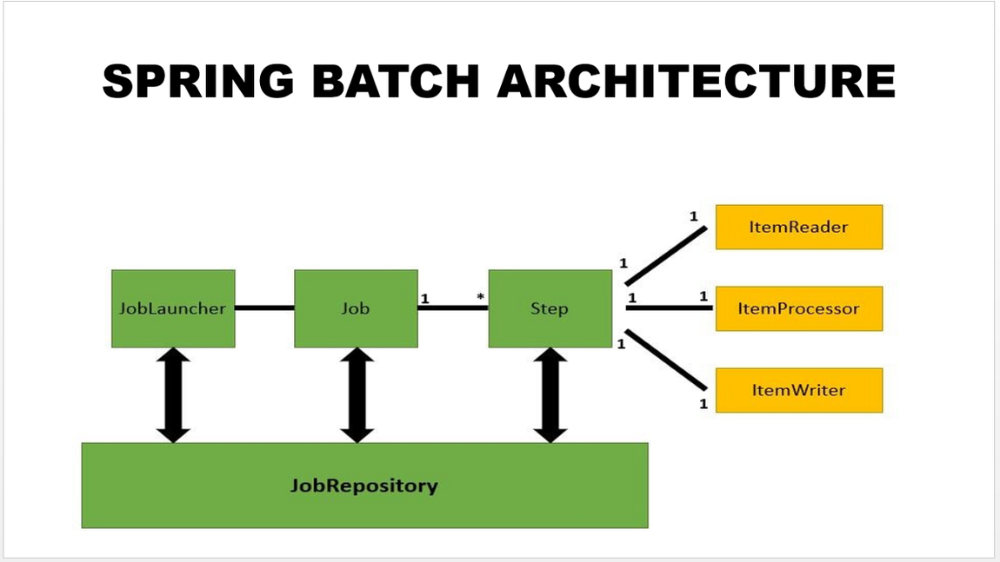
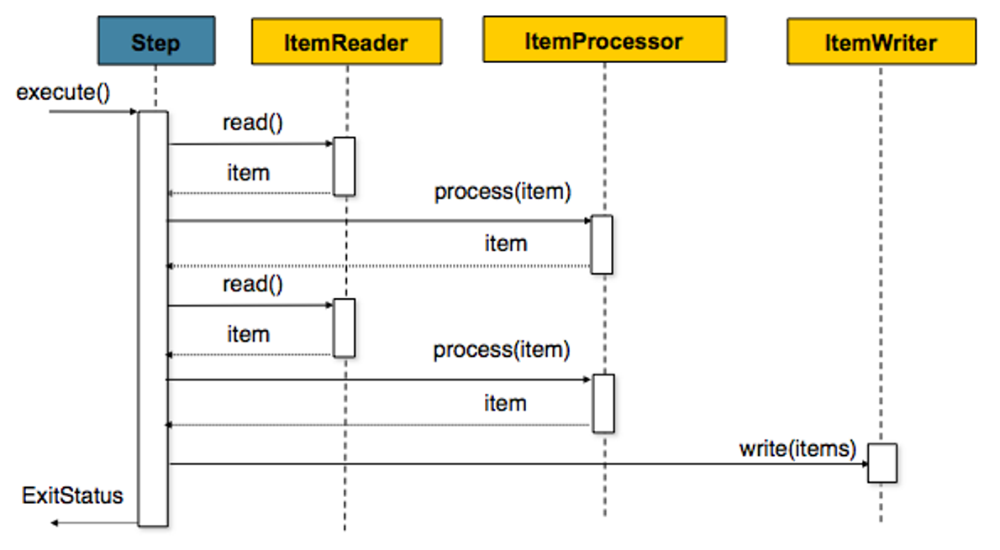

#### **Spring Batch의 구조**

### **JobRepository**

- 다양한 배치 수행과 관련된 수치 데이터와 잡의 상태를 유지 및 관리한다.
- 일반적으로 관계형 데이터베이스를 사용하며 스프링 배치 내의 대부분의 주요 컴포넌트가 공유한다.
- 실행된 Step, 현재 상태, 읽은 아이템 및 처리된 아이템 수 등이 모두 JobRepository에 저장된다.

### **Job**

- Job은 배치 처리 과정을 하나의 단위로 만들어 표현한 객체이고 여러 Step 인스턴스를 포함하는 컨테이너이다.
- Job이 실행될 때 스프링 배치의 많은 컴포넌트는 탄력성(resiliency)을 제공하기 위해 서로 상호작용을 한다.

### **JobLauncher**

- Job을 실행하는 역할을 담당한다. Job.execute을 호출하는 역할이다.
- Job의 재실행 가능 여부 검증, 잡의 실행 방법, 파라미터 유효성 검증 등을 수행한다.
- 스프링 부트의 환경에서는 부트가 Job을 시작하는 기능을 제공하므로, 일반적으로 직접 다룰 필요가 없는 컴포넌트다.
- Job을 실행하면 해당 잡은 각 Step을 실행한다. 각 스텝이 실행되면 JobRepository는 현재 상태로 갱신된다.

### **Step**

- 스프링 배치에서 가장 일반적으로 상태를 보여주는 단위이다. 각 Step은 잡을 구성하는 독립된 작업의 단위이다.
- Step에는 Tasklet, Chunk 기반으로 2가지가 있다.

### **Tasklet**

- Step이 중지될 때까지 execute 메서드가 계속 반복해서 수행하고 수행할 때마다 독립적인 트랜잭션이 얻어진다. 초기화, 저장 프로시저 실행, 알림 전송과 같은 잡에서 일반적으로 사용된다.

### **Chunk**

- 한 번에 하나씩 데이터(row)를 읽어 Chunk라는 덩어리를 만든 뒤, Chunk 단위로 트랜잭션을 다루는 것
- Chunk 단위로 트랜잭션을 수행하기 때문에 실패할 경우엔 해당 Chunk 만큼만 롤백이 되고, 이전에 커밋된 트랜잭션 범위까지는 반영이 된다.
- Chunk 기반 Step은 ItemReader, ItemProcessor, ItemWriter 라는 3개의 주요 부분으로 구성될 수 있다.

