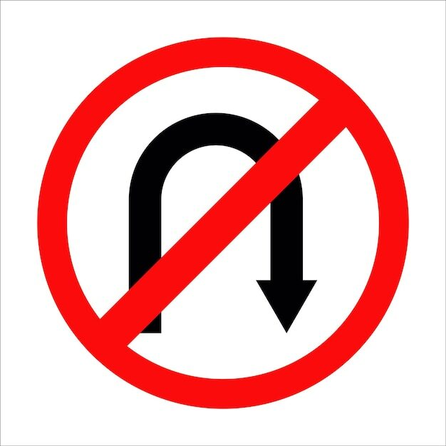
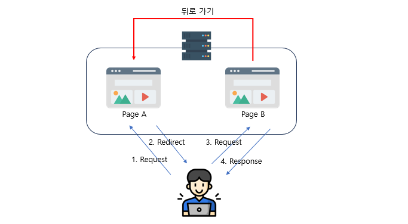

> 웹 브라우저에서 로그아웃, 세션 만료 등으로 인해 로그인페이지로 이동됐을 때 뒤로가기 버튼을 눌러 이전 페이지로 돌아가는것을 막는 방법..!



웹 사이트에서는 보통 Session을 이용해 사용자의 로그인 상태를 유지한다.

Interceptor로 session의 유무를 확인하여 로그아웃이나 세션 유지기간의 만료로 인해 세션이 소멸된 경우 로그인 화면으로 강제로 이동(redirect)시킨다.

하지만 강제로 로그인 페이지로 <u>Redirect 시키더라도 웹 브라우저의 뒤로가기 버튼을 누르면 이전 페이지를 볼 수 있다.</u>

세션이 없는(인증되지 않은) 사용자에게 주요 페이지가 노출되는 것은 보안에 매우 취약하다.



**원인:**

웹브라우저에서 페이지를 이동하면 자체적으로 방문기록(History)을 캐시(cache)에 저장하는데 뒤로가기 버튼을 누르면 캐시에 저장되어있는 가장 최근 페이지로 이동한다.

그렇기 때문에 서버에 요청 없이 웹페이지 즉, html 화면을 띄우는 것이 가능하다.

**해결 방법:**

Interceptor가 없다면 Interceptor를 등록하여, 캐시를 제거하는 로직을 추가한다.

+ *로그인 페이지로 직접적으로 Redirect 시키는 것이 아니라 중간에 다른 경로를 경유해서 가면 해당 문제를 완전히 해결할 수 있다.*

#### SessionInterceptor.java

- Interceptor 클래스 및 메서드 구현

```java
@Slf4j
public class SessionInterceptor extends HandlerInterceptorAdapter {

    @Override
    public boolean preHandle(HttpServletRequest request, HttpServletResponse response, Object handler) throws Exception {

        log.debug("session interceptor preHandle..");

        // 캐싱 방지 처리
        response.addHeader("Cache-Control", "no-cache, no-store, max-age=0, must-revalidate");
        response.addHeader("Pragma", "no-cache");
        response.addHeader("Expires", "0");
        response.addHeader("X-Content-Type-Options", "nosniff");
        response.addHeader("X-Frame-Options", "SAMEORIGIN");
        response.addHeader("X-XSS-Protection", "1; mode=block");

        log.debug("remove cache");

        HttpSession hs = request.getSession();
        String sessionOpuserCode = (String) hs.getAttribute("opuserCode");

        String url = request.getRequestURL().toString();

        if ((sessionOpuserCode == null || sessionOpuserCode.isEmpty()) && (url.contains("login") || url.contains("fail"))) {
            log.debug("session fail");
            // WEB-INF/views/common/sessionFail.jsp 파일로 Redirect시켜 경유함.
            response.sendRedirect("common/sessionFail");
            return false;

        }
        return true;
    }
}
```

#### MvcConfig.java

- Interceptor 등록

```java
@Slf4j
@Configuration
@EnableWebMvc
public class MvcConfig implements WebMvcConfigurer {

	@Bean
	public SessionInterceptor sessionInterceptor() {
		return new SessionInterceptor();
	}

	@Override
	public void addInterceptors(InterceptorRegistry registry) {
		registry.addInterceptor(sessionInterceptor());

	}
}
```

#### sessionFail.jsp

- Redirect 시킬 페이지 (경유)

```html
<%@ page contentType="text/html;charset=UTF-8" language="java" %>
<script>
    alert('중복로그인 및 기타사유로 세션이 만료되었거나 사용자 인증이 필요합니다.');
    location.href = '/login?sessionExpired';
</script>
```

#### login.js

- 최종 도착. 로그인 페이지
- 정상적인 웹페이지 Load를 위해 mounted 후 딜레이 추가

```
mounted : function() {
        var currentURL = window.location.href;
        if(currentURL.indexOf('sessionExpired') !== -1){
            setTimeout(function() {
                alert("중복로그인 및 기타사유로 세션이 만료되었거나 사용자 인증이 필요합니다.");
            }, 10); // 0.01초 (page를 로드하는 시간 딜레이 적용)
        }
    },
```
